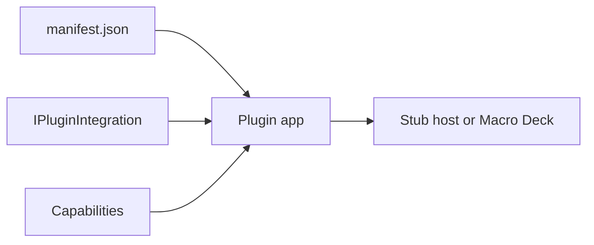

# Macro Deck 3 Plugin Documentation — Consolidated Reference

Source: `https://docs.macro-deck.app` (Astro Starlight). Authoritative markdown source:
`https://github.com/Macro-Deck-App/Macro-Deck/tree/main/docs/src/content/docs/`
Retrieved: 2026-10-02, from the repo `main` branch (131 content files + `docs/public/specs/openapi.yaml`
+ `docs/public/specs/asyncapi.yaml`).

**Method note.** Code samples below are copied **verbatim** from the markdown source, which is the same
content the site renders. Where the site renders a table, the table is reproduced as markdown.

---

## 0. URL map — what exists and what 404s

Several URLs in the task brief do not exist. The real ones:

| Requested URL | Actual URL | Status |
|---|---|---|
| `/features/overview/` | `/features/` | redirect equivalent (`features/index.md`) |
| `/reference/plugin-protocol/` | `/reference/protocol/` | requested path 404s |
| `/cli/overview/` | `/cli/` | requested path 404s |
| `/ui/views/views-and-surfaces/` | `/ui/views/` | requested path 404s |
| `/guides/` (index) | not present | only `debugging`, `publishing`, `troubleshooting` exist under `/guides/` |
| `/ui/reference/compatibility/` | exists | OK |
| `/reference/rest/` + `/reference/rest/operations/*` | exists, **generated** by `starlight-openapi` from `docs/public/specs/openapi.yaml`; not in the content collection | OK |
| `/llms.txt` | 404 | does not exist |

Full sitemap (131 URLs) is at `https://docs.macro-deck.app/sitemap-0.xml`.
Extra sections not in the brief but present: `/creator-portal/*` (9 pages) and `/guide/*` (user guide, 25 pages).

---

# 1. INTRODUCTION — plugin development

## 1.1 https://docs.macro-deck.app/introduction/quickstart/

Specifies: the whole create → run → package loop, without Macro Deck installed.

Prerequisites: **.NET 10 SDK** (includes ASP.NET Core shared framework). Macro Deck not required.



```bash
dotnet tool install --global MacroDeck.Plugin.Cli --prerelease
```

```bash
macrodeck-plugin new --name "Acme Light Control" --id com.acme.light-control \
  --publisher "Acme" --project-name Acme.LightControl --yes
```

```text
Created plugin project at '~/src/Acme.LightControl'.
Manifest: ~/src/Acme.LightControl/src/Acme.LightControl/manifest.json
Build configuration: ~/src/Acme.LightControl/src/Acme.LightControl/macrodeck-build.json
warning publication-metadata-missing: 'repository' is required to publish to the Macro Deck plugin ecosystem. It is not required to develop or run this plugin locally.
```

```bash
cd Acme.LightControl
dotnet build
dotnet test
```

```text
Build succeeded.
Passed!  - Failed:     0, Passed:     7, Skipped:     0, Total:     7
```

```text
Acme.LightControl/
  Acme.LightControl.slnx
  src/Acme.LightControl/
    manifest.json            # id, name, version, icon, entrypoints per platform
    macrodeck-build.json     # how `build` builds each platform
    Program.cs               # registers the integration and runs the plugin
    PluginIntegration.cs     # the capabilities your plugin offers
    LogMessageAction.cs      # an example action
    Localization/Strings.resx  # every user-facing string
    Assets/icon.svg          # replace with your icon
  tests/Acme.LightControl.Tests/
    PluginIntegrationTests.cs
```

```csharp
var plugin = MacroDeckPlugin.CreatePlugin(args)
	.UseMacroDeckLogging()
	.UseLocalization(Strings.LocalizationCatalog)
	.RegisterIntegration<PluginIntegration>()
	.Build();

await plugin.RunAsync();
```

```csharp
public sealed class PluginIntegration : IPluginIntegration
{
	public PluginIntegration(ILogger logger)
	{
		_logger = logger.ForContext<PluginIntegration>();
		Actions = [new LogMessageAction(logger)];
	}

	public IReadOnlyList<IActionDefinition> Actions { get; }

	public Task InitializeAsync(IIntegrationContext context) { ... }

	public Task ShutdownAsync() => Task.CompletedTask;
}
```

```bash
macrodeck-plugin run --project src/Acme.LightControl --stub-host
```

```text
Started a disposable stub host at http://127.0.0.1:52091.
Started process 25405 (mode: SelfRegistering, host: http://127.0.0.1:52091). Press Ctrl-C to stop.
...
[plugin]       Registered with the host as '"com.acme.light-control"'.
Session established (negotiated plugin protocol v3).
[plugin] info: Acme.LightControl.PluginIntegration[0]
[plugin]       Initialized.
```

`Session established` is the success signal. The stub host is a real, disposable, in-process host using the
same registration/session/WebSocket code as Macro Deck.

```bash
cd src/Acme.LightControl
macrodeck-plugin build --output ../../artifacts
```

```text
Building linux-x64...
Building osx-arm64...
Building win-x64...
Built linux-x64, osx-arm64, win-x64.
Packed com.acme.light-control 1.0.0 -> ../../artifacts/com.acme.light-control-1.0.0.macroDeckPlugin (1041 entries, 342566335 bytes uncompressed).
```

```bash
macrodeck-plugin validate --artifact ../../artifacts/com.acme.light-control-1.0.0.macroDeckPlugin
```

```text
...
com.acme.light-control 1.0.0: 0 error(s), 2 warning(s).
```

## 1.2 https://docs.macro-deck.app/introduction/first-action/

Specifies: adding an action with a parameter, triggering it from a test and from a button, and adding a
state provider.

```xml
<data name="Actions.SetBrightness.Name" xml:space="preserve">
  <value>Set brightness</value>
</data>
<data name="Actions.SetBrightness.Description" xml:space="preserve">
  <value>Sets the light to a brightness between 0 and 100.</value>
</data>
<data name="Actions.SetBrightness.Brightness.Label" xml:space="preserve">
  <value>Brightness</value>
</data>
```

```csharp
using System.Globalization;
using MacroDeck.Localization;
using MacroDeck.Sdk.Actions;
using Serilog;

namespace Acme.LightControl;

public sealed class SetBrightnessAction(ILogger logger) : IActionDefinition
{
	private double _brightness;

	public string Id => "set-brightness";

	public LocalizedText Name => Strings.Actions.SetBrightness.Name();

	public LocalizedText Description => Strings.Actions.SetBrightness.Description();

	public IReadOnlyList<ActionParameter> Parameters { get; } =
	[
		ActionParameter.Slider("brightness", 0, 100,
			label: Strings.Actions.SetBrightness.Brightness.Label(),
			defaultValue: 100),
	];

	public IActionExecutor CreateExecutor() => new Executor(this, logger);

	private sealed class Executor(SetBrightnessAction action, ILogger logger) : IActionExecutor
	{
		public Task<ActionResult> ExecuteAsync(ActionExecutionContext context)
		{
			var brightness = Convert.ToDouble(
				context.Parameters.GetValueOrDefault("brightness")?.ToString() ?? "100",
				CultureInfo.InvariantCulture);

			action._brightness = brightness;
			logger.Information("Brightness set to {Brightness}", brightness);
			return ActionResult.SucceededTask;
		}
	}
}
```

```diff
- Actions = [new LogMessageAction(logger)];
+ Actions = [new LogMessageAction(logger), new SetBrightnessAction(logger)];
```

```csharp
[Test]
public async Task Set_brightness_logs_the_new_value()
{
	await using var harness = CreateHarness();
	await harness.InitializeIntegrationsAsync();

	var outcome = await harness.Actions.ExecuteAsync(
		"set-brightness",
		new Dictionary<string, object?> { ["brightness"] = 40 });

	Assert.That(outcome.Succeeded, Is.True);
	Assert.That(harness.Logs.Events.Any(e => e.Message.Contains("Brightness set to 40")), Is.True);
}
```

```diff
- public sealed class SetBrightnessAction(ILogger logger) : IActionDefinition
+ public sealed class SetBrightnessAction(ILogger logger) : IActionDefinition, IStateProviderActionDefinition
```

```csharp
public Task<ActionStateSnapshot?> GetActionStateAsync(
	IReadOnlyDictionary<string, object?> parameters,
	CancellationToken cancellationToken)
{
	ActionStateDefinition[] states =
	[
		new("off", MacroDeckStrings.States.Off()),
		new("on", MacroDeckStrings.States.On()),
	];
	return Task.FromResult<ActionStateSnapshot?>(new(states, _brightness > 0 ? "on" : "off"));
}
```

```csharp
var state = await harness.Actions.GetActionStateAsync("set-brightness");
Assert.That(state.Data!.Value.GetProperty("activeStateId").GetString(), Is.EqualTo("on"));
```

```bash
macrodeck-plugin test --project src/Acme.LightControl
```

```text
Passed: 27, Failed: 0, Skipped: 22
Conformant: yes
...
[PASS] MDC0309 Every state-provider action's state operation returns a well-formed snapshot (Required)
[PASS] MDC0310 Every state a state-provider action returns has an id that is a valid declared-kind identifier (Required)
```

**Restart the plugin after changing `Actions`** so the host receives the new list.

## 1.3 https://docs.macro-deck.app/introduction/manual-setup/

Specifies: every file of a plugin project, written by hand.

```text
MyPlugin/
├── Assets/
│   └── icon.svg            the plugin icon, referenced by manifest.json
├── MyIntegration.cs        your capabilities
├── MyPlugin.csproj         a console project with the Macro Deck packages
├── Program.cs              starts the plugin
├── macrodeck-build.json    how macrodeck-plugin build builds each platform
└── manifest.json           who the plugin is
```

```xml
<Project Sdk="Microsoft.NET.Sdk">

  <PropertyGroup>
    <OutputType>Exe</OutputType>
    <TargetFramework>net10.0</TargetFramework>
    <ImplicitUsings>enable</ImplicitUsings>
    <Nullable>enable</Nullable>
  </PropertyGroup>

  <ItemGroup>
    <FrameworkReference Include="Microsoft.AspNetCore.App" />
    <PackageReference Include="MacroDeck.Plugin.Hosting" Version="3.0.0-*" />
    <PackageReference Include="MacroDeck.Plugin.Serilog" Version="3.0.0-*" />
    <PackageReference Include="MacroDeck.Plugin.Analyzers" Version="3.0.0-*" PrivateAssets="all" />
  </ItemGroup>

  <ItemGroup>
    <Content Include="manifest.json" CopyToOutputDirectory="PreserveNewest" />
    <Content Include="Assets/icon.svg" CopyToOutputDirectory="PreserveNewest" />
  </ItemGroup>

</Project>
```

**`Microsoft.NET.Sdk` + `<FrameworkReference Include="Microsoft.AspNetCore.App" />`, NOT
`Microsoft.NET.Sdk.Web`.**

```json
{
  "$schema": "https://schemas.macro-deck.app/plugin-manifest-v1.schema.json",
  "manifestVersion": 1,
  "id": "com.example.my-plugin",
  "name": "My Plugin",
  "version": "1.0.0",
  "description": "What the plugin does.",
  "icon": "Assets/icon.svg",
  "entrypoints": {
    "win-x64": {
      "executable": "runtimes/win-x64/MyPlugin.dll",
      "runtime": { "kind": "FrameworkDependent", "dotnetVersion": "10.0" }
    },
    "osx-arm64": {
      "executable": "runtimes/osx-arm64/MyPlugin.dll",
      "runtime": { "kind": "FrameworkDependent", "dotnetVersion": "10.0" }
    },
    "linux-x64": {
      "executable": "runtimes/linux-x64/MyPlugin.dll",
      "runtime": { "kind": "FrameworkDependent", "dotnetVersion": "10.0" }
    }
  }
}
```

| Field | Rule |
|---|---|
| `manifestVersion` | Always `1`. |
| `id` | Reverse-domain, lowercase, at least two segments: `com.example.my-plugin`. |
| `name` | Display name, 1-128 characters. |
| `version` | SemVer 2.0. |
| `entrypoints` | One entry per runtime identifier you have tested; `executable` is relative to the package root. |

```csharp
using MacroDeck.Plugin.Hosting;
using MacroDeck.Plugin.Serilog;

var plugin = MacroDeckPlugin.CreatePlugin(args)
    .UseMacroDeckLogging()
    .RegisterIntegration<MyIntegration>()
    .Build();

await plugin.RunAsync();
```

```csharp
using MacroDeck.Sdk;
using MacroDeck.Sdk.Actions;

public sealed class MyIntegration : IPluginIntegration
{
    public IReadOnlyList<IActionDefinition> Actions { get; } = [];

    public Task InitializeAsync(IIntegrationContext context) => Task.CompletedTask;

    public Task ShutdownAsync() => Task.CompletedTask;
}
```

```json
{
  "version": 1,
  "targets": {
    "win-x64": {
      "executable": "dotnet",
      "arguments": ["publish", "MyPlugin.csproj", "-c", "Release", "-r", "win-x64",
                    "--self-contained", "false", "-p:UseAppHost=false",
                    "-o", "bin/publish/win-x64"],
      "output": "bin/publish/win-x64"
    },
    "osx-arm64": {
      "executable": "dotnet",
      "arguments": ["publish", "MyPlugin.csproj", "-c", "Release", "-r", "osx-arm64",
                    "--self-contained", "false", "-p:UseAppHost=false",
                    "-o", "bin/publish/osx-arm64"],
      "output": "bin/publish/osx-arm64"
    },
    "linux-x64": {
      "executable": "dotnet",
      "arguments": ["publish", "MyPlugin.csproj", "-c", "Release", "-r", "linux-x64",
                    "--self-contained", "false", "-p:UseAppHost=false",
                    "-o", "bin/publish/linux-x64"],
      "output": "bin/publish/linux-x64"
    }
  }
}
```

```csharp
using MacroDeck.Plugin.Hosting;
using MacroDeck.Plugin.Serilog;
using Microsoft.Extensions.DependencyInjection;

var builder = MacroDeckPlugin.CreatePlugin(args)
    .UseMacroDeckLogging()
    .RegisterIntegration<MyIntegration>();

builder.Services.AddHttpClient<WeatherClient>(client =>
    client.BaseAddress = new Uri("https://api.example.com/"));
builder.Services.Configure<WeatherOptions>(builder.Configuration.GetSection("Weather"));

var plugin = builder.Build();
await plugin.RunAsync();
```

```csharp
public sealed class MyIntegration(WeatherClient weather, IOptions<WeatherOptions> options)
    : IPluginIntegration
{
    // ...
}
```

**Validate the artifact, not the source manifest** — `runtimes/` entrypoints only exist after `build`.

## 1.4 https://docs.macro-deck.app/introduction/samples-and-template/

| Repository | Use it when |
|---|---|
| [Macro-Deck-Plugin-Template](https://github.com/Macro-Deck-App/Macro-Deck-Plugin-Template) | You are starting a plugin. |
| [Macro-Deck-Sample-Plugins](https://github.com/Macro-Deck-App/Macro-Deck-Sample-Plugins) | You want to see a capability implemented end to end. |

```bash
macrodeck-plugin new --name "My Plugin" --id com.example.my-plugin --publisher "Example" --yes
```

```text
MyPlugin/
├── MyPlugin.slnx
├── Directory.Build.props        net10.0, nullable, analyzers for every project
├── Directory.Packages.props     one MacroDeckSdkVersion for every Macro Deck package
├── NuGet.config                 nuget.org plus an empty local-feed/
├── src/MyPlugin/
│   ├── manifest.json
│   ├── macrodeck-build.json     one framework-dependent publish per platform
│   ├── MyPlugin.csproj
│   ├── Program.cs               CreatePlugin, logging, localization, one integration
│   ├── PluginIntegration.cs     IPluginIntegration with one action
│   ├── LogMessageAction.cs      the example action - replace it
│   ├── Localization/Strings.resx
│   ├── Assets/icon.svg          replace with your icon
│   └── Properties/launchSettings.json   "Macro Deck - Real Host" debug profile
└── tests/MyPlugin.Tests/        NUnit tests on MacroDeck.Plugin.Testing
```

```bash
dotnet new install "MacroDeck.Plugin.Templates@*-*"
dotnet new macrodeck-plugin -n Acme.LightControl -o Acme.LightControl \
  --pluginId com.acme.light-control --pluginName "Acme Light Control"
```

| Sample | Demonstrates |
|---|---|
| Weather | Smallest complete plugin: plain and dynamic-options actions, read-only and writable variables, an event, a one-step config flow, a weather provider, a second language (`de`). |
| Music player | Transport, artwork, catalogue browsing, output devices, two instances with different capabilities, dynamic event options, action interaction pickers. |
| REST API | A typed `HttpClient` through DI, a multi-step config flow with a secret and an OAuth branch, integration issues, notifications, API-backed variables and options. |
| Virtual profile | A plugin-owned virtual profile with widget interactions, pushed variable updates, deck navigation, widget appearance, scripts and notifications. |

Not in the samples (they ship as packages): **`MacroDeck.Plugin.Testing`** and **the conformance suite**.

---

# 2. FEATURES

## 2.0 https://docs.macro-deck.app/features/ (the "overview")

```csharp
public sealed class ObsIntegration : IPluginIntegration, IVariableProvider, IEventProvider
{
	public IReadOnlyList<IActionDefinition> Actions { get; } = [new StartRecordingAction()];
	// IVariableProvider and IEventProvider members, see their pages.
}
```

| Group | Feature | Contract |
|---|---|---|
| Buttons | Actions | `IActionDefinition`, `IActionExecutor` |
| | Button states | `IStateProviderActionDefinition` |
| | Button icons | `IIconProviderActionDefinition` |
| Data | Variables | `IVariableProvider` |
| | Events | `IEventProvider`, `IEventPublisher` |
| | Messaging between plugins | `IIntegrationContext.Messages` |
| | Deck and clients | `IIntegrationContext.Deck` |
| | Music players | `IMusicPlayerProvider` |
| | Weather | `IWeatherProvider` |
| | Virtual profiles | `IProfileProvider` |
| Setup | Setup flows | `IConfigFlowProvider`, `IConfigFlow` |
| | Integration issues | `IIntegrationIssueProvider` |
| | Settings migrations | `IMigrationProvider` |
| | Localization | `MacroDeck.Localization` |
| | Logging | `ILogger` |
| | Testing | `MacroDeck.Plugin.Testing` |
| Hardware | Devices | `IDeviceProvider` |
| | Layouts | `ILayoutProvider` |
| | Android devices | `IAndroidDeviceManager` |
| | Macro Deck UI | `IUiProvider` |
| | Widget types | `IWidgetTypeProvider` |
| | Folder views | `IFolderViewProvider` |
| | Screensavers | `IScreenSaverProvider` |
| | Video streams | `IVideoStreamIntegration`, `IVideoStreamProvider` |

```csharp
public sealed class StartRecordingAction : IActionDefinition
{
	public string Id => "start-recording"; // local id: lowercase kebab-case
	// ...
}
```

- **Pass the local id.** Macro Deck qualifies it with your plugin's identity.
- **Runtime resource ids** may use a broader grammar but must not contain `::`.

## 2.1 https://docs.macro-deck.app/features/actions/

```csharp
using System.Globalization;
using MacroDeck.Localization;
using MacroDeck.Sdk;
using MacroDeck.Sdk.Actions;

public sealed class LightsIntegration : IPluginIntegration
{
	private readonly LightClient _client = new();

	public IReadOnlyList<IActionDefinition> Actions => [new SetBrightnessAction(_client)];

	// Other IPluginIntegration members omitted.
}

internal sealed class SetBrightnessAction(LightClient client) : IActionDefinition
{
	public string Id => "set-brightness";

	public LocalizedText Name => Strings.Actions.SetBrightness();

	public LocalizedText Description => Strings.Actions.SetBrightnessDescription();

	public IReadOnlyList<ActionParameter> Parameters { get; } =
	[
		ActionParameter.Text("light", label: Strings.Parameters.Light(), required: true),
		ActionParameter.Slider("brightness", 0, 100, label: Strings.Parameters.Brightness(), defaultValue: 100)
	];

	public IActionExecutor CreateExecutor() => new Executor(client);

	private sealed class Executor(LightClient client) : IActionExecutor
	{
		public async Task<ActionResult> ExecuteAsync(ActionExecutionContext context)
		{
			if (!client.IsConnected)
			{
				return ActionResult.Failed(ActionErrorCodes.NotConnected, Strings.Errors.BridgeOffline());
			}

			if (context.Parameters.GetValueOrDefault("light") is not string light || light.Length == 0)
			{
				return ActionResult.Failed(ActionErrorCodes.InvalidParameter, Strings.Errors.NoLightSelected());
			}

			var brightness = Convert.ToDouble(context.Parameters.GetValueOrDefault("brightness") ?? 100,
				CultureInfo.InvariantCulture);

			await client.SetBrightnessAsync(light, brightness, context.CancellationToken);
			return ActionResult.Success();
		}
	}
}
```

```csharp
return ActionResult.Success();                                         // it happened
return ActionResult.Failed(ActionErrorCodes.NotFound, Strings.Errors.SceneGone()); // it did not
return ActionResult.Accepted(Strings.Status.WaitingForDevice());       // taken, not yet confirmed
```

| `ActionErrorCodes` | Meaning |
|---|---|
| `NotConfigured` | No usable configuration - no account, no instance. |
| `NotConnected` | Configured, but the provider is not reachable right now. |
| `PermissionDenied` | Missing scope, grant or OS permission. |
| `ProviderError` | The provider errored - unexpected response, broken call. |
| `ProviderRejected` | The provider understood the request and declined it. |
| `InvalidParameter` | A parameter is missing, malformed or unusable. |
| `NotFound` | The target does not exist. |
| `Timeout` | Completion could not be confirmed in time. |
| `Unavailable` | Not available here - wrong platform, unsupported provider version. |

```csharp
public IReadOnlyList<ActionParameter> Parameters { get; } =
[
	ActionParameter.Choice("auth", [
		new ActionParameterOption { Value = "none", Label = Strings.Auth.None() },
		new ActionParameterOption { Value = "header", Label = Strings.Auth.Header() }
	], label: Strings.Parameters.Auth(), defaultValue: "none"),
	ActionParameter.Text("headerName", label: Strings.Parameters.HeaderName()).OnlyWhen("auth", "header"),
	ActionParameter.Secret("token", label: Strings.Parameters.Token()).OnlyWhen("auth", "header"),
	ActionParameter.Url("url", label: Strings.Parameters.Url(), required: true, autoPrefixHttps: true),
	ActionParameter.Duration("timeout", label: Strings.Parameters.Timeout(), defaultMilliseconds: 5000)
];
```

**`ActionParameter` factories, verbatim from the docs:**
`Text`, `MultilineText`, `Number`, `Slider`, `Toggle`, `Password`, `Secret`, `Choice`, `DynamicChoice`,
`Autocomplete`, `MultiSelect`, `Color`, `File`, `Folder`, `Hotkey`, `Duration`, `DateTime`, `Json`, `Code`,
`KeyValue`, `Object`, `Array`, `IpAddress`, `Url`, `Icon`, `Image`, `KeyboardSequence`, `KeyboardCombo`,
`WidgetTarget`.

| `ActionExecutionContext` | |
|---|---|
| `Parameters` | Configured values, keyed by parameter name. |
| `CancellationToken` | Cancelled when the flow is aborted. |
| `OwnerWidgetId` | The widget whose flow is running; `null` for scripts, automations and other widget-less runs. |
| `OriginClientId` | The client that pressed, or `null` for a backend-initiated run. |
| `Interactions`, `Ui` | Ask the originating client a question or open a modal. `null` when nobody is there to ask - handle it. |
| `CallDepth` | Script hops this run is nested behind. Pass it on, incremented, when handing work to another Macro Deck. |

```csharp
internal sealed class JoinChannelAction(DiscordClient client) : IDynamicOptionsActionDefinition
{
	public IReadOnlyList<ActionParameter> Parameters { get; } =
	[
		ActionParameter.DynamicChoice("guildId", label: Strings.Parameters.Server(), required: true),
		ActionParameter.DynamicChoice("channelId", label: Strings.Parameters.Channel(), required: true)
	];

	public async Task<DynamicOptionsResult> GetDynamicOptionsAsync(
		DynamicOptionsContext context, CancellationToken cancellationToken)
	{
		if (!client.IsConnected)
		{
			return new DynamicOptionsResult { Options = [], Error = Strings.Errors.DiscordNotRunning() };
		}

		if (context.ParameterName == "channelId")
		{
			if (context.CurrentParameters.GetValueOrDefault("guildId") is not string guildId)
			{
				return new DynamicOptionsResult { Options = [], Error = Strings.Errors.PickServerFirst() };
			}

			var channels = await client.GetChannelsAsync(guildId, cancellationToken);
			return new DynamicOptionsResult
			{
				Options = [.. channels.Select(c => new ActionParameterOption { Value = c.Id, Label = c.Name })],
				CacheSeconds = 15
			};
		}

		var guilds = await client.GetGuildsAsync(cancellationToken);
		return new DynamicOptionsResult
		{
			Options = [.. guilds.Select(g => new ActionParameterOption { Value = g.Id, Label = g.Name })]
		};
	}

	// Id, Name, Description, CreateExecutor omitted.
}
```

```csharp
internal sealed class ToggleAction : IUiConfigurableActionDefinition
{
	public Task<IUiSession?> CreateConfigurationSessionAsync(
		ActionConfigurationRequest request, CancellationToken cancellationToken)
		=> Task.FromResult<IUiSession?>(new ToggleConfigSession(request.Parameters));

	// IActionDefinition members omitted - Parameters is still required.
}
```

```csharp
private async Task<ActionResult> ConfirmAsync(Func<MeldState, bool> reached, CancellationToken cancellationToken)
{
	var deadline = DateTime.UtcNow + TimeSpan.FromSeconds(5);
	while (!reached(_state))
	{
		var remaining = deadline - DateTime.UtcNow;
		if (remaining <= TimeSpan.Zero)
		{
			return ActionResult.Accepted();
		}

		try
		{
			await _stateChanged.WaitAsync(remaining, cancellationToken);
		}
		catch (TimeoutException)
		{
			break;
		}
	}

	return reached(_state) ? ActionResult.Success() : ActionResult.Accepted();
}
```

| Operation | SDK member |
|---|---|
| `describe` | `Actions` and each definition's parameters and capabilities |
| `execute` | `CreateExecutor().ExecuteAsync` |
| `options` | `IDynamicOptionsActionDefinition.GetDynamicOptionsAsync` |
| `state` | `IStateProviderActionDefinition.GetActionStateAsync` |
| `icon`, `icon.content` | `IIconProviderActionDefinition` |

## 2.2 https://docs.macro-deck.app/features/button-states/

```csharp
using MacroDeck.Localization;
using MacroDeck.Sdk.Actions;

internal sealed class MicMuteAction(VoiceClient client) : IActionDefinition, IStateProviderActionDefinition
{
	private static readonly IReadOnlyList<ActionStateDefinition> _states =
	[
		new("unmuted", MacroDeckStrings.States.Unmuted())
		{
			DefaultAppearance = new ActionStateAppearance { BackgroundColor = "#2f855a" }
		},
		new("muted", MacroDeckStrings.States.Muted())
		{
			DefaultAppearance = new ActionStateAppearance { BackgroundColor = "#c53030" }
		},
		new("unavailable", MacroDeckStrings.States.Unavailable())
		{
			DefaultAppearance = new ActionStateAppearance { BackgroundColor = "#4a5568", LabelColor = "#cbd5e0" }
		}
	];

	public string Id => "toggle-mute";

	public Task<ActionStateSnapshot?> GetActionStateAsync(
		IReadOnlyDictionary<string, object?> parameters,
		CancellationToken cancellationToken)
	{
		// Answer from state the client already holds - never connect here.
		var active = client.IsConnected ? client.IsMuted ? "muted" : "unmuted" : "unavailable";
		return Task.FromResult<ActionStateSnapshot?>(new ActionStateSnapshot(_states, active));
	}

	// Name, Description, Parameters and CreateExecutor omitted - see Actions.
}
```

```csharp
new ActionStateDefinition("recording", MacroDeckStrings.States.Recording())
{
	DefaultAppearance = new ActionStateAppearance
	{
		Label = "",                   // icon-only
		BackgroundColor = "#c53030",
		LabelColor = "#ffffff"
	}
}
```

| `ActionStateAppearance` | Effect | `null` means |
|---|---|---|
| `Label` | Button text in this state. `""` shows no text. | The state's own `Label`. |
| `BackgroundColor` | `#rrggbb`. | The button's default. |
| `LabelColor` | `#rrggbb`. | The button's default. |
| `IconId` | Icon in the host's icon id format. | No icon. |

```csharp
public Task<ActionStateSnapshot?> GetActionStateAsync(
	IReadOnlyDictionary<string, object?> parameters, CancellationToken cancellationToken)
{
	// Half-typed drafts arrive here too: a missing value is not an error.
	if (parameters.GetValueOrDefault("scene") is not string scene || scene.Length == 0)
	{
		return Task.FromResult<ActionStateSnapshot?>(null);
	}

	var active = _obs.CurrentScene == scene ? "active" : "inactive";
	return Task.FromResult<ActionStateSnapshot?>(new ActionStateSnapshot(_states, active));
}

public TimeSpan StatePollInterval => TimeSpan.FromSeconds(1);
```

```csharp
public async Task<ActionResult> ExecuteAsync(ActionExecutionContext context)
{
	var wasMuted = _client.IsMuted;
	await _client.SetMutedAsync(!wasMuted, context.CancellationToken);
	return ActionResult.Success(wasMuted ? "unmuted" : "muted");
}
```

Reuse `MacroDeckStrings.States`: `On`, `Off`, `Muted`, `Unmuted`, `Visible`, `Hidden`, `Recording`,
`Streaming`, `Playing`, `Paused`, `Unavailable` and more.

## 2.3 https://docs.macro-deck.app/features/button-icons/

```csharp
using MacroDeck.Sdk.Actions;

internal sealed class NowPlayingAction(PlayerClient player) : IActionDefinition, IIconProviderActionDefinition
{
	public string Id => "now-playing";

	public Task<ActionIconSnapshot?> GetActionIconAsync(
		IReadOnlyDictionary<string, object?> parameters,
		CancellationToken cancellationToken)
	{
		var artwork = player.CurrentArtwork; // already held - never fetch here
		ActionIconSnapshot? snapshot = !player.IsConnected ? null
			: artwork is null ? new ActionIconSnapshot { NoIcon = true }
			: new ActionIconSnapshot { Version = artwork.TrackId, MediaType = artwork.MediaType };

		return Task.FromResult(snapshot);
	}

	public Task<ActionIconContent?> GetActionIconContentAsync(
		IReadOnlyDictionary<string, object?> parameters,
		string version,
		CancellationToken cancellationToken)
	{
		var artwork = player.CurrentArtwork;
		return Task.FromResult(artwork?.TrackId == version
			? new ActionIconContent(artwork.Bytes, artwork.MediaType)
			: null);
	}

	// Name, Description, Parameters and CreateExecutor omitted - see Actions.
}
```

```csharp
// Can't answer right now - the widget shows its configured icon.
return Task.FromResult<ActionIconSnapshot?>(null);

// Working, and deliberately showing nothing.
return Task.FromResult<ActionIconSnapshot?>(new ActionIconSnapshot { NoIcon = true });

// An icon the host already has - no bytes needed.
return Task.FromResult<ActionIconSnapshot?>(new ActionIconSnapshot
{
	Version = condition,
	Reference = ActionIconReference.IconPack(WeatherIcons.For(condition))
});

// Your own bytes - fetched through GetActionIconContentAsync when Version changes.
return Task.FromResult<ActionIconSnapshot?>(new ActionIconSnapshot { Version = avatarHash, MediaType = "image/png" });
```

| `ActionIconSnapshot` | |
|---|---|
| `Version` | Stable identity of the image. The host refetches bytes only when it changes. Empty with `NoIcon`. |
| `Reference` | A host-resolvable icon: `ActionIconReference.IconPack(id)` or `ActionIconReference.PluginIcon(key, name)`. Opaque, and **never a URL**. |
| `MediaType` | Media type of the bytes, when there is no `Reference`. |
| `NoIcon` | Render nothing. |

```csharp
return Task.FromResult<ActionIconSnapshot?>(new ActionIconSnapshot
{
	Version = "spotify",
	Reference = ActionIconReference.PluginIcon("logos", "spotify")
});
```

`PluginIcon` throws `ArgumentException` for a key that is not a valid pack key (lowercase letters, digits
and inner hyphens) and for a blank name or one containing `/`.

```csharp
public async Task InitializeAsync(IIntegrationContext context)
{
	_player.TrackChanged += async (_, _) => await context.Widgets.InvalidateIconAsync("now-playing");
	// ...
}
```

```csharp
await context.Widgets.ApplyAsync(new WidgetAppearanceRequest
{
	WidgetId = widgetId,
	Patch = new WidgetAppearancePatch { IconColor = "#ef4444" },
});
```

## 2.4 https://docs.macro-deck.app/features/variables/

```csharp
using MacroDeck.Sdk;
using MacroDeck.Sdk.Variables;

public sealed class MusicPlayerIntegration : IPluginIntegration, IVariableProvider
{
	private readonly PlaybackEngine _engine = new();

	public IReadOnlyList<VariableDefinition> Variables { get; } =
	[
		VariableDefinition.Eager("music_track", VariableType.Text) with { Id = "track" },
		VariableDefinition.Eager("music_is_playing", VariableType.Boolean) with { Id = "is-playing" },
		VariableDefinition.Eager("music_position", VariableType.Numeric, refreshInterval: TimeSpan.FromSeconds(1))
			with { Id = "position", Unit = "s", SemanticKind = VariableSemanticKinds.Duration }
	];

	public ValueTask<VariableReading> ReadAsync(string localId, CancellationToken cancellationToken = default)
		=> ValueTask.FromResult(localId switch
		{
			"track" => VariableReading.Of(_engine.CurrentTrack.Title),
			"is-playing" => VariableReading.Of(_engine.IsPlaying),
			"position" => VariableReading.Of(_engine.PositionSeconds),
			_ => VariableReading.Unavailable
		});

	// IPluginIntegration members omitted.
}
```

| Property | What it does | Example |
|---|---|---|
| `Name` | Variable name in templates. | `"weather_temperature"` |
| `Id` | Local id passed to `ReadAsync` / `SetValueAsync`. Stable once shipped. | `"temperature"` |
| `Type` | `Text`, `Numeric` or `Boolean`. | `VariableType.Numeric` |
| `DisplayName`, `Description` | Localized text shown in the variable picker. | `Strings.Variables.Temperature()` |
| `Unit` | Symbol shown next to the value, reachable as `vars.x.unit`. | `"°C"`, `"%"`, `"GB"` |
| `SemanticKind` | How the host formats it - see below. | `VariableSemanticKinds.Percentage` |
| `DecimalPlaces` | Digits shown for a numeric value. | `1` |
| `RefreshInterval` | How often the host calls `ReadAsync`. Host default when `null`. | `TimeSpan.FromSeconds(5)` |
| `Write` | Makes the variable writable. | `new VariableWriteCapability()` |
| `Attributes` | Free-form strings, readable as `vars.x.<key>`. | `new Dictionary<string, string> { ["room"] = "office" }` |
| `Configuration` | Groups the variable under one configured instance. | `new VariableConfiguration(entryId, "Studio PC")` |

| `SemanticKind` | `Unit` | stored | rendered |
|---|---|---|---|
| `duration` | `s` | `187` | `03:07` |
| `percentage` | `%` | `12.5` | `12.5 %` |
| `bytes` | `B` | `1536` | `1.5 KB` |
| `none` | `fps` | `60` | `60 fps` |

Max eager variables: `VariableLimits.MaxEagerVariablesPerProvider` (**256**).

```csharp
public IReadOnlyList<VariableDefinition> Variables { get; } =
[
	VariableDefinition.Eager("music_volume", VariableType.Numeric) with
	{
		Id = "volume",
		Unit = "%",
		SemanticKind = VariableSemanticKinds.Percentage,
		Write = new VariableWriteCapability()
	}
];

public ValueTask<VariableReading> ReadAsync(string localId, CancellationToken cancellationToken = default)
	=> ValueTask.FromResult(localId switch
	{
		// min, max and step give a bound Slider its range.
		"volume" => VariableReading.Of(_engine.VolumePercent, 0, 100, 1),
		_ => VariableReading.Unavailable
	});

public ValueTask<VariableWriteResult> SetValueAsync(string localId, object? value,
	CancellationToken cancellationToken = default)
{
	if (value is not (double or int or long))
	{
		return ValueTask.FromResult(VariableWriteResult.InvalidValue());
	}

	_engine.SetVolume((int)Convert.ToDouble(value, CultureInfo.InvariantCulture)); // clamps to 0-100
	return ValueTask.FromResult(VariableWriteResult.Applied());
}
```

`VariableWriteResult`: `Applied`, `NotWritable`, `NotFound`, `Unavailable`, `InvalidValue`, `Failed`.
`VariableWriteCapability { CommitOnRelease = true }` for disruptive drags.

```csharp
await using var harness = /* your harness setup */;
await harness.InitializeIntegrationsAsync();

var track = (await harness.Variables.GetAsync("track")).DataAs<VariableReadingDto>();
Assert.That(track!.Value.Text, Is.EqualTo("Intro"));

var written = (await harness.Variables.SetAsync("volume",
	new VariableValueDto { Kind = "number", Number = 35 })).DataAs<VariableSetResult>();
Assert.That(written!.Status, Is.EqualTo("Applied"));
```

| member | true when |
|---|---|
| `state.is_available` | the reference resolved to a value |
| `state.is_not_available` | it did not - unknown name, or a provider that went quiet |
| `state.is_empty` | it resolved **and** renders as zero characters |
| `state.is_not_empty` | it resolved **and** renders as at least one character |

```liquid
By {{ vars.music_artist }}
```

**Because `state` is resolved first, an `Attributes` key named `state` is unreachable.**

```csharp
public sealed class Foobar2000Integration : IPluginIntegration, IVariableProvider
{
	private readonly Foobar2000Client _client;

	public IReadOnlyList<VariableDefinition> Variables { get; } = [];

	public bool SupportsCatalog => true;

	public bool SupportsSearch => true;

	public string CatalogName => "foobar2000";

	public async ValueTask<VariableCatalogPage> DiscoverAsync(
		VariableCatalogQuery query,
		CancellationToken cancellationToken = default)
	{
		if (!_client.IsConnected)
		{
			return VariableCatalogPage.Empty;
		}

		// The client's cursor is handed straight through as the continuation token.
		var page = await _client.GetCustomTagsAsync(query.Search, query.PageSize, query.ContinuationToken,
			cancellationToken);

		return new VariableCatalogPage
		{
			Items = page.Tags
				.Select(tag => VariableDefinition.OnDemand(tag.Name, VariableType.Text) with
				{
					Name = $"foobar_{tag.Name}",
				})
				.ToList(),
			ContinuationToken = page.NextCursor,
		};
	}

	// A tag typed by hand or read from an old profile is still valid - resolve it.
	public ValueTask<VariableDefinition?> ResolveAsync(
		string localId,
		CancellationToken cancellationToken = default)
		=> ValueTask.FromResult(Foobar2000Tags.IsValidName(localId)
			? VariableDefinition.OnDemand(localId, VariableType.Text)
			: null);

	public async ValueTask<VariableReading> ReadAsync(
		string localId,
		CancellationToken cancellationToken = default)
		=> _client.IsConnected
			? VariableReading.Of(await _client.GetCustomTagValueAsync(localId, cancellationToken))
			: VariableReading.Unavailable;
}
```

Catalog rules: ids may contain anything except `::`, whitespace and control chars, up to
`MacroDeckId.MaxResourceLocalIdLength`; page size ≤ `MaxVariableCatalogPageSize` (**200**); `SupportsPush`
→ `OnAttachedAsync(sink)` then `SubscribeAsync(localIds)` (≤ **1024** ids); out-of-set publishes dropped.

Declare `host:variable-values` in `manifest.json` when using push.

## 2.5 https://docs.macro-deck.app/features/events/

```csharp
using MacroDeck.Sdk;
using MacroDeck.Sdk.Actions;
using MacroDeck.Sdk.Events;

public sealed class StreamStudioIntegration : IPluginIntegration, IEventProvider
{
	private StudioClient? _client;

	public IReadOnlyList<EventDefinition> EventDefinitions { get; } =
	[
		new()
		{
			Id = "scene-changed",
			Name = Strings.Events.SceneChanged(),
			Category = Strings.Events.ScenesCategory(),
			ConfigurationParameters =
			[
				ActionParameter.DynamicChoice("sceneId",
					label: Strings.Parameters.Scene(),
					placeholder: Strings.Parameters.AnyScene())
			],
			PayloadParameters =
			[
				ActionParameter.DynamicChoice("sceneId", label: Strings.Parameters.SceneId()),
				ActionParameter.Text("sceneName", label: Strings.Parameters.Scene())
			]
		}
	];

	public Task InitializeAsync(IIntegrationContext context)
	{
		var events = context.Events; // safe to keep for the process lifetime
		_client = new StudioClient();
		_client.SceneChanged += scene => events.Publish("scene-changed", new Dictionary<string, object?>
		{
			["sceneId"] = scene.Id,
			["sceneName"] = scene.Name
		});
		return Task.CompletedTask;
	}

	// Remaining IPluginIntegration members omitted.
}
```

| Property | What it does | Example |
|---|---|---|
| `Id` | Provider-local id, stable across releases. | `"scene-changed"` |
| `Name`, `Description` | Localized text in the event picker. | `Strings.Events.SceneChanged()` |
| `Category` | Groups events in the picker. Optional. | `Strings.Events.ScenesCategory()` |
| `IconName` | An icon the UI already ships. No image data. | `"movie"` |
| `ConfigurationParameters` | What the user authors on the trigger. | `ActionParameter.DynamicChoice("sceneId", ...)` |
| `PayloadParameters` | What an occurrence carries. Never rendered as an input. | `ActionParameter.Text("sceneName", ...)` |
| `DeliveryKind` | `Push` (default): you publish. `Scheduled`: the host produces occurrences. | `EventDeliveryKind.Push` |

```csharp
using MacroDeck.Plugin.Hosting.Integrations.HostApis; // IPluginCatalogNotifier, injected
using MacroDeck.Plugin.Protocol.Handshake;             // CapabilityKinds

catalogNotifier.CatalogChanged(CapabilityKinds.Events);
```

```csharp
ConfigurationParameters =
[
	ActionParameter.DynamicChoice("trackId", label: Strings.Parameters.Track(), placeholder: Strings.Parameters.AnyTrack())
],
PayloadParameters =
[
	ActionParameter.DynamicChoice("trackId", label: Strings.Parameters.TrackId()),
	ActionParameter.Text("trackName", label: Strings.Parameters.Track()),
	ActionParameter.Toggle("muted", label: Strings.Parameters.Muted())
]
```

```csharp
_events.Publish("hotkey-pressed", new Dictionary<string, object?>
{
	["key"] = "F3",                                                  // string
	["repeat"] = 2,                                                  // number
	["held"] = false,                                                // boolean
	["combo"] = new { modifiers = new[] { "Ctrl", "Shift" }, key = "F3" } // object
});
```

Object/array values arrive as compact JSON text: `{"modifiers":["Ctrl","Shift"],"key":"F3"}`.

```csharp
public Task InitializeAsync(IIntegrationContext context)
{
	_events = context.Events;
	_events.BindingsChanged -= ApplyBoundCombos;
	_events.BindingsChanged += ApplyBoundCombos;
	ApplyBoundCombos();
	return Task.CompletedTask;
}

private void ApplyBoundCombos()
{
	var combos = _events.GetBindings()
		.Where(binding => binding.EventId == "hotkey-pressed")
		.Select(binding => binding.Parameters.GetValueOrDefault("combo"))
		.Where(value => value is { Operator: "==", Value.ValueKind: JsonValueKind.Object })
		.Select(value => value!.Value!.Value)
		.ToList();

	_hook.Swallow(combos);
}
```

| `EventBindingValue.Operator` values |
|---|
| `==`, `!=`, `>`, `<`, `>=`, `<=`, or one of `isEmpty`, `isNotEmpty`, `isAvailable`, `isNotAvailable` |

```csharp
public sealed class StreamStudioIntegration : IPluginIntegration, IEventProvider, IDynamicEventOptionsProvider
{
	public Task<DynamicOptionsResult> GetEventOptionsAsync(EventOptionsContext context,
		CancellationToken cancellationToken)
	{
		var session = _client?.Session ?? StudioSession.Empty;

		IReadOnlyList<ActionParameterOption> options = context.ParameterName switch
		{
			"sceneId" => session.Scenes.Select(s => new ActionParameterOption { Value = s.Id, Label = s.Name }).ToList(),
			_ => []
		};

		return Task.FromResult(new DynamicOptionsResult
		{
			Options = options,
			AllowsCustomValue = true,
			CacheSeconds = 30
		});
	}
}
```

`EventOptionsContext`: `EventId`, `ParameterName`, `Filter`, `CurrentParameters`.

```csharp
var context = new FakeIntegrationContext();
await integration.InitializeAsync(context);

studio.RaiseSceneChanged(new Scene("s1", "Intro"));

var published = context.Events.Published.Single();
Assert.That(published.EventId, Is.EqualTo("scene-changed"));
Assert.That(published.Parameters!.Value.GetProperty("sceneName").GetString(), Is.EqualTo("Intro"));
```

## 2.6 https://docs.macro-deck.app/features/messaging/

```csharp
using System.Text.Json;
using MacroDeck.Sdk;
using MacroDeck.Sdk.Actions;
using MacroDeck.Sdk.Messaging;

public sealed class ObsIntegration : IPluginIntegration
{
	private IMessageChannel? _messages;
	private string _scene = "Starting";

	public IReadOnlyList<IActionDefinition> Actions => [];

	public async Task InitializeAsync(IIntegrationContext context)
	{
		_messages = context.Messages;

		await _messages.HandleRequestsAsync<object, SceneInfo>("obs.scene.current",
			(_, _, _) => Task.FromResult(new SceneInfo(_scene)));
	}

	public Task ShutdownAsync() => Task.CompletedTask;

	private async Task OnSceneChangedAsync(string scene)
	{
		_scene = scene;
		await _messages!.PublishAsync("obs.scene.changed", new SceneInfo(scene));
	}
}

public sealed record SceneInfo(string Scene);
```

```csharp
public async Task InitializeAsync(IIntegrationContext context)
{
	await context.Messages.SubscribeAsync<SceneInfo>("obs.scene.changed",
		(scene, message, _) => UpdateLightsAsync(scene!.Scene));

	var current = await context.Messages.RequestAsync<object?, SceneInfo>("obs.scene.current", null);
}
```

| Kind | Send with | Handle with | Reaches | Answer |
|---|---|---|---|---|
| Event | `PublishAsync` | `SubscribeAsync` | every matching subscription | none; completes once Macro Deck accepted the event |
| Command | `SendAsync` | `HandleCommandsAsync` | the topic's one handler | completes when the handler finished |
| Request | `RequestAsync` | `HandleRequestsAsync` | the topic's one handler | the handler's return value |

**Topic grammar:** two or more dot-separated segments of lowercase letters, digits, `-` and `_`, each
starting and ending with a letter or digit, at most **128** characters. `MessageTopic.IsValidTopic` checks
one. `obs.*` is the only wildcard.

| `MessageChannelException.ErrorCode` | Meaning |
|---|---|
| `Unsupported` | This Macro Deck has no message channel. |
| `NotConnected` | Your plugin is not connected to Macro Deck right now. Registrations are kept and sent once it is. |
| `InvalidTopic` | The topic or pattern does not follow the topic grammar. |
| `PayloadTooLarge` | The payload or reply is larger than 64 KiB once serialized. |
| `NoHandler` | Nothing handles the topic. |
| `HandlerUnavailable` | The handler is temporarily unreachable. Retry later. |
| `TopicAlreadyHandled` | Another participant already handles the topic; see `HandlerOwner`. |
| `HandlerFailed` | The handler threw or failed. |
| `Timeout` | The handler did not answer in time. |
| `RateLimited` | Too many messages in quick succession. Retry later. |

Limits: command/request waits at most **30 s**; ~**50 msgs/s** with bursts to **100**; at most **16**
outstanding commands/requests per plugin, a handler receives at most **8** at once; at most **256**
subscriptions, **256** command topics, **256** request topics.

```json
"permissions": ["host:messaging"]
```

```csharp
var context = new FakeIntegrationContext();
context.Messages.RespondTo("obs.scene.current", _ => JsonSerializer.SerializeToElement(new { scene = "Live" }));

await integration.InitializeAsync(context);
var reply = await context.Messages.DeliverRequestAsync("lights.state", sender: "com.example.deck");

Assert.That(context.Messages.Published.Select(message => message.Topic), Does.Contain("lights.changed"));
```

## 2.7 https://docs.macro-deck.app/features/deck/

```csharp
await context.Deck.ChangeFolderAsync(folderId);                 // every client
await context.Deck.ChangeFolderAsync(folderId, originClientId); // one client
await context.Deck.ChangeProfileAsync(profileId, originClientId);
await context.Deck.GoToParentAsync(originClientId);
await context.Deck.GoBackAsync(originClientId);
```

```csharp
public sealed class ScopedHotkeysIntegration : IPluginIntegration
{
	private IDeckNavigator? _deck;

	public Task InitializeAsync(IIntegrationContext context)
	{
		_deck = context.Deck;
		_deck.ClientChanged += OnClientChanged;
		return Task.CompletedTask;
	}

	private void OnClientChanged(object? sender, DeckClientChangedEventArgs e)
	{
		// e.Client.ClientId moved from e.PreviousFolderId to e.Client.FolderId.
	}

	// A hotkey that should only move the client showing folder B.
	private Task NextFromFolderBAsync(string folderB, string folderC)
	{
		var client = _deck!.GetClients().FirstOrDefault(c => c.FolderId == folderB);
		return client is null ? Task.CompletedTask : _deck.ChangeFolderAsync(folderC, client.ClientId);
	}

	// Other IPluginIntegration members omitted; unsubscribe ClientChanged when the integration shuts down.
}
```

| `DeckClient` member | Meaning |
|---|---|
| `ClientId` | The id to pass as `originClientId`. |
| `DeviceId` | The paired device behind the client, or `null`. |
| `ProfileId`, `FolderId` | What the client has open. |

Client ids of devices connected through a plugin start with `device:`.

## 2.8 https://docs.macro-deck.app/features/setup-flows/

```csharp
using MacroDeck.Sdk;
using MacroDeck.Sdk.Actions;
using MacroDeck.Sdk.ConfigFlow;
using MacroDeck.Localization;

public sealed class MediaServerIntegration : IPluginIntegration, IConfigFlowProvider
{
	public IConfigFlow CreateConfigFlow() => new MediaServerConfigFlow();

	// IPluginIntegration members omitted.
}

public sealed class MediaServerConfigFlow : IConfigFlow
{
	public Task<ConfigFlowResult> StartAsync(IConfigFlowContext context, CancellationToken cancellationToken)
		=> Task.FromResult(ConfigFlowResult.Step(ConnectionStep()));

	public async Task<ConfigFlowResult> SubmitAsync(
		string stepId,
		IReadOnlyDictionary<string, object?> input,
		IConfigFlowContext context,
		CancellationToken cancellationToken)
	{
		var serverUrl = (input.GetValueOrDefault("server_url") as string ?? string.Empty).Trim();
		var apiKey = input.GetValueOrDefault("api_key") as string ?? string.Empty;

		if (!await MediaServerClient.CanConnectAsync(serverUrl, apiKey, cancellationToken))
		{
			return ConfigFlowResult.Error(ConnectionStep(), Strings.Setup.CannotConnect());
		}

		// Both form fields are persisted automatically; api_key is encrypted because it is a Secret field.
		return ConfigFlowResult.Complete("Media server");
	}

	private static ConfigFlowStep ConnectionStep() => new()
	{
		StepId = "connection",
		Title = Strings.Setup.ConnectionTitle(),
		Fields =
		[
			ActionParameter.Url("server_url", label: Strings.Setup.ServerUrl(),
				placeholder: "http://192.168.1.20:8096", required: true),
			ActionParameter.Secret("api_key", label: Strings.Setup.ApiKey(), required: true)
		]
	};
}
```

| Factory | What the host does |
|---|---|
| `Step(step)` | Shows `step`. |
| `Error(step, message, fieldErrors)` | Shows `step` again with a general message and/or per-field messages. Values from this submit are discarded. |
| `External(url, resumeStepId)` | Opens `url` in the browser, waits for the redirect callback, then submits `resumeStepId`. |
| `Complete(title, values)` | Saves the entry: all collected form values plus the extra `values`. |

```csharp
public async Task<ConfigFlowResult> SubmitAsync(string stepId, IReadOnlyDictionary<string, object?> input,
	IConfigFlowContext context, CancellationToken cancellationToken)
	=> stepId switch
	{
		"connection" => await SubmitConnection(input, cancellationToken), // returns Step(InstanceStep(...))
		"instance" => SubmitInstance(input),                            // returns Complete(...)
		_ => ConfigFlowResult.Error(ConnectionStep(), Strings.Setup.UnknownStep())
	};

private static ConfigFlowStep InstanceStep(IReadOnlyList<BotInstance> instances) => new()
{
	StepId = "instance",
	Title = Strings.Setup.InstanceTitle(),
	Fields =
	[
		ActionParameter.Choice("instance_id",
			options: instances.Select(i => new ActionParameterOption { Value = i.Id, Label = i.Name }).ToList(),
			label: Strings.Setup.Instance(),
			required: true)
	]
};
```

```csharp
new ConfigFlowStep
{
	StepId = "credentials",
	Title = Strings.Setup.ConnectTitle(),
	Description = Strings.Setup.ConnectDescription(),
	Instructions =
	[
		new ConfigFlowInstruction { Text = Strings.Setup.CreateAppInstruction() },
		new ConfigFlowInstruction
		{
			Text = Strings.Setup.AddRedirectUriInstruction(),
			Values = [new ConfigFlowCopyValue { Label = Strings.Setup.RedirectUri(), Value = context.OAuth.RedirectUri }]
		}
	],
	Links = [new ConfigFlowLink { Label = Strings.Setup.Dashboard(), Url = "https://developer.example.com" }],
	Fields = [ActionParameter.Text("client_id", label: Strings.Setup.ClientId(), required: true)],
	AdvancedFields = [ActionParameter.Url("api_base", label: Strings.Setup.CustomEndpoint())]
};
```

| Member | Rendered as |
|---|---|
| `Title`, `Description` | Heading and the sentence introducing the step. |
| `Values` | `ConfigFlowCopyValue`s - labelled, monospaced values with a copy button. |
| `Instructions` | A numbered list; never number the text yourself. |
| `Links` | Labelled links. |
| `Fields` | The form. |
| `AdvancedFields` | Hidden behind an "Advanced configuration" switch. Never `Required`. |

```csharp
Fields =
[
	ActionParameter.Choice("brand", brands, label: Strings.Setup.Brand(), required: true),
	ActionParameter.Choice("razerModel", razerModels, label: Strings.Setup.Model(), required: true)
		.OnlyWhen("brand", "razer"),
	ActionParameter.Choice("logitechModel", logitechModels, label: Strings.Setup.Model(), required: true)
		.OnlyWhen("brand", "logitech")
]
```

```csharp
ActionParameter.Secret("api_key", label: Strings.Setup.ApiKey(), required: true)

// Values that were never form fields:
return ConfigFlowResult.Complete(title, new Dictionary<string, ConfigFlowValue>
{
	["access_token"] = ConfigFlowValue.Secret(token.AccessToken),
	["refresh_token"] = ConfigFlowValue.Secret(token.RefreshToken),
	["display_name"] = ConfigFlowValue.Plain(profile.DisplayName)
});
```

```csharp
public async Task InitializeAsync(IIntegrationContext context)
{
	foreach (var entry in await context.Config.GetEntriesAsync())
	{
		var serverUrl = await context.Config.GetStringAsync(entry.Id, "server_url");
		var apiKey = await context.Config.GetSecretAsync(entry.Id, "api_key");
		// Connect one client per entry. entry.Title is the name the user sees.
	}
}
```

```csharp
// Step 1: collect the client id, then hand the user off to the provider.
var url = $"https://auth.example.com/authorize?client_id={Uri.EscapeDataString(clientId)}" +
	$"&redirect_uri={Uri.EscapeDataString(context.OAuth.RedirectUri)}" +
	$"&state={Uri.EscapeDataString(context.OAuth.State)}&response_type=code";
return ConfigFlowResult.External(url, resumeStepId: "authorize");

// Step 2: the host submits "authorize" once the callback arrives.
var code = context.OAuth.AuthorizationCode;
if (string.IsNullOrEmpty(code))
{
	return ConfigFlowResult.Error(WaitingStep(), Strings.Setup.AuthorizationNotCompleted());
}

var token = await ExchangeCodeAsync(clientId, clientSecret, code, context.OAuth.RedirectUri, cancellationToken);
return ConfigFlowResult.Complete("Example", new Dictionary<string, ConfigFlowValue>
{
	["access_token"] = ConfigFlowValue.Secret(token.AccessToken),
	["refresh_token"] = ConfigFlowValue.Secret(token.RefreshToken)
});
```

```csharp
private static List<ActionParameter> Fields(IConfigFlowContext context)
{
	var fields = new List<ActionParameter>();
	if ((context as IConfigFlowEntryContext)?.EntryTitle is null)
	{
		// Creating a new entry: ask for a name. Editing: the entry already has one.
		fields.Add(ActionParameter.Text("name", label: Strings.Setup.ConfigurationName(), required: true));
	}

	fields.Add(ActionParameter.Text("host", label: Strings.Setup.Host(), required: true));
	fields.Add(ActionParameter.Secret("password", label: Strings.Setup.Password()));
	return fields;
}
```

```csharp
public sealed class SystemMediaIntegration : IPluginIntegration, IConfigFlowProvider
{
	public bool RequiresConfiguration => false;

	public bool AllowsMultipleConfigurations => false;

	public IConfigFlow CreateConfigFlow() => new SystemMediaSettingsFlow();

	public async Task InitializeAsync(IIntegrationContext context)
	{
		var entry = (await context.Config.GetEntriesAsync()).FirstOrDefault();
		var cycleApps = entry is not null &&
			await context.Config.GetStringAsync(entry.Id, "cycle_apps") is "true";
		// No entry yet: run with the defaults.
	}

	// Other IPluginIntegration members omitted.
}
```

`RequiresConfiguration` is read when the integration is discovered, so keep it side-effect free. Hosts up
to 3.0.0-beta.14 ignore it.

Config flow over the wire: one `config-flow` capability, driven by `flow.start`, `flow.submit`,
`flow.abandon`. `describe` carries `allowsMultipleConfigurations`, `servesConfigUiTree`,
`requiresConfiguration`.

## 2.9 https://docs.macro-deck.app/features/integration-issues/

```csharp
using MacroDeck.Sdk;
using MacroDeck.Sdk.Issues;

public sealed class StreamStudioIntegration : IPluginIntegration, IIntegrationIssueProvider
{
	private const string WrongEndpointIssueId = "wrong-endpoint";

	private StudioConnection? _connection;

	public Task<IReadOnlyList<IntegrationIssue>> GetIssuesAsync(CancellationToken cancellationToken = default)
	{
		IReadOnlyList<IntegrationIssue> issues = _connection?.NeedsSetup == true
			?
			[
				new IntegrationIssue
				{
					Id = WrongEndpointIssueId,
					Title = Strings.Issues.WrongEndpointTitle(),
					Description = Strings.Issues.WrongEndpointDescription(),
					Severity = IntegrationIssueSeverity.Error,
					ActionLabel = Strings.Issues.OpenSetup()
				}
			]
			: [];

		return Task.FromResult(issues);
	}

	public Task<IssueResolution> ResolveIssueAsync(string issueId, CancellationToken cancellationToken = default)
		=> Task.FromResult(issueId == WrongEndpointIssueId
			? IssueResolution.Ok(followUp: IssueResolutionFollowUp.StartConfigFlow)
			: IssueResolution.Failed(Strings.Issues.UnknownIssue()));

	// IPluginIntegration members omitted.
}
```

| Property | What it does | Example |
|---|---|---|
| `Id` | Stable id passed back to `ResolveIssueAsync`. Required. | `"wrong-endpoint"` |
| `Title` | Localized headline. Required. | `Strings.Issues.WrongEndpointTitle()` |
| `Description` | Localized detail. | `Strings.Issues.WrongEndpointDescription()` |
| `Severity` | `Info`, `Warning` (default) or `Error`. | `IntegrationIssueSeverity.Error` |
| `ActionLabel` | Text of the resolve button. | `Strings.Issues.OpenSetup()` |

```csharp
public async Task<IssueResolution> ResolveIssueAsync(string issueId, CancellationToken cancellationToken = default)
{
	switch (issueId)
	{
		case "reconnect":
			return await _connection.ReconnectAsync(cancellationToken)
				? IssueResolution.Ok()
				: IssueResolution.Failed(Strings.Issues.StillUnreachable());

		case "permission":
			return IssueResolution.Ok(Strings.Issues.GrantInSystemSettings());

		case "credentials-expired":
			return IssueResolution.Ok(followUp: IssueResolutionFollowUp.StartConfigFlow);

		default:
			return IssueResolution.Failed(Strings.Issues.UnknownIssue());
	}
}
```

Issue ids: no `::`, whitespace or control characters, at most `MacroDeckId.MaxResourceLocalIdLength`
(**256**).

```csharp
var issues = await harness.Issues.GetIssuesAsync();
var resolved = await harness.Issues.ResolveAsync(new IssueResolveArguments { IssueId = "wrong-endpoint" });
```

## 2.10 https://docs.macro-deck.app/features/settings-migrations/

```csharp
using System.Text.Json;
using MacroDeck.Sdk;
using MacroDeck.Sdk.Migration;

public sealed class ObsIntegration : IPluginIntegration, IMigrationProvider
{
	public IReadOnlyList<IIntegrationMigration> Migrations { get; } = [new ObsMacroDeck2Migration()];

	// IPluginIntegration members omitted.
}

internal sealed class ObsMacroDeck2Migration : IIntegrationMigration
{
	private const string IntegrationId = "com.example.obs"; // the id in your manifest.json

	public MigrationSource Source => MigrationSource.MacroDeck2;

	// Macro Deck 2 names the assembly an action type lives in.
	public IReadOnlyList<string> ClaimedActionSources { get; } = ["OBS-WebSocket Plugin"];

	// Macro Deck 2's settings file name: "<author>_<plugin name>", lowercased.
	public IReadOnlyList<string> ClaimedSettingsSources { get; } = ["macro deck_obs-websocket plugin"];

	public Task<ActionMigrationResult?> MigrateActionAsync(ForeignAction action, CancellationToken cancellationToken)
		=> Task.FromResult(action.TypeName switch
		{
			"SuchByte.OBSWebSocketPlugin.Actions.SetSceneAction" => MigrateSetScene(action),
			_ => null
		});

	public Task<IReadOnlyList<MigratedConfiguration>> MigrateConfigurationAsync(
		ForeignPluginSettings settings, CancellationToken cancellationToken)
		=> Task.FromResult<IReadOnlyList<MigratedConfiguration>>([]);

	private static ActionMigrationResult? MigrateSetScene(ForeignAction action)
	{
		var scene = ReadString(action.Configuration, "SceneName");
		if (string.IsNullOrWhiteSpace(scene))
		{
			return null;
		}

		return new ActionMigrationResult(IntegrationId, "set-scene", action.DisplayName ?? "Set OBS scene",
			new Dictionary<string, JsonElement> { ["scene"] = JsonSerializer.SerializeToElement(scene) });
	}

	private static string? ReadString(string? json, string name) { /* parse leniently, null on failure */ }
}
```

`MigrationSource` values seen: `MigrationSource.MacroDeck2`, `TouchPortal`, `Deckboard`.

```csharp
private static ActionMigrationResult? MigrateChatMode(ForeignAction action, string mode)
{
	var method = ReadEnumIndex(action.Configuration, "Method"); // 0 = on, 1 = off, 2 = toggle
	if (method is not (0 or 1))
	{
		return null; // "toggle" has no equivalent: this plugin's action only sets a fixed value
	}

	return new ActionMigrationResult(IntegrationId, "set-chat-mode", action.DisplayName ?? "Set chat mode",
		new Dictionary<string, JsonElement>
		{
			["mode"] = JsonSerializer.SerializeToElement(mode),
			["enabled"] = JsonSerializer.SerializeToElement(method == 0)
		});
}
```

```csharp
public Task<IReadOnlyList<MigratedConfiguration>> MigrateConfigurationAsync(
	ForeignPluginSettings settings, CancellationToken cancellationToken)
{
	var results = new List<MigratedConfiguration>();

	foreach (var credentials in settings.Credentials)
	{
		if (!credentials.TryGetValue("host", out var host) || string.IsNullOrWhiteSpace(host))
		{
			continue; // no host: this entry would look configured and never connect
		}

		var title = credentials.TryGetValue("name", out var name) && name.Length > 0 ? name : "OBS Connection";
		var values = new Dictionary<string, JsonElement> { ["host"] = JsonSerializer.SerializeToElement(host) };

		var secrets = new Dictionary<string, MigratedSecret>();
		if (credentials.TryGetValue("password", out var password) && password.Length > 0)
		{
			secrets["password"] = new MigratedSecret(password, MigratedSecretKind.Secret);
		}

		results.Add(new MigratedConfiguration(IntegrationId, title, values, secrets));
	}

	return Task.FromResult<IReadOnlyList<MigratedConfiguration>>(results);
}
```

```csharp
return new ActionMigrationResult(IntegrationId, "set-scene", action.DisplayName ?? "Set OBS scene",
	parameters,
	Warnings: [Strings.Migration.ConnectionNotMigrated(name: connectionName)]);
```

`MigratedSecretKind`: `.Password` (user-chosen, may be shown again), `.Secret` (token/key never typed).

Protocol: `migration` capability kind at local id `provider`; operations `describe`, `migrate-action`,
`migrate-configuration`.

## 2.11 https://docs.macro-deck.app/features/localization/

```xml
<data name="Actions.LogMessage.Name" xml:space="preserve">
  <value>Write log message</value>
</data>
<data name="Actions.LogMessage.Message.Label" xml:space="preserve">
  <value>Message</value>
</data>
```

```xml
<data name="Actions.LogMessage.Name" xml:space="preserve">
  <value>Log-Nachricht schreiben</value>
</data>
```

```xml
<PackageReference Include="MacroDeck.Plugin.Analyzers" PrivateAssets="all" />
<PackageReference Include="MacroDeck.Localization" />
```

```csharp
using MacroDeck.Localization;
using MacroDeck.Sdk.Actions;

public sealed class LogMessageAction : IActionDefinition
{
	public string Id => "log-message";

	public LocalizedText Name => Strings.Actions.LogMessage.Name();

	public IReadOnlyList<ActionParameter> Parameters { get; } =
	[
		ActionParameter.Text("message", label: Strings.Actions.LogMessage.Message.Label(), required: true),
	];

	// Other members omitted.
}
```

```xml
<data name="Status.ConnectedAs" xml:space="preserve">
  <value>Connected as {userName}</value>
</data>
<data name="Status.Retries" xml:space="preserve">
  <value>Retry {attempt} of {limit}</value>
  <comment>[attempt:int][limit:int] Shown while reconnecting.</comment>
</data>
```

```csharp
Strings.Status.ConnectedAs(userName: connection.User);  // Connected as manuel
Strings.Status.Retries(attempt: 2, limit: 5);           // Retry 2 of 5
```

```xml
<data name="Status.Scenes.One" xml:space="preserve">
  <value>{count} scene</value>
  <comment>[plural]</comment>
</data>
<data name="Status.Scenes.Other" xml:space="preserve">
  <value>{count} scenes</value>
  <comment>[plural]</comment>
</data>
```

```csharp
Strings.Status.Scenes(3);  // one member at the base key, count first
```

```csharp
new UiHeading { Key = "confirm", Text = MacroDeckStrings.Common.Save() };

// "{field} is required" with your own label nested in it
ActionResult.Failed(ActionErrorCodes.InvalidParameter,
	MacroDeckStrings.Validation.Required(Strings.Actions.LogMessage.Message.Label()));
```

```csharp
ActionResult.Failed(ActionErrorCodes.InvalidParameter, Strings.Errors.MissingMessage());
VariableWriteResult.Unavailable(Strings.Errors.NotConnected());
IssueResolution.Failed(Strings.Issues.TokenExpired());

ConfigFlowResult.Complete(title: "Studio PC");  // plain string - not localized
```

**Language fallback chain** (`de-AT` reader, plugin default `en`): 1. `de-AT` → 2. `de` → 3. catalog
default `en` → 4. Macro Deck's default `en`. Unresolvable renders as `[[scope:Key]]`, e.g.
`[[plugin:com.example.demo:Status.Scenes]]`.

```csharp
using MacroDeck.Localization;

[Test]
public void German_readers_see_german_text()
{
	var registry = new LocalizationCatalogRegistry();
	registry.Register(Strings.LocalizationCatalog);
	registry.Register(MacroDeckStrings.LocalizationCatalog);
	var resolver = new LocalizationResolver(registry);

	Assert.That(resolver.Resolve(Strings.Status.ConnectedAs("manuel"), "de"), Is.EqualTo("Verbunden als manuel"));
	Assert.That(resolver.Resolve(Strings.Status.Scenes(1), "de"), Is.EqualTo("eine Szene"));
	Assert.That(resolver.Resolve(Strings.Status.Scenes(3), "fr"), Is.EqualTo("3 scenes")); // falls back
}
```

```json
"languages": ["en", "de", "pt-BR", "zh-Hant-TW"]
```

| resx | generated member |
|---|---|
| `Connect` | `static LocalizedString Connect()` |
| `Status.ConnectedAs` = `Connected as {userName}` | `Status.ConnectedAs(LocalizedText userName)` |
| `Status.Retries`, comment `[attempt:int][limit:int]` | `Status.Retries(int attempt, int limit)` |
| `Status.Scenes.One` / `.Other`, comment `[plural]` | `Status.Scenes(int count)` |
| (class) | `Strings.LocalizationScope` = `"plugin:<manifest id>"` |
| (class) | `Strings.LocalizationCatalog` — the compiled `ILocalizationCatalog` |

| MSBuild property | default |
|---|---|
| `MacroDeckLocalizationScope` | `plugin:<id>`, read from `manifest.json` |
| `MacroDeckLocalizationClassName` | the resource base name, `Strings` |

| prefix | meaning |
|---|---|
| `[name:type]` | Placeholder type: `string`, `int`, `long`, `double`, `bool`. |
| `[plural]` | This entry is one form of a plural family. On every form. |
| `[removed:guidance]` | Retired key: still generated and resolvable, reports MDLOC006. |

MDLOC001–MDLOC008 meanings are in §8.4 (Analyzers).

## 2.12 https://docs.macro-deck.app/features/logging/

```csharp
// Program.cs
var plugin = MacroDeckPlugin.CreatePlugin(args)
	.UseMacroDeckLogging()
	.UseLocalization(Strings.LocalizationCatalog)
	.RegisterIntegration<PluginIntegration>()
	.Build();

await plugin.RunAsync();

// PluginIntegration.cs
using Serilog;

public sealed class PluginIntegration(ILogger logger) : IPluginIntegration
{
	private readonly ILogger _logger = logger.ForContext<PluginIntegration>();

	public IReadOnlyList<IActionDefinition> Actions => [];

	public async Task InitializeAsync(IIntegrationContext context)
	{
		try
		{
			var bridge = await HueBridge.ConnectAsync();
			_logger.Information("Connected to {Bridge} with {LightCount} lights", bridge.Name, bridge.Lights.Count);
		}
		catch (HttpRequestException exception)
		{
			_logger.Warning(exception, "Bridge not reachable, retrying in the background");
		}
	}

	public Task ShutdownAsync() => Task.CompletedTask;
}
```

```text
2026-08-06 10:11:12.345 +02:00 [WRN] [Integration/app.macro-deck.spotify/SpotifyClient] message
```

| | Location |
|---|---|
| Host log files | `<data directory>/logs/host-<date>.log`, one file per day, 14 kept |
| Data directory, Windows | `%APPDATA%\MacroDeck` |
| Data directory, macOS | `~/Library/Application Support/MacroDeck` |
| Data directory, Linux | `$XDG_DATA_HOME/MacroDeck`, or `~/.local/share/MacroDeck` |

```json
{
  "MacroDeck": {
    "Plugin": {
      "Logging": { "MinimumLevel": "Debug" }
    }
  }
}
```

```csharp
.UseMacroDeckLogging(cfg => cfg
	.MinimumLevel.Debug()
	.WriteTo.File("plugin.log"))
```

Quieted categories (start at `Warning`): `Microsoft.AspNetCore.Hosting.Diagnostics`,
`Microsoft.AspNetCore.Routing.EndpointMiddleware`, `Microsoft.AspNetCore.Http.Result`,
`Microsoft.AspNetCore.Mvc`, `Microsoft.AspNetCore.Cors.Infrastructure.CorsService`,
`Microsoft.AspNetCore.StaticFiles`, `System.Net.Http.HttpClient`.

```csharp
.UseMacroDeckLogging(cfg => cfg
	.MinimumLevel.Override("Microsoft.AspNetCore.Hosting.Diagnostics", LogEventLevel.Information))
```

```csharp
_logger.Information("Set {Light} to {Brightness} %", light, brightness);
```

```csharp
_logger.Information("Authenticated as {User}", account.DisplayName); // not the token
```

Fallback file: `<state directory>/<plugin id>/logs/plugin-fallback.log`. Default state directory:
`%LOCALAPPDATA%\MacroDeck\plugins`, `~/Library/Application Support/MacroDeck/plugins`,
`$XDG_STATE_HOME/macro-deck/plugins` (or `~/.local/state/macro-deck/plugins`).

| `MacroDeck:Plugin:Logging` option | Default | What it does |
|---|---|---|
| `MinimumLevel` | `Information` | Minimum level forwarded to the host. |
| `BatchSize` | 64 | Events per `log.publish` batch. |
| `FlushInterval` | 2 seconds | How often a partial batch is sent. |
| `QueueCapacity` | 2000 | Total across the two internal queues. |
| `EnableFallbackFile` | `true` | Write undelivered batches to the fallback file. |
| `FallbackFileMaxBytes` | 1 MiB | Hard cap on that file. |

| Host ingestion limit | Value |
|---|---|
| Events per batch | 64 |
| Message length | 4096 characters |
| Properties per event | 32 |
| Property name / value length | 64 / 512 characters |
| Source context length | 128 characters |
| Exception length / nesting depth | 8192 characters / 5 |
| Inbound log queue depth | 256 |
| Events per second, and burst | 20, with a burst of 500 |

| Route | Answers |
|---|---|
| `GET /_macrodeck/health` | Liveness, from the moment the process serves. |
| `GET /_macrodeck/ready` | 200 once a session is open, 503 before. |
| `GET /_macrodeck/info` | Id, name, version, registration mode, protocol version. |
| `GET /_macrodeck/diagnostics` | Connection state, reconnect attempt, in-flight invocations. |

| `health.*` setting | Default | Clamped to |
|---|---|---|
| `health.path` | `/_macrodeck/health` | - |
| `health.intervalSeconds` | 15 | 5-120 |
| `health.timeoutSeconds` | 2 | 1-10 |
| `health.unhealthyThreshold` | 3 | 2-10 |

## 2.13 https://docs.macro-deck.app/features/testing/

```csharp
using MacroDeck.Plugin.Testing;
using NUnit.Framework;

public sealed class PluginIntegrationTests
{
	private static PluginTestHarness CreateHarness() =>
		PluginTestHarness.Create(builder => builder
			.UseLocalization(Strings.LocalizationCatalog)
			.RegisterIntegration<PluginIntegration>());

	[Test]
	public async Task The_example_action_writes_the_message_to_the_log()
	{
		await using var harness = CreateHarness();
		await harness.InitializeIntegrationsAsync();

		var outcome = await harness.Actions.ExecuteAsync(
			"log-message",
			new Dictionary<string, object?> { ["message"] = "Hello from a test" });

		Assert.That(outcome.Succeeded, Is.True);
		Assert.That(harness.Logs.Events.Any(e => e.Message.Contains("Hello from a test")), Is.True);
	}
}
```

```csharp
var outcome = await harness.Actions.ExecuteAsync("log-message",
	new Dictionary<string, object?> { ["message"] = "   " });

Assert.That(outcome.Succeeded, Is.False);
Assert.That(outcome.Error, Is.Not.Null);
```

```csharp
await harness.Actions.ExecuteAsync("ring", new Dictionary<string, object?>());

var reading = (await harness.Variables.GetAsync("rings")).DataAs<VariableReadingDto>();
Assert.That(reading!.Value.Number, Is.EqualTo(1));
```

```csharp
await harness.Actions.ExecuteAsync("ring", new Dictionary<string, object?>());

var published = harness.Context.Events.Published.Single();
Assert.That(published.EventId, Is.EqualTo("rang"));
Assert.That(published.Parameters!.Value.GetProperty("count").GetInt32(), Is.EqualTo(1));
```

```csharp
harness.Context.Messages.RespondTo("obs.scene.current", _ => JsonSerializer.SerializeToElement("Live"));
await harness.InitializeIntegrationsAsync();

var reply = await harness.Context.Messages.DeliverRequestAsync("lights.state", sender: "com.example.deck");
Assert.That(harness.Context.Messages.Published.Select(message => message.Topic), Does.Contain("lights.changed"));
```

```csharp
await using var harness = CreateHarness();
var entry = harness.Context.Config.AddEntry("Front door");
harness.Context.Config.SeedString(entry, "room", "Hallway");

await harness.InitializeIntegrationsAsync();
```

```csharp
Assert.That(harness.Logs.WithProperty("Room", "Hallway"), Has.Count.EqualTo(1));
Assert.That(harness.Logs.AtLeast(LogLevels.Warning), Is.Empty);
```

```csharp
var devices = new FakeDeviceProviderContext();
var provider = new LightpadProvider();

await provider.InitializeAsync(devices);
var first = devices.AssignedIdOf("pad-1");
await provider.InitializeAsync(devices);

Assert.That(devices.AssignedIdOf("pad-1"), Is.EqualTo(first));
```

```csharp
var screenSavers = new FakeScreenSaverProviderContext();
var provider = new PhotoIntegration();

await provider.InitializeAsync(screenSavers);

Assert.That(screenSavers.ScreenSavers.ContainsKey("photos"), Is.True);
Assert.That(screenSavers.Calls.Last().Kind, Is.EqualTo(ScreenSaverProviderCallKind.Register));
```

```csharp
var videoStreams = new FakeVideoStreamProviderContext();
await new DoorCameraIntegration(server).InitializeAsync(videoStreams);

Assert.That(videoStreams.Providers.ContainsKey("door-cameras"), Is.True);
Assert.That(videoStreams.Calls.Last().Kind, Is.EqualTo(VideoStreamProviderCallKind.Register));
```

`VideoStreamProviderTestClient`: `DescribeAsync`, `GetStreamsAsync`, `OpenSessionAsync`,
`SuspendSessionAsync`, `ResumeSessionAsync`, `CloseSessionAsync`.

```csharp
var previews = await session.Ui.GetPreviewsAsync();
var outcome = await session.Ui.OpenPreviewAsync(previews[0].Id, previews[0].Profile);

Assert.That(outcome.Accepted, Is.True, outcome.FailureReason);
Assert.That(outcome.Tree!.Value.GetProperty("root").GetProperty("id").GetString(), Is.EqualTo("station"));

await session.Ui.CloseAsync(outcome.SessionId!);
```

```csharp
harness.Clock.Advance(TimeSpan.FromSeconds(30));
await Wait.UntilAsync(() => harness.Context.Events.Published.Count > 0, because: "the poll should fire");
```

| Tool | Use it for |
|---|---|
| `PluginTestHarness` | Fast, in process, no socket. Start here. |
| `MacroDeckTestHost.HostAsync` | The real protocol over loopback, plugin in process. |
| `MacroDeckTestHost.LaunchAsync` | A built executable or packed artifact. |

## 2.14 https://docs.macro-deck.app/features/layouts/

```csharp
using MacroDeck.Sdk;
using MacroDeck.Sdk.Devices;
using MacroDeck.Sdk.Layouts;

public sealed class MacroPadIntegration : IPluginIntegration, ILayoutProvider, IDeviceProvider
{
	private string? _layoutId;

	public string ProviderName => "Macro Pad";

	public async Task InitializeAsync(ILayoutProviderContext context, CancellationToken cancellationToken = default)
	{
		var registration = await context.RegisterLayoutAsync(
			new LayoutDescriptor(
				"pad-3x2",
				"Macro Pad",
				Regions:
				[
					new LayoutRegion
					{
						Id = "keys",
						Kind = LayoutRegionKinds.Grid,
						Grid = new LayoutGrid { Rows = 2, Columns = 3, KeySize = new LayoutKeySize(72, 72) }
					}
				],
				Capabilities: new LayoutCapabilities
				{
					Visuals = new LayoutVisualCapabilities
					{
						StaticIcons = true, BackgroundColors = true, TextLabels = true
					}
				}),
			cancellationToken);

		_layoutId = registration.LayoutId;
	}

	public async Task InitializeAsync(IDeviceProviderContext context, CancellationToken cancellationToken = default)
	{
		await context.RegisterDeviceAsync(
			new DeviceDescriptor("SERIAL-1", "Macro Pad", LayoutReference: _layoutId),
			cancellationToken);
	}

	public Task ShutdownAsync(CancellationToken cancellationToken = default) => Task.CompletedTask;

	// IPluginIntegration members omitted.
}
```

```text
you register     LayoutDescriptor.Id          "pad-3x2"
host returns     LayoutRegistration.LayoutId  "com.example.macropad::pad-3x2"
device carries   LayoutReference              "com.example.macropad::pad-3x2"
```

`LayoutRegionKinds`: `grid`, `button`, `encoder`, `touch-strip`, `pedal` (an **open string**).

```csharp
Regions:
[
	new LayoutRegion
	{
		Id = "keys", Kind = LayoutRegionKinds.Grid,
		Grid = new LayoutGrid { Rows = 2, Columns = 4, KeySize = new LayoutKeySize(120, 120) }
	},
	new LayoutRegion { Id = "strip", Kind = LayoutRegionKinds.TouchStrip, Count = 1 },
	new LayoutRegion { Id = "dials", Kind = LayoutRegionKinds.Encoder, Count = 4, Name = "Dials" }
]
```

| `LayoutGrid` member | Meaning |
|---|---|
| `Rows`, `Columns` | The size right now. |
| `IsConfigurable` | The user may pick another size. `false` (default) ignores the bounds below. |
| `MinRows`, `MaxRows`, `MinColumns`, `MaxColumns` | Per-axis bounds. Default 1. |
| `SupportsRuntimeResize` | A resize applies live. |
| `KeySize` | Pixel size of one key. |
| `RowsLocked`, `ColumnsLocked` | Derived: fixed, or configurable with min >= max. |

`LayoutVisualCapabilities`: `StaticIcons`, `AnimatedIcons`, `Borders`, `BackgroundColors`, `TextLabels`,
`Transparency`, `WidgetSpacing`, `CornerRadius`, `CustomFolderViews`, `MaxUpdatesPerSecond`. `.Full` sets
every flag. **Every visual flag defaults to `false`**; a `Visuals` block that sets nothing reads as
"renders nothing".

```csharp
using MacroDeck.Plugin.Testing.Fakes;
using MacroDeck.Sdk.Layouts;

[Test]
public async Task The_pad_declares_one_fixed_2x3_grid()
{
	var context = new FakeLayoutProviderContext();

	await new MacroPadIntegration().InitializeAsync(context);

	var grid = context.Layouts["pad-3x2"].PrimaryGrid!.Grid!;
	Assert.Multiple(() =>
	{
		Assert.That((grid.Rows, grid.Columns), Is.EqualTo((2, 3)));
		Assert.That(grid.RowsLocked && grid.ColumnsLocked, Is.True);
	});
}
```

Protocol: `layout-provider` capability, `describe` + `layouts`; host api `layouts` with `register` /
`unregister`. Manifest permission `host:layouts`.

## 2.15 https://docs.macro-deck.app/features/devices/

```csharp
using MacroDeck.Sdk;
using MacroDeck.Sdk.Devices;

public sealed class MacroPadIntegration(IPadWatcher watcher) : IPluginIntegration, IDeviceProvider
{
	private readonly IPadWatcher _watcher = watcher;

	public string ProviderName => "Macro Pad";

	public async Task InitializeAsync(IDeviceProviderContext context, CancellationToken cancellationToken = default)
	{
		foreach (var pad in _watcher.ConnectedPads())
		{
			await context.RegisterDeviceAsync(Describe(pad), cancellationToken);
		}

		_watcher.Attached += (_, pad) => _ = context.RegisterDeviceAsync(Describe(pad));
		_watcher.Detached += (_, pad) => _ = context.SetDevicePresenceAsync(pad.SerialNumber, DevicePresence.Offline);
		_watcher.Start();
	}

	public Task ShutdownAsync(CancellationToken cancellationToken = default) => _watcher.StopAsync();

	private static DeviceDescriptor Describe(Pad pad)
		=> new(pad.SerialNumber,
			pad.ProductName,
			Model: pad.ProductName,
			Manufacturer: "Example",
			LayoutReference: "com.example.macropad::pad-3x2",
			Capabilities: new DeviceCapabilities { KeyCount = 6, SupportsImages = true });

	// IPluginIntegration members omitted.
}
```

| `IDeviceProviderContext` member | What it does |
|---|---|
| `RegisterDeviceAsync` | Offers a device, or re-registers a known provider-local id as the same device. Returns `DeviceRegistration(DeviceId, ProviderDeviceId)`. |
| `UpdateDeviceAsync` | Refreshes metadata. Unknown devices ignored. |
| `SetDevicePresenceAsync` | Reports reachability. |
| `UnregisterDeviceAsync` | Withdraws a device from this session. The device is retained. |

| `DeviceDescriptor` parameter | Meaning |
|---|---|
| `Id` | Stable provider-local id. |
| `Name` | Proposed name. A user-set name wins. |
| `Model`, `Manufacturer` | Shown in device settings. |
| `LayoutReference` | The layout the device uses. |
| `Capabilities` | `KeyCount`, `DialCount`, `DisplayCount`, `SupportsImages`, `SupportsText`, plus `Extra`. |
| `Presence` | `Online` (default), `Offline` or `Unknown`. |
| `Metadata` | Provider-defined, opaque. |

```csharp
private readonly ConcurrentDictionary<string, long> _lastRevisions = new(StringComparer.Ordinal);

public Task OnSessionOpenedAsync(IDeviceSession session, CancellationToken cancellationToken = default)
{
	session.SurfaceChanged += (_, e) => Render(session.ProviderDeviceId, e.Surface);
	session.Closed += (_, e) => StopRendering(session.ProviderDeviceId);

	Render(session.ProviderDeviceId, session.CurrentSurface);
	return Task.CompletedTask;
}

private void Render(string serial, DeviceSurface surface)
{
	if (surface.Revision <= _lastRevisions.GetValueOrDefault(serial))
	{
		return;
	}

	_lastRevisions[serial] = surface.Revision;
	_watcher.Pad(serial).Clear(surface.Layout.Rows, surface.Layout.Columns, surface.Layout.BackgroundColor);

	foreach (var widget in surface.Widgets)
	{
		_watcher.Pad(serial).DrawKey(widget.PositionX, widget.PositionY, widget.Appearance?.Label,
			widget.Appearance?.BackgroundColor);
	}
}
```

**`Revision` starts at 1 and increases within this session only. Never persist it.**

```csharp
var result = await session.SendInteractionAsync(new DeviceInteraction
{
	Kind = DeviceInteractionKind.Press,
	Target = new DeviceInteractionTarget { WidgetId = widget.Id },
	SurfaceRevision = session.CurrentSurface.Revision
});

if (result.ReasonCode == DeviceSessionReasons.WidgetNotOnSurface)
{
	Render(session.ProviderDeviceId, session.CurrentSurface);
}
```

| Result | Meaning |
|---|---|
| `Accepted` | The host took it. |
| `Rejected` + `WidgetNotOnSurface` | The press raced a surface push. |
| `Rejected` + `HostLocked` | The host is locked. |
| `Rejected` + `TriggerFailed` | The widget was edited or deleted. |
| `Rejected` + `SessionNotFound` | The host no longer holds the session. |
| `NotSupported` | A contract kind with no widget model yet. |

Only `Press`, `Release`, `ShortPress`, `LongPress` execute today.

| You send | The host fires |
|---|---|
| `Press` | `onTouchStart` immediately, and starts a 600 ms timer. |
| (timer elapses while held) | `onLongPress`. |
| `Release` | `onTouchEnd`, plus `onShortPress` if the long press had not fired. |
| `ShortPress` / `LongPress` | That trigger directly — no synthesis. |

```csharp
var appearance = widget.Appearance;
if (appearance?.IconId is { } iconId)
{
	var cached = _icons.GetValueOrDefault((iconId, appearance.IconVersion));
	var image = await session.GetIconAsync(iconId, size: 72, knownETag: cached?.ETag);
	if (image is { NotModified: false })
	{
		_icons[(iconId, appearance.IconVersion)] = image;
	}
}
```

`size: null` serves the largest variant (**512 px**). Too large throws `DeviceSessionException` with
`ReasonCode` `IconTooLarge`.

```csharp
if (appearance is { HasProviderIcon: true })
{
	var image = await session.GetWidgetIconAsync(widget.Id, knownETag: cachedETag);
	// null: nothing to serve right now - render label and colour instead.
}
```

Sessions need `device-provider` **capability version 2**.

Protocol: capability `describe`, `devices`, `session.open`, `session.surface`, `session.close` (v2 only);
host api `devices`: `register`, `update`, `presence`, `unregister`, `interaction`, `icon`, `widget-icon`,
`close`. Manifest permission `host:devices`.

## 2.16 https://docs.macro-deck.app/features/android-devices/ (summarised)

`IAndroidDeviceManager` is **plugin-only** (a built-in integration gets no such member). Take it from DI.
Requires `host:adb` in the manifest for an installed plugin, plus ADB enabled in Macro Deck **Settings > ADB**
and **Allow plugins to use ADB**.

`AndroidDeviceAccess`: `Unsupported`, `Available`, `AdbNotEnabled`, `AdbNotAllowed`.

| `IAndroidDevice` member | What it does |
|---|---|
| `ExecuteShellAsync(command)` | Runs `command`, returns `AndroidShellResult`. |
| `GetBatteryStateAsync()` | `Level` (0-100), `IsCharging`, `Status`, `Health`. |
| `PushFileAsync(localPath, remotePath)` | Computer → device. |
| `PullFileAsync(remotePath, localPath)` | Device → computer. |
| `InstallApkAsync(apkPath)` | Installs an APK, replacing an installed version of the same app. |
| `UninstallPackageAsync(packageName)` | Uninstalls an app. |
| `IsPackageInstalledAsync(packageName)` | Whether an app is installed. |

| `AndroidDeviceErrorCode` | Meaning |
|---|---|
| `AdbNotEnabled` | ADB is switched off in Macro Deck. |
| `AdbNotAllowed` | ADB is on, but this plugin may not use it. |
| `AdbUnavailable` | Macro Deck cannot find `adb`, or cannot reach its server. |
| `DeviceNotFound` | No device with this serial is attached. |
| `DeviceOffline` | The device is attached but not reachable. |
| `DeviceUnauthorized` | The device has not authorized this computer. |
| `Timeout` | adb did not finish in time. |
| `CommandFailed` | adb ran and reported a failure. |
| `InvalidArgument` | An argument was rejected before anything ran. |
| `HostUnavailable` | There is no connection to Macro Deck. |
| `Unsupported` | The host does not offer ADB to plugins, or the device cannot answer this operation. |
| `HostLocked` | Macro Deck is locked. |

At most **4** ADB calls in flight per plugin. Host time limits: 10 s (`battery`, `package-installed`),
20 s (`connect`), 1 min (`shell`, `uninstall`), 5 min (`push`, `pull`, `install`).

## 2.17 https://docs.macro-deck.app/features/video-streams/ (summarised)

| `IVideoStreamProviderContext` member | What it does |
|---|---|
| `RegisterProviderAsync` | Returns `VideoStreamProviderRegistration(QualifiedId, ProviderId)`; qualified id is `plugin.id::provider-id`. `ArgumentException` for an invalid/duplicate id or a seventeenth provider. |
| `UnregisterProviderAsync` | Withdraws a provider; open sessions closed first with `ProviderRemoved`. |
| `NotifyStreamsChangedAsync` | Streams changed; the host re-reads. |
| `UpdateSessionAsync`, `CloseSessionAsync` | Session calls from your side. |

| `IVideoStreamProvider` member | Meaning |
|---|---|
| `Id` | Resource local id: non-empty, ≤ 256 chars, no whitespace, no `::`. |
| `Name`, `Description` | Shown in pickers. |

Stream `State`: `Connected` (default), `Connecting`, `Disconnected`, `Unavailable`.

| Call | When | Your answer |
|---|---|---|
| `OpenAsync` | A consumer starts showing a stream. | `VideoStreamSessionDescription` or `VideoStreamException`. |
| `SuspendAsync` | The consumer stopped showing it. | Pause expensive work. |
| `ResumeAsync` | Shown again. | A new description, or null. |
| `CloseAsync` | The session ended. | Release everything. |

| Reason | Meaning |
|---|---|
| `ConsumerClosed` | The consumer closed the session. |
| `LeaseExpired` | The consumer stopped renewing. |
| `ConsumerDisconnected` | The consumer's connection ended. |
| `ProviderRemoved` | You withdrew the provider, or the integration stopped/disabled/re-initialising. |
| `HostDisconnected` | Your plugin lost its connection. |
| `HostShutdown` | Macro Deck is shutting down. |
| `Failed` | The session failed. |

| Factory | Meaning |
|---|---|
| `VideoStreamSessionDescription.Hls(url)` | HLS playlist; every segment/key/map on the same origin. |
| `VideoStreamSessionDescription.Mjpeg(url)` | `multipart/x-mixed-replace` JPEG stream. |
| `VideoStreamSessionDescription.FromUrl(transport, url)` | Any transport from a URL. Macro Deck plays `hls` and `mjpeg` only. |

The **host relays the media**, so a provider's source can listen on loopback only.

## 2.18 https://docs.macro-deck.app/features/music-players/ (summarised)

`IMusicPlayerProvider`.

| `MusicPlayerState` property | Meaning |
|---|---|
| `IsConnected` | There is a usable session. |
| `IsUnavailable`, `StatusMessage` | Configured but unreachable right now, and a short reason. |
| `PlaybackState` | `Stopped`, `Playing` or `Paused`. |
| `TrackName`, `Artists`, `AlbumName` | What is playing. |
| `ArtworkId` | Opaque id resolved through `GetArtworkAsync`. |
| `Position`, `Duration` | Playback position and track length. `null` when unknown. |
| `VolumePercent` | 0-100, or `null`. |
| `ShuffleEnabled`, `RepeatMode` | `RepeatMode` is `Off`, `Track` or `Context`. |
| `DeviceName`, `DeviceType` | Where playback is happening. |
| `Badge` | Short text beside the playback badge, such as `2/3`. |

| Member | On failure | Why |
|---|---|---|
| `GetCatalogAsync` | **Throw.** | Empty renders "no tracks", a throw renders "retry". |
| `PlayItemAsync` | **Log and return.** | A command failure must not abort the user's action flow. |

Also documented: `GetArtworkAsUiResourceAsync` (own player's cover as a `UiResource`) and
`RegisterMusicPlayerArtworkAsync` (another player's cover).

## 2.19 https://docs.macro-deck.app/features/weather/ (summarised)

`IWeatherProvider`.

| Snapshot property | Meaning |
|---|---|
| `IsAvailable` | `false` when there is no data. |
| `LocationName` | Shown on the widget. |
| `Unit` | `Celsius` or `Fahrenheit`. Every temperature in the snapshot is already in this unit. |
| `Temperature`, `ApparentTemperature` | Current and "feels like". `null` when unknown. |
| `Condition` | A `WeatherCondition`, used to pick the icon. |
| `IsDay` | Picks the day or night icon variant. |
| `Days` | `WeatherForecastDay(Date, Condition, Min, Max)`. |
| `Hours` | `WeatherHour(Time, Condition, Temperature, PrecipitationProbability)`. |
| `WindSpeed` | km/h with `Celsius`, mph with `Fahrenheit`. |
| `WindDirection` | Degrees the wind blows **from**: 0 = north, 90 = east. |
| `Humidity` | Relative humidity, 0-100. |
| `Precipitation` | mm with `Celsius`, inches with `Fahrenheit`. |
| `Sunrise`, `Sunset` | Today, with the location's own offset. |

## 2.20 https://docs.macro-deck.app/features/virtual-profiles/ (summarised)

`IProfileProvider`.

| Type | Members |
|---|---|
| `VirtualProfileDescriptor` | `Id`, `Name`, `Layout`, `Folders` |
| `ProfileLayout` | `Kind`, `Rows`, `Columns`, `RowsLocked`, `ColumnsLocked`. Create with `ProfileLayout.Grid(rows, columns, locked = true)`. |
| `VirtualFolderDescriptor` | `Id`, `Name`, `Widgets`, `ParentId = null`, `Order = 0` |
| `VirtualWidgetDescriptor` | `Id`, `Type`, `PositionX`, `PositionY`, `Width = 1`, `Height = 1`, `Data = null` |

---

# 3. MACRO DECK UI

## 3.0 https://docs.macro-deck.app/ui/

```xml
<!-- Plugin project -->
<PackageReference Include="MacroDeck.Ui" Version="3.0.0" />

<!-- Test project -->
<PackageReference Include="MacroDeck.Ui.Testing" Version="3.0.0" />
```

| Package | What it is |
|---|---|
| `MacroDeck.Ui` | The declarative C# DSL and the reactive runtime. |
| `MacroDeck.Ui.Model` | The transport-neutral tree, event and patch contract. |
| `MacroDeck.Ui.Testing` | Renders and asserts against a view headlessly. |

```csharp
var muted = new UiState<bool>(false);

var tile = new UiButton
{
    Key = "mute",
    Justify = UiComponentJustify.Center,
    Background = UiValue.From(() => muted.Value ? "#ff3b30" : "#2c2c2e"),
    Events = [UiEventHandler.On(UiComponentEvents.Press, () => muted.Value = !muted.Value)],
    Children = [new UiTextRun { Key = "label", Text = UiText.From(() => muted.Value ? "Muted" : "Mute"), Size = 0.14 }],
};

var view = new UiView(request.Surface, tile);
```

Every node type is `ui.*` or `macrodeck.*`.

## 3.1 https://docs.macro-deck.app/ui/components/ (index — the 26 node types)

`ui.*`: `ui.stack`, `ui.text`, `ui.image`, `ui.range-bar`, `ui.slider`, `ui.button`, `ui.layer`,
`ui.chart`, `ui.text-field`, `ui.list`, `ui.transform`, `ui.shape`, `ui.icon`, `ui.grid`, `ui.gauge`,
`ui.toggle`, `ui.segmented`, `ui.dial`, `ui.modifier`, `ui.responsive`, `ui.first-fit` (**21**).

`macrodeck.*`: `macrodeck.dynamic-text`, `macrodeck.clock-dial`, `macrodeck.progress-bar`,
`macrodeck.progress-text`, `macrodeck.video-stream` (**5**). 26 total; 25 component pages + the index.

## 3.2 https://docs.macro-deck.app/ui/views/ — Views and surfaces

```csharp
public sealed class WeatherUiProvider : IUiProvider
{
    public IReadOnlyList<UiSurfaceDeclaration> Surfaces { get; } =
    [
        new() { Kind = UiSurfaceKinds.Widget, SessionMode = UiSessionModes.Shared },
        new() { Kind = UiSurfaceKinds.Folder, SessionMode = UiSessionModes.Shared },
        new() { Kind = UiSurfaceKinds.Config, SessionMode = UiSessionModes.Exclusive },
    ];

    public Task<IUiSession?> CreateSessionAsync(UiSessionRequest request, CancellationToken cancellationToken)
        => Task.FromResult<IUiSession?>(null); // one branch per kind - see Serving a view
}
```

| Kind | What it is | Who opens it | Session mode | Page |
|---|---|---|---|---|
| `config` | An integration's config flow, a configured action instance, a folder's view settings, a widget's settings, or a device's screensaver settings | The user, from a configuration dialog | exclusive | configuration / widget-configuration |
| `widget` | A deck widget | Every client showing the deck | shared | widget |
| `preview` | A read-only rendering of a widget's unsaved draft | The widget editor | shared | widget |
| `folder` | A whole folder that selected a custom view | Every client showing the folder | shared | folder-views |
| `screensaver` | What a device shows after sitting idle | The device itself | shared | screensavers |
| `dialog` | A modal an action opened | The action | exclusive | modal |
| `developer-preview` | One `[UiPreview]` scenario | Developer Tools | exclusive | developer-preview |

| Surface | When the tree is declined or fails |
|---|---|
| `config` for a config flow or an action | The client renders your declared `ConfigFlowStep.Fields` or `IActionDefinition.Parameters`. |
| `config` for a widget | Only the editor's JSON mode is left. |
| `widget`, `folder`, `dialog` | Nothing is rendered. There is no non-tree fallback. |

## 3.3 https://docs.macro-deck.app/ui/views/sessions/ — Serving a view

```csharp
using MacroDeck.Sdk.Ui;
using MacroDeck.Ui.Components;
using MacroDeck.Ui.Dsl;
using MacroDeck.Ui.Model.Events;
using MacroDeck.Ui.Model.Nodes;
using MacroDeck.Ui.Model.Patches;
using MacroDeck.Ui.Model.Surfaces;
using MacroDeck.Ui.Runtime;

public sealed class CounterUiProvider : IUiProvider
{
    private readonly UiState<int> _count = new(0);

    public IReadOnlyList<UiSurfaceDeclaration> Surfaces { get; } =
        [new() { Kind = UiSurfaceKinds.Widget, SessionMode = UiSessionModes.Shared }];

    public Task<IUiSession?> CreateSessionAsync(UiSessionRequest request, CancellationToken cancellationToken)
    {
        if (request.Surface.Kind != UiSurfaceKinds.Widget)
        {
            return Task.FromResult<IUiSession?>(null);
        }

        var root = new UiButton
        {
            Key = "counter",
            Events = [UiEventHandler.On(UiComponentEvents.Press, () => _count.Value++)],
            Children = [new UiTextRun { Key = "value", Text = UiText.From(() => _count.Value.ToString()), Size = 0.4 }],
        };

        return Task.FromResult<IUiSession?>(new ViewSession(new UiView(request.Surface, root)));
    }
}

public sealed class ViewSession : IUiSession
{
    private readonly UiView _view;

    public ViewSession(UiView view)
    {
        _view = view;
        _view.Changed += (_, _) => Changed?.Invoke(this, EventArgs.Empty);
        _view.HandlerFaulted += (_, fault)
            => Faulted?.Invoke(this, new UiSessionFaultedEventArgs(fault.Exception.Message, fault.Exception));
    }

    public event EventHandler? Changed;

    public event EventHandler<UiSessionFaultedEventArgs>? Faulted;

    public UiTree BuildTree() => _view.Tree;

    public IReadOnlyList<UiPatch> DrainPatches() => _view.DrainPatches();

    public void Dispatch(UiEvent uiEvent) => _view.Dispatch(uiEvent);

    public ValueTask DisposeAsync()
    {
        _view.Dispose();
        return ValueTask.CompletedTask;
    }
}
```

```csharp
public IReadOnlyList<UiSurfaceDeclaration> Surfaces { get; } =
[
    new() { Kind = UiSurfaceKinds.Widget, SessionMode = UiSessionModes.Shared },
    new() { Kind = UiSurfaceKinds.Config, SessionMode = UiSessionModes.Exclusive },
];
```

| Step | What happens | Your side |
|---|---|---|
| Open | The host asks for a session for one surface, carrying the UI model version it speaks (`request.UiModelVersion`). | Return a session or `null`. The session id is host-issued. |
| Snapshot | The host asks for a full tree when a client attaches and whenever it must resynchronise. | `BuildTree()` must describe the revision your emitted patches have reached. |
| Patches | You raise `Changed`; the host drains. | Coalescing several changes into one raise is fine. A patch dropped in `DrainPatches` is lost to every attached client. |
| Events | `Dispatch` delivers a client event, never concurrently for one session. | Reject an event by producing no patch. A throw faults the session. |
| Close | The host disposes the session — at any time. | Release what the session holds in `DisposeAsync`, including disposing its `UiView`. |

| You send | The host | The client sees |
|---|---|---|
| A patch over the byte limit, or too fast | Refuses it and asks you for a fresh tree. | That tree. |
| A patch whose `fromRevision` does not match the session | Refuses it and resyncs. | Your current revision, through a full tree. |
| A patch with no operations, or one that does not advance the revision | Refuses it with `INVALID_PAYLOAD`. No resync. | Nothing; it is not stale. |
| A tree over the byte, node or declared-resource limit | Ends the session with `PAYLOAD_TOO_LARGE`. | The session ended. |
| Sustained overload after a resync | Ends the session with `RATE_LIMITED`. | The session ended; retryable. |

| Operation (plugin → host, capability `ui`, localId `provider`) | Purpose |
|---|---|
| `describe` | The surfaces this provider serves, the UI model version, and the preview scenarios. `previews` is optional. |
| `session.open` | Open a session for one surface. |
| `session.open` (config) | `integration-config`, `action-config`, `folder-view-config`, `widget-config`. |
| `session.open` (developer preview) | The SDK builds the scenario and never consults `IUiProvider`. |
| `session.snapshot` | Produce the current full tree. |
| `session.event` | A client acted on a node. |
| `session.close` | The host is ending this session. |
| `modal.result` | How a modal this plugin opened ended. |

## 3.4 https://docs.macro-deck.app/ui/views/configuration/ — Serving a configuration view

```csharp
public sealed class MediaServerIntegration : IPluginIntegration, IUiConfigFlowProvider
{
    public IReadOnlyList<IActionDefinition> Actions { get; } = [new ToggleAction()];

    public IConfigFlow CreateConfigFlow() => new MediaServerConfigFlow();

    public Task InitializeAsync(IIntegrationContext context) => Task.CompletedTask;

    public Task ShutdownAsync() => Task.CompletedTask;
}

public sealed class MediaServerConfigFlow : IUiConfigFlow
{
    private static ConfigFlowStep ConnectionStep() => new()
    {
        StepId = "connection",
        Title = Strings.Setup.ConnectionTitle(),
        Fields =
        [
            ActionParameter.Secret("api_key", label: Strings.Setup.ApiKey(), required: true),
            ActionParameter.Number("poll_seconds", label: Strings.Setup.PollInterval(), min: 5, max: 3600,
                defaultValue: 30),
        ],
    };

    public Task<ConfigFlowResult> StartAsync(IConfigFlowContext context, CancellationToken cancellationToken)
        => Task.FromResult(ConfigFlowResult.Step(ConnectionStep()));

    public async Task<ConfigFlowResult> SubmitAsync(string stepId, IReadOnlyDictionary<string, object?> input,
        IConfigFlowContext context, CancellationToken cancellationToken)
    {
        var apiKey = input.GetValueOrDefault("api_key") as string ?? string.Empty;

        return await MediaServerClient.CanConnectAsync(apiKey, cancellationToken)
            ? ConfigFlowResult.Complete("Media server")
            : ConfigFlowResult.Error(ConnectionStep(), Strings.Setup.CannotConnect());
    }

    public Task<IUiSession?> CreateUiSessionAsync(UiSessionRequest request, CancellationToken cancellationToken)
    {
        var apiKey = new UiState<string>(string.Empty);
        var pollSeconds = new UiState<double>(30);

        var root = new UiConfigStack
        {
            Key = "root",
            Children =
            [
                new UiSecretInput
                {
                    Key = "api_key",
                    Label = Strings.Setup.ApiKey(),
                    Required = true,
                    Binding = Bind.To(apiKey),
                },
                new UiNumberInput
                {
                    Key = "poll_seconds",
                    Label = Strings.Setup.PollInterval(),
                    Description = Strings.Setup.PollIntervalHint(),
                    Min = 5,
                    Max = 3600,
                    ShowSlider = true,
                    Binding = Bind.To(pollSeconds),
                },
            ],
        };

        return Task.FromResult<IUiSession?>(new ViewSession(new UiView(request.Surface, root)));
    }
}
```

```csharp
// Declared fields stay - they are the fallback and they mark secrets.
ActionParameter.Secret("api_key", label: Strings.Setup.ApiKey(), required: true)

// The tree's top-level input with the same key feeds the same submit.
new UiSecretInput { Key = "api_key", Label = Strings.Setup.ApiKey(), Binding = Bind.To(apiKey) }
```

```csharp
public sealed class MediaServerIntegration : IPluginIntegration, IUiConfigFlowProvider { /* ... */ }

public sealed class MediaServerConfigFlow : IUiConfigFlow
{
    public Task<IUiSession?> CreateUiSessionAsync(UiSessionRequest request, CancellationToken cancellationToken)
        => Task.FromResult<IUiSession?>(new ViewSession(new UiView(request.Surface, BuildTree())));
}
```

```csharp
public sealed class ToggleAction : IUiConfigurableActionDefinition
{
    public string Id => "toggle";

    public LocalizedText Name => Strings.Toggle.Name();

    public LocalizedText Description => Strings.Toggle.Description();

    public IReadOnlyList<ActionParameter> Parameters { get; } =
    [
        ActionParameter.Text("target", label: Strings.Toggle.Target(), required: true),
        ActionParameter.Text("mode", label: Strings.Toggle.Mode(), defaultValue: "toggle"),
    ];

    public IActionExecutor CreateExecutor() => new ToggleExecutor();

    public Task<IUiSession?> CreateConfigurationSessionAsync(ActionConfigurationRequest request,
        CancellationToken cancellationToken)
    {
        var target = new UiState<string>(Read(request, "target") ?? string.Empty);
        var mode = new UiState<string>(Read(request, "mode") ?? "toggle");

        var root = new UiConfigStack
        {
            Key = "root",
            Children =
            [
                new UiStringInput { Key = "target", Label = Strings.Toggle.Target(), Required = true, Binding = Bind.To(target) },
                new UiChoiceInput
                {
                    Key = "mode",
                    Label = Strings.Toggle.Mode(),
                    Segmented = true,
                    Binding = Bind.To(mode),
                    Options = UiValue.Of<IReadOnlyList<UiOption>>([
                        UiOption.Of("on", Strings.Toggle.ModeOn()),
                        UiOption.Of("off", Strings.Toggle.ModeOff()),
                        UiOption.Of("toggle", Strings.Toggle.ModeToggle()),
                    ]),
                },
            ],
        };

        return Task.FromResult<IUiSession?>(new ViewSession(new UiView(request.Session.Surface, root)));
    }

    private static string? Read(ActionConfigurationRequest request, string name)
        => request.Parameters.TryGetValue(name, out var value) && value.ValueKind == JsonValueKind.String
            ? value.GetString()
            : null;
}
```

`request.Parameters` holds the instance's stored values, keyed by parameter name. `Secret` and `Password`
parameters arrive **masked** (`UiConfigSurfaceAttributes.MaskedSecretValue`, `"$masked"`).

```csharp
var folder = new UiState<string>(string.Empty);
var placeholder = new UiState<string>(string.Empty);

new UiConfigStack
{
    Key = "root",
    Children =
    [
        new UiFolderInput { Key = "folder", Label = Strings.Frame.Folder(), Required = true, Binding = Bind.To(folder) },
        new UiImageInput
        {
            Key = "placeholder",
            Label = Strings.Frame.Placeholder(),
            Description = Strings.Frame.PlaceholderHint(),
            FileExtensions = UiValue.Of<IReadOnlyList<string>>(["png", "jpg", "webp"]),
            Binding = Bind.To(placeholder),
        },
    ],
}
```

| Node type | DSL element | Value |
|---|---|---|
| `folder` | `UiFolderInput` | A folder path |
| `file` | `UiFileInput` | A file path, optionally limited to `FileExtensions` |
| `image` | `UiImageInput` | An image file path, limited to image formats unless `FileExtensions` says otherwise |

**`FileExtensions` are bare extensions, without the dot.** Declared-field counterparts: `ActionParameter.File`
(with `fileExtensions`), `ActionParameter.Folder`, `ActionParameter.Image` (no extensions; always offers
the image formats, which are PNG, JPEG, GIF, WebP, **SVG**).

```csharp
var stop = new UiConfigButton
{
    Key = "stop",
    Label = "Stop using",
    Icon = "x",
    Events = [UiEventHandler.On(UiConfigEvents.Activate, StopUsingProvider)],
};

new UiStatus
{
    Key = "provider",
    Icon = "zap",
    Label = "Provided by",
    Value = "Mute / Unmute",
    Children = [stop],
    Fallback = new UiConfigStack
    {
        Key = "provider-fallback",
        Children = [new UiProse { Key = "provider-text", Text = "Provided by Mute / Unmute" }, stop with { Key = "stop-text", Icon = default }],
    },
}
```

```csharp
new UiConfigButton
{
    Key = "rename",
    Label = "Rename",
    ConfirmLabel = "Save",
    PromptValue = UiValue.From(() => current.Value),
    Events = [UiEventHandler.On(UiConfigEvents.Activate, data =>
    {
        if (data.TryGetString(out var name) && name.Trim().Length > 0)
        {
            current.Value = name.Trim();
        }
    })],
}
```

Confirm properties: `ConfirmMessage`, `ConfirmTitle`, `ConfirmLabel`, `ConfirmDanger`, `PromptValue`,
`Placeholder`.

```csharp
new UiWhen
{
    Key = "stop-when",
    Condition = () => asking.Value,
    Content = () => new UiConfigDialog
    {
        Key = "stop",
        Title = "Stop using this provider?",
        Text = "Your own states come back.",
        Events = [UiEventHandler.On(UiConfigEvents.Cancel, () => asking.Value = false)],
        Children =
        [
            new UiConfigButton { Key = "keep", Label = "Cancel", Events = [UiEventHandler.On(UiConfigEvents.Activate, () => asking.Value = false)] },
            new UiConfigButton { Key = "stop-now", Label = "Stop using", ConfirmDanger = true, Events = [UiEventHandler.On(UiConfigEvents.Activate, Stop)] },
        ],
    },
}
```

```csharp
public Task<IUiSession?> CreateUiSessionAsync(UiSessionRequest request, CancellationToken cancellationToken)
    => Task.FromResult<IUiSession?>(null); // the client renders the declared fields
```

| What happens | What the user gets |
|---|---|
| You return `null` | The declared fields. Not an error. |
| The provider times out, disconnects or trips a session limit | The declared fields, never an error. |
| The client cannot render your UI model version | The declared fields. Negotiated before any session opens. |

| `UiConfigEntryPoints` | Attributes | Served by |
|---|---|---|
| `IntegrationConfig` (`integration-config`) | `IntegrationId`, `ConfigFlowSessionId` | `IUiConfigFlow.CreateUiSessionAsync` |
| `ActionConfig` (`action-config`) | `ActionId`, `Parameters` | `IUiConfigurableActionDefinition.CreateConfigurationSessionAsync` |
| `FolderViewConfig` (`folder-view-config`) | `FolderId`, `FolderViewId`, `FolderViewConfiguration` | Your `IUiProvider` |
| `ScreenSaverConfig` (`screensaver-config`) | `DeviceId`, `ScreenSaverId`, `ScreenSaverConfiguration` | Your `IUiProvider` |
| `WidgetConfig` (`widget-config`) | `WidgetId`, `WidgetType`, `WidgetData`, `WidgetWidth`, `WidgetHeight` | Your `IUiProvider` |

## 3.5 https://docs.macro-deck.app/ui/views/widget-configuration/

```csharp
public sealed class GaugeWidgetUiProvider : IUiProvider
{
    private const string GaugeWidgetType = "example.gauge";

    public IReadOnlyList<UiSurfaceDeclaration> Surfaces { get; } =
    [
        new() { Kind = UiSurfaceKinds.Widget, SessionMode = UiSessionModes.Shared },
        new() { Kind = UiSurfaceKinds.Config, SessionMode = UiSessionModes.Exclusive },
    ];

    public Task<IUiSession?> CreateSessionAsync(UiSessionRequest request, CancellationToken cancellationToken)
    {
        var attributes = request.Surface.Attributes;
        if (request.Surface.Kind != UiSurfaceKinds.Config ||
            !attributes.TryGetValue(UiConfigSurfaceAttributes.EntryPoint, out var entryPoint) ||
            entryPoint.GetString() != UiConfigEntryPoints.WidgetConfig ||
            !attributes.TryGetValue(UiConfigSurfaceAttributes.WidgetType, out var widgetType) ||
            widgetType.GetString() != GaugeWidgetType)
        {
            return Task.FromResult<IUiSession?>(null);
        }

        attributes.TryGetValue(UiConfigSurfaceAttributes.WidgetData, out var data);
        var root = GaugeConfigView.Build(data);

        return Task.FromResult<IUiSession?>(new ViewSession(new UiView(request.Surface, root)));
    }
}

public static class GaugeConfigView
{
    public static UiElement Build(JsonElement data)
    {
        var label = new UiState<string>(ReadString(data, "label") ?? string.Empty);
        var variable = new UiState<string>(ReadString(data, "variable") ?? string.Empty);
        var maximum = new UiState<double>(100);
        var flows = new UiState<JsonElement>(data.ValueKind == JsonValueKind.Object &&
            data.TryGetProperty("flows", out var f) ? f : JsonSerializer.SerializeToElement(Array.Empty<object>()));

        return new UiWidgetConfiguration
        {
            Key = "root",
            Properties = new UiWidgetProperties
            {
                Key = "properties",
                Children =
                [
                    new UiStringInput { Key = "label", Label = Strings.Gauge.Label(), Binding = Bind.To(label) },
                    new UiVariablePickerInput
                    {
                        Key = "variable",
                        Label = Strings.Gauge.Variable(),
                        VariableTypes = UiValue.Of<IReadOnlyList<string>>(["Integer", "Float"]),
                        Binding = Bind.To(variable),
                    },
                    new UiNumberInput { Key = "maximum", Label = Strings.Gauge.Maximum(), Min = 1, Binding = Bind.To(maximum) },
                    UiWidgetAppearance.Section(data, UiWidgetAppearanceFields.BackgroundColor | UiWidgetAppearanceFields.Border),
                ],
            },
            Editor = new UiWidgetEditor
            {
                Key = "editor",
                Children = [new UiActionsListEditor { Key = "flows", Binding = Bind.To(flows), CanRun = true }],
            },
        };
    }

    private static string? ReadString(JsonElement data, string key)
        => data.ValueKind == JsonValueKind.Object && data.TryGetProperty(key, out var v) &&
           v.ValueKind == JsonValueKind.String ? v.GetString() : null;
}
```

**A `UiState<JsonElement>` must hold a defined value** — `default(JsonElement)` throws a `UiViewException`.

```csharp
new UiWidgetConfiguration
{
    Key = "root",
    Properties = new UiWidgetProperties { Key = "properties", Children = [/* fields */] },
    Editor = new UiWidgetEditor { Key = "editor", Children = [/* room for a big editor */] }, // optional
};
```

```csharp
new UiStringInput { Key = "label" }                 // writes "label"
new UiObjectInput { Key = "border", Children =
    [new UiColorInput { Key = "color" }] }          // writes "border.color"
new UiArrayInput { Key = "states" /* ... */ }       // writes a JSON array
```

| `UiConfigSurfaceAttributes` | Value |
|---|---|
| `WidgetId` | The widget being configured. |
| `WidgetType` | Its type id. Check it before serving. |
| `WidgetData` | Its stored configuration. |
| `WidgetWidth`, `WidgetHeight` | Its size on the deck. Never part of `WidgetData`, never written back. |

```csharp
new UiActionsListEditor { Key = "flows", Binding = Bind.To(flows), CanRun = true }
```

| Node type | DSL element | Configures |
|---|---|---|
| `actions-list-editor` | `UiActionsListEditor` | The list of action flows, with triggers, ordering and nesting |
| `action-picker` | `UiActionPickerInput` | One action from the catalog of everything installed |
| `variable-picker` | `UiVariablePickerInput` | One variable, narrowed by `VariableTypes` or `WritableOnly` |
| `device-picker` | `UiDevicePickerInput` | One connected device |
| `integration-picker` | `UiIntegrationPickerInput` | One integration, or one of its configuration entries |
| `icon` | `UiIconReferenceInput` | One icon, as a typed provider reference |
| `icon-display` | `UiIconDisplayInput` | An icon's framing over a preview of `Icon` at `AspectRatio` against `Background`; with `Tint` set the preview draws the icon in that colour |

```csharp
new UiIconReferenceInput
{
    Key = "icon",
    Binding = Bind.To(icon),
    DefaultValue = UiIconReference.PluginIcon("logos", "spotify"),
}
```

```csharp
new UiActionsListEditor
{
    Key = "flows",
    Binding = Bind.To(flows),
    OffersStateProvider = true,
    OffersIconProvider = true,
    StateProviderBlockId = UiValue.From(() => stateProvider.Value?.BlockId ?? string.Empty),
    Events = [UiEventHandler.OnAsync(UiConfigEvents.Provide, (data, _) => AdoptAsync(data))],
}
```

The `provide` event payload: `{ "capability": "state" | "icon", "blockId": "...", "enabled": true | false }`.

```csharp
Properties = new UiWidgetProperties
{
    Key = "properties",
    Children =
    [
        new UiStringInput { Key = "variable", Label = Strings.Gauge.Variable(), Binding = Bind.To(variable) },
        UiWidgetAppearance.Section(data, UiWidgetAppearanceFields.All),
    ],
},
```

Reserved input ids owned by the appearance section: `appearance-heading`, `border-heading`, plus the
documented data keys.

```csharp
new UiColorInput
{
    Key = "backgroundColor",
    Label = Strings.Background(),
    Binding = Bind.To(background),
    SupportsReset = true,
    DefaultValue = "",
    AllowTransparent = true,
}
```

```csharp
if (widgetType.GetString() != GaugeWidgetType)
{
    return Task.FromResult<IUiSession?>(null);
}
```

## 3.6 https://docs.macro-deck.app/ui/views/widget-types/

```csharp
public sealed class GaugeIntegration : IPluginIntegration, IWidgetTypeProvider, IUiProvider
{
    private const string GaugeSchema = """
        {"type":"object","properties":{"unit":{"type":"string"}},"required":["unit"]}
        """;

    private string? _gaugeType;

    public string ProviderName => "Gauges";

    public async Task InitializeAsync(IWidgetTypeProviderContext context, CancellationToken cancellationToken = default)
    {
        var registration = await context.RegisterWidgetTypeAsync(
            new WidgetTypeDescriptor(
                "gauge",
                MyStrings.GaugeName(),
                MyStrings.GaugeDescription(),
                DefaultData: """{"unit":"km/h"}""",
                DataSchema: GaugeSchema,
                HasConfiguration: true),
            cancellationToken);

        _gaugeType = registration.WidgetTypeId; // "com.example.gauges::gauge"
    }

    public IReadOnlyList<UiSurfaceDeclaration> Surfaces { get; } =
    [
        new UiSurfaceDeclaration { Kind = UiSurfaceKinds.Widget, SessionMode = UiSessionModes.Shared },
        new UiSurfaceDeclaration { Kind = UiSurfaceKinds.Preview, SessionMode = UiSessionModes.Shared },
        new UiSurfaceDeclaration { Kind = UiSurfaceKinds.Config, SessionMode = UiSessionModes.Exclusive },
    ];

    public Task<IUiSession?> CreateSessionAsync(UiSessionRequest request, CancellationToken cancellationToken)
    {
        var surface = request.Surface;
        var attributes = surface.Attributes;

        UiElement? root = surface.Kind switch
        {
            UiSurfaceKinds.Widget or UiSurfaceKinds.Preview
                when attributes[UiWidgetSurfaceAttributes.WidgetType].GetString() == _gaugeType
                => GaugeView(70, attributes[UiWidgetSurfaceAttributes.Data].GetProperty("unit").GetString()!),
            UiSurfaceKinds.Config
                when attributes[UiConfigSurfaceAttributes.EntryPoint].GetString() == UiConfigEntryPoints.WidgetConfig
                && attributes[UiConfigSurfaceAttributes.WidgetType].GetString() == _gaugeType
                => GaugeConfig(attributes[UiConfigSurfaceAttributes.WidgetData]),
            _ => null,
        };

        return Task.FromResult<IUiSession?>(root is null ? null : new ViewSession(new UiView(surface, root)));
    }

    // IPluginIntegration members, GaugeView and GaugeConfig omitted.
}
```

```csharp
var registration = await context.RegisterWidgetTypeAsync(descriptor, cancellationToken);
// registration.WidgetTypeId == "com.example.gauges::gauge"
```

```csharp
UiSurfaceKinds.Preview // with attributes["sample"] == true
```

```csharp
new WidgetTypeDescriptor("battery", MyStrings.BatteryName(), DataSchema: BatterySchema, HasConfiguration: true)
{
    SupportsFlows = true,
}
```

```json
{"type":"object","properties":{"flows":{"type":"array"}}}
```

```csharp
new WidgetTypeDescriptor("lamp", MyStrings.LampName())
{
    DefaultShortPressAction = new WidgetDefaultAction("toggle",
        new Dictionary<string, string> { ["room"] = "kitchen" }),
}
```

```csharp
new WidgetTypeDescriptor("frame", MyStrings.FrameName(), DataSchema: FrameSchema, HasConfiguration: true)
{
    AppearanceProperties =
    [
        WidgetAppearanceProperty.BackgroundColor, WidgetAppearanceProperty.Label,
        WidgetAppearanceProperty.LabelColor, WidgetAppearanceProperty.Font,
    ],
}
```

| Key | Property | Value |
|---|---|---|
| `border` | `Border`, `BorderColor` | `{ "style": "...", "color": "#rrggbb" }`. `style` is `off`, `static`, `heartbeat`, `breathing`, `blink`, `comet`, `ants`, `hue-shift` or `rgb`; without `color` the ring uses its default colour |
| `backgroundColor` | `BackgroundColor` | `#rrggbb`, or `transparent` |
| `label` | `Label` | The text as entered |
| `labelColor` | `LabelColor` | `#rrggbb` |
| `fontFaceId` | `Font` | A face id from the host's font catalogue (the `macrodeck.fonts` option source) |
| `fontSize` | `Font` | Size as a whole-number percentage |
| `textAlign` | `Font` | `left`, `center` or `right` |
| `labelPosition` | `Font` | `top`, `center` or `bottom` |
| `accentColor` | `AccentColor` | `#rrggbb` |

```csharp
attributes.TryGetValue(UiWidgetSurfaceAttributes.Data, out var data);
var appearance = UiWidgetAppearance.Read(data);

var root = new UiButton
{
    Key = "frame",
    Background = appearance.BackgroundColor ?? "#1f2937",
    Children = [new UiTextRun { Key = "caption", Text = appearance.Label ?? string.Empty, Color = appearance.LabelColor ?? "#ffffff" }],
};
```

```json
{
  "type": "object",
  "properties": {
    "border": { "type": "object" },
    "backgroundColor": { "type": "string" },
    "label": { "type": "string" },
    "labelColor": { "type": "string" },
    "fontFaceId": { "type": "string" },
    "fontSize": { "type": "number" },
    "textAlign": { "type": "string" },
    "labelPosition": { "type": "string" },
    "accentColor": { "type": "string" }
  }
}
```

```csharp
await context.UnregisterWidgetTypeAsync("gauge", cancellationToken);
```

`WidgetTypeDescriptor` members: `Id`, `Name`, `Description`, `DefaultData`, `DataSchema`,
`HasConfiguration`, `SupportsFlows`, `DefaultShortPressAction`, `AppearanceProperties`.

## 3.7 https://docs.macro-deck.app/ui/views/widget/ — Deck widget views

```csharp
public IReadOnlyList<UiSurfaceDeclaration> Surfaces { get; } =
[
    new UiSurfaceDeclaration { Kind = UiSurfaceKinds.Widget, SessionMode = UiSessionModes.Shared },
];

public Task<IUiSession?> CreateSessionAsync(UiSessionRequest request, CancellationToken cancellationToken)
{
    if (request.Surface.Kind != UiSurfaceKinds.Widget)
    {
        return Task.FromResult<IUiSession?>(null);
    }

    var data = request.Surface.Attributes[UiWidgetSurfaceAttributes.Data];
    var city = data.TryGetProperty("city", out var value) ? value.GetString() : null;

    var view = new UiView(request.Surface, Weather(city ?? "Berlin"));
    return Task.FromResult<IUiSession?>(new ViewSession(view));
}

private UiStack Weather(string city) => new()
{
    Key = "weather",
    Justify = UiComponentJustify.SpaceBetween,
    Children =
    [
        new UiStack
        {
            Key = "current",
            Direction = UiComponentDirections.Horizontal,
            Justify = UiComponentJustify.SpaceBetween,
            Children =
            [
                new UiStack
                {
                    Key = "labels",
                    Children =
                    [
                        new UiTextRun { Key = "location", Text = city, Size = 0.09 },
                        new UiTextRun { Key = "temp", Text = UiText.From(() => $"{_forecast.Value.Temperature}°"), Size = 0.26 },
                    ],
                },
                new UiImage { Key = "icon", Source = _sun, Size = 0.26 },
            ],
        },
        new UiTextRun
        {
            Key = "condition",
            Text = UiText.From(() => _forecast.Value.Condition),
            Size = 0.08,
            Role = UiComponentTextRoles.Secondary,
        },
        new UiRangeBar { Key = "range", MainSize = 0.06, Start = 0.2, End = 0.6, Marker = 0.45 },
    ],
};
```

| Attribute (`UiWidgetSurfaceAttributes`) | Meaning |
|---|---|
| `widgetId` | The widget being drawn. |
| `widgetType` | Its qualified widget type id. |
| `data` | Its stored configuration, as JSON. |
| `cornerRadius` | The tile's corner radius. |
| `sample` | `true` when the picker asks for a representative sample. |
| `ghost` | `true` when drawing the drag ghost of a widget that is also drawn live. |

```csharp
var attributes = request.Surface.Attributes;
var isSample = attributes.TryGetValue(UiWidgetSurfaceAttributes.Sample, out var sample)
    && sample.ValueKind == JsonValueKind.True;
var isGhost = attributes.TryGetValue(UiWidgetSurfaceAttributes.Ghost, out var ghost)
    && ghost.ValueKind == JsonValueKind.True;
```

## 3.8 https://docs.macro-deck.app/ui/views/folder-views/

```csharp
public sealed class MonitorIntegration : IPluginIntegration, IFolderViewProvider, IUiProvider
{
    private string? _dashboard;

    public string ProviderName => "System monitor";

    public async Task InitializeAsync(IFolderViewProviderContext context, CancellationToken cancellationToken = default)
    {
        var registration = await context.RegisterFolderViewAsync(
            new FolderViewDescriptor(
                "dashboard",
                MyStrings.DashboardName(),
                MyStrings.DashboardDescription(),
                HasConfiguration: true),
            cancellationToken);

        _dashboard = registration.FolderViewId; // "com.example.monitor::dashboard"
    }

    public IReadOnlyList<UiSurfaceDeclaration> Surfaces { get; } =
    [
        new UiSurfaceDeclaration { Kind = UiSurfaceKinds.Folder, SessionMode = UiSessionModes.Shared },
        new UiSurfaceDeclaration { Kind = UiSurfaceKinds.Config, SessionMode = UiSessionModes.Exclusive },
    ];

    public Task<IUiSession?> CreateSessionAsync(UiSessionRequest request, CancellationToken cancellationToken)
    {
        var surface = request.Surface;
        var attributes = surface.Attributes;

        UiElement? root = surface.Kind switch
        {
            UiSurfaceKinds.Folder
                when attributes[UiFolderSurfaceAttributes.ViewId].GetString() == _dashboard
                => Dashboard(attributes[UiFolderSurfaceAttributes.Configuration]),
            UiSurfaceKinds.Config
                when attributes[UiConfigSurfaceAttributes.EntryPoint].GetString() == UiConfigEntryPoints.FolderViewConfig
                && attributes[UiConfigSurfaceAttributes.FolderViewId].GetString() == _dashboard
                => DashboardConfig(attributes[UiConfigSurfaceAttributes.FolderViewConfiguration]),
            _ => null,
        };

        return Task.FromResult<IUiSession?>(root is null ? null : new ViewSession(new UiView(surface, root)));
    }

    private static UiStack Dashboard(JsonElement configuration) => new()
    {
        Key = "dashboard",
        Direction = UiComponentDirections.Horizontal,
        Gap = 0.04,
        Padding = 0.04,
        Children =
        [
            new UiClockDial { Key = "clock", Value = UiValue.Of(UiTimeReference.InZone("Europe/Berlin")), Fill = true },
            Card("cpu", "CPU"),
            Card("gpu", "GPU"),
        ],
    };

    // IPluginIntegration members, Card and DashboardConfig omitted.
}
```

```csharp
var viewId = attributes[UiFolderSurfaceAttributes.ViewId].GetString();
var configuration = attributes[UiFolderSurfaceAttributes.Configuration];
```

A `folder` surface carries `folderId`, `folderName`, `viewId` and `configuration`.

```csharp
new FolderViewDescriptor("mixer", "Mixer", Navigation: FolderViewNavigation.Hidden);
```

```csharp
await context.UnregisterFolderViewAsync("dashboard", cancellationToken);
```

## 3.9 https://docs.macro-deck.app/ui/views/screensavers/

```csharp
public sealed class PhotoIntegration : IPluginIntegration, IScreenSaverProvider, IUiProvider
{
    private string? _photos;

    public string ProviderName => "Photo frame";

    public async Task InitializeAsync(IScreenSaverProviderContext context, CancellationToken cancellationToken = default)
    {
        var registration = await context.RegisterScreenSaverAsync(
            new ScreenSaverDescriptor(
                "photos",
                MyStrings.PhotosName(),
                MyStrings.PhotosDescription(),
                HasConfiguration: true),
            cancellationToken);

        _photos = registration.ScreenSaverId; // "com.example.photos::photos"
    }

    public IReadOnlyList<UiSurfaceDeclaration> Surfaces { get; } =
    [
        new UiSurfaceDeclaration { Kind = UiSurfaceKinds.ScreenSaver, SessionMode = UiSessionModes.Shared },
        new UiSurfaceDeclaration { Kind = UiSurfaceKinds.Config, SessionMode = UiSessionModes.Exclusive },
    ];

    public Task<IUiSession?> CreateSessionAsync(UiSessionRequest request, CancellationToken cancellationToken)
    {
        var surface = request.Surface;
        var attributes = surface.Attributes;

        UiElement? root = surface.Kind switch
        {
            UiSurfaceKinds.ScreenSaver
                when attributes[UiScreenSaverSurfaceAttributes.ScreenSaverId].GetString() == _photos
                => Photos(attributes[UiScreenSaverSurfaceAttributes.Configuration]),
            UiSurfaceKinds.Config
                when attributes[UiConfigSurfaceAttributes.EntryPoint].GetString() == UiConfigEntryPoints.ScreenSaverConfig
                && attributes[UiConfigSurfaceAttributes.ScreenSaverId].GetString() == _photos
                => PhotosConfig(attributes[UiConfigSurfaceAttributes.ScreenSaverConfiguration]),
            _ => null,
        };

        return Task.FromResult<IUiSession?>(root is null ? null : new ViewSession(new UiView(surface, root)));
    }

    private UiStack Photos(JsonElement configuration)
    {
        var album = configuration.TryGetProperty("album", out var value) ? value.GetString() : null;

        return new UiStack
        {
            Key = "photos",
            Justify = UiComponentJustify.Center,
            Align = UiComponentAlignments.Center,
            Children = [new UiImage { Key = "photo", Source = UiValue.Of(NextPhoto(album)), Size = 0.9 }],
        };
    }

    // IPluginIntegration members, NextPhoto and PhotosConfig omitted.
}
```

```csharp
new ScreenSaverDescriptor("player", MyStrings.PlayerName(), Interactive: true);
```

| Member | Package | What it is |
|---|---|---|
| `IScreenSaverProvider` | SDK | Implemented by an integration that offers screensavers. |
| `ScreenSaverDescriptor` | SDK | One screensaver: `Id`, `Name`, `Description`, `HasConfiguration`, `Interactive`, `Metadata`. |
| `IScreenSaverProviderContext` | SDK | `RegisterScreenSaverAsync` and `UnregisterScreenSaverAsync`. |
| `ScreenSaverRegistration` | SDK | The qualified `ScreenSaverId` and its owner. |
| `UiSurfaceKinds.ScreenSaver` | UI model | The `screensaver` surface kind to declare. |
| `UiScreenSaverSurfaceAttributes` | UI model | `DeviceId`, `ScreenSaverId` and `Configuration`. |
| `UiConfigEntryPoints.ScreenSaverConfig` | UI model | The `screensaver-config` entry point. |
| `UiConfigSurfaceAttributes.ScreenSaverId`, `.ScreenSaverConfiguration`, `.DeviceId` | UI model | Which screensaver and its values. `DeviceId` is informational: never authorize anything by it. |
| `PluginPermissions.HostScreenSavers` | Packaging | The `host:screensavers` manifest permission. |
| `FakeScreenSaverProviderContext`, `ScreenSaverProviderTestClient` | Plugin testing | Testing screensavers. |

## 3.10 https://docs.macro-deck.app/ui/views/modal/

```csharp
public async Task<ActionResult> ExecuteAsync(ActionExecutionContext context)
{
    if (context.Ui is null)
    {
        return ActionResult.Success();
    }

    var result = await context.Ui.ShowModalAsync<string>(
        context.OriginClientId,
        new ModalDefinition { ViewId = "device-picker", Title = MyStrings.SelectDevice() },
        context.CancellationToken);

    if (result.Cancelled)
    {
        return ActionResult.Success();
    }

    await TransferAsync(result.Value!, context.CancellationToken);
    return ActionResult.Success();
}
```

```csharp
public IReadOnlyList<UiSurfaceDeclaration> Surfaces { get; } =
[
    new UiSurfaceDeclaration { Kind = UiSurfaceKinds.Dialog, SessionMode = UiSessionModes.Exclusive },
];

public Task<IUiSession?> CreateSessionAsync(UiSessionRequest request, CancellationToken cancellationToken)
{
    var surface = request.Surface;
    if (surface.Kind != UiSurfaceKinds.Dialog
        || surface.Attributes[UiDialogSurfaceAttributes.ViewId].GetString() != "device-picker")
    {
        return Task.FromResult<IUiSession?>(null);
    }

    var picker = new UiList
    {
        Key = "devices",
        Gap = UiSize.FromBasis(0.015),
        Children = [.. _devices.Select(device => new UiButton
        {
            Key = device.Id,
            Answer = UiValue.Of(device.Id),
            Events = [UiEventHandler.On(UiComponentEvents.Press, () => { })],
            Children =
            [
                new UiTextRun { Key = "name", Text = device.Name, Size = UiSize.FromBasis(0.038) },
                new UiTextRun { Key = "detail", Text = device.Detail, Size = UiSize.FromBasis(0.03), Role = UiComponentTextRoles.Secondary },
            ],
        })],
    };

    return Task.FromResult<IUiSession?>(new ViewSession(new UiView(surface, picker)));
}
```

```csharp
Answer = UiValue.Of(device.Id),
Events = [UiEventHandler.On(UiComponentEvents.Press, () => { })],
```

```csharp
var opened = await context.Ui.ShowModalAsync(
    context.OriginClientId,
    new ModalDefinition
    {
        ViewId = "now-playing",
        Data = new Dictionary<string, JsonElement> { ["track"] = JsonSerializer.SerializeToElement("Nightcall") },
    },
    context.CancellationToken);
```

A `dialog` surface carries `modalId`, `viewId` and `Data` (`UiDialogSurfaceAttributes`).

**Check `Cancelled` before touching `Value`. Everything that is not an explicit completion is a
cancellation** — user dismissal, client disconnect, flow cancellation, session fault, or the run reaching
Macro Deck's maximum flow duration.

## 3.11 https://docs.macro-deck.app/ui/views/developer-preview/

```csharp
using MacroDeck.Ui.Dsl;
using MacroDeck.Ui.Previews;

internal static class WeatherViewPreviews
{
    [UiPreview("Sunny", Profile = UiPreviewProfiles.Widget)]
    public static UiElement Sunny() => WeatherView.Build(new MockWeatherService { City = "Vienna" });

    [UiPreview("Offline", Profile = UiPreviewProfiles.Widget)]
    public static UiElement Offline() => WeatherView.Build(new MockWeatherService { Offline = true });

    [UiPreview("Long city name", Profile = UiPreviewProfiles.Widget)]
    public static UiElement LongName()
        => WeatherView.Build(new MockWeatherService { City = "Llanfairpwllgwyngyllgogerychwyrndrobwllllantysiliogogogoch" });
}
```

```csharp
[UiPreview("Offline")]
public static UiElement Offline() => WeatherView.Build(new MockWeatherService { Offline = true });
```

The method must be `static`, take no parameters, and return a `UiElement`, a `UiView` or a `UiPreview`.

```csharp
[UiPreview("Long text", View = "WeatherDetailsView", Profile = UiPreviewProfiles.Config)]
```

| Member | Default | Meaning |
|---|---|---|
| `Scenario` (constructor) | - | The scenario's name. Required, not blank. |
| `View` | The declaring type's name without a trailing `Previews` | The view the scenario groups under. |
| `Profile` | `UiPreviewProfiles.Config` (`config`) | `config` or `widget`. |

```csharp
[UiPreview("Live feed", Profile = UiPreviewProfiles.Widget)]
public static UiPreview LiveFeed()
{
    var feed = new MockWeatherFeed();

    return UiPreview.Of(WeatherView.Build(feed), feed);
}
```

| Fact | Consequence |
|---|---|
| Discovery reads metadata only. | A scenario runs only when someone opens it. |
| A preview renders on its own `developer-preview` surface. | No provider you wrote for `config`, `widget`, `dialog` or `folder` is ever asked. |
| A malformed `[UiPreview]` method is skipped and reported. | Discovery never fails. |
| A scenario that throws when opened fails only that preview. | — |
| Listing and opening previews require an admin session. | Previews are unreachable by deck clients. |

A folder view or a dialog in the app is laid out in CSS pixels, **120 of them to a cell**; a deck tile is
laid out cell-for-cell.

```bash
macrodeck-plugin preview render --project <path> --size 200x200 --output previews
```

## 3.12 https://docs.macro-deck.app/ui/views/custom/

```csharp
public static class NowPlayingView
{
    public static UiElement Build(INowPlayingService service)
    {
        var track = service.CurrentTrack; // UiState<TrackInfo?>, owned by the service

        return new UiStack
        {
            Key = "now-playing",
            Padding = 0.06,
            Gap = 0.04,
            Children =
            [
                new UiImage { Key = "art", Source = UiValue.From(() => track.Value?.Artwork!), Size = 0.6 },
                new UiTextRun { Key = "title", Text = UiText.From(() => track.Value?.Title), Size = 0.12 },
                new UiProgressBar
                {
                    Key = "progress",
                    Value = UiValue.From(() => track.Value?.Progress!),
                    Thickness = 0.05,
                },
                new UiButton
                {
                    Key = "skip",
                    Justify = "center",
                    Events = [UiEventHandler.OnAsync(UiComponentEvents.Press, service.SkipAsync)],
                    Children = [new UiTextRun { Key = "label", Text = Strings.NowPlaying.Skip(), Size = 0.12 }],
                },
            ],
        };
    }
}
```

```csharp
public sealed class NowPlayingUiProvider : IUiProvider
{
    private readonly INowPlayingService _service;

    public NowPlayingUiProvider(INowPlayingService service) => _service = service;

    public IReadOnlyList<UiSurfaceDeclaration> Surfaces { get; } =
        [new() { Kind = UiSurfaceKinds.Folder, SessionMode = UiSessionModes.Shared }];

    public Task<IUiSession?> CreateSessionAsync(UiSessionRequest request, CancellationToken cancellationToken)
    {
        if (request.Surface.Kind != UiSurfaceKinds.Folder)
        {
            return Task.FromResult<IUiSession?>(null);
        }

        var view = new UiView(request.Surface, NowPlayingView.Build(_service));
        return Task.FromResult<IUiSession?>(new ViewSession(view));
    }
}
```

```csharp
internal static class NowPlayingViewPreviews
{
    [UiPreview("Playing", Profile = UiPreviewProfiles.Widget)]
    public static UiElement Playing() => NowPlayingView.Build(new MockNowPlayingService
    {
        CurrentTrack = new UiState<TrackInfo?>(new TrackInfo(
            "Nightcall",
            Artwork: null,
            UiProgressReference.Advancing(42_000, DateTimeOffset.UtcNow, durationMs: 215_000))),
    });

    [UiPreview("Between tracks", Profile = UiPreviewProfiles.Widget)]
    public static UiElement BetweenTracks() => NowPlayingView.Build(new MockNowPlayingService());
}
```

```csharp
[Fact]
public async Task Pressing_skip_invokes_the_service()
{
    var service = new MockNowPlayingService();
    var host = UiTestHost.Render(NowPlayingView.Build(service));

    host.ById("skip").Raise(UiComponentEvents.Press);
    await host.SettleAsync();

    Assert.True(service.SkipWasCalled);
}

[Fact]
public void Title_shows_the_current_track()
{
    var service = new MockNowPlayingService
    {
        CurrentTrack = new UiState<TrackInfo?>(new TrackInfo(
            "Nightcall", Artwork: null, UiProgressReference.Halted(0, DateTimeOffset.UtcNow, durationMs: 215_000))),
    };
    var host = UiTestHost.Render(NowPlayingView.Build(service));

    Assert.NotEmpty(host.ByText("Nightcall"));
}
```

| Task | `UiTestHost` / `UiTestNode` |
|---|---|
| Query rendered nodes | `ById`, `FindById`, `ByType`, `SingleByType`, `ByText` |
| Choose the box a responsive view is drawn in | `SetBox(widthCells, heightCells)` |
| Simulate events | `Raise(name)`, `Change(value)`, `Activate()`, `Submit()` |
| Wait for async handlers and loads | `SettleAsync()` |
| Inspect the tree and emitted patches | `Tree`, `Revision`, `Patches`, `LastPatch`, `Describe()`, `DescribePatches()` |
| Snapshot public view state | `ToCanonicalJson()` |

## 3.13 https://docs.macro-deck.app/ui/concepts/ui-model/

```csharp
var surface = new UiSurface { Kind = UiSurfaceKinds.Widget, SessionMode = UiSessionModes.Shared };
var volume = new UiState<double>(0.4);

var root = new UiStack
{
    Key = "volume",
    Gap = 0.04,
    Children =
    [
        new UiTextRun { Key = "readout", Text = UiText.From(() => $"{volume.Value * 100:0}%") },
        new UiSlider
        {
            Key = "level",
            Level = UiValue.From(() => volume.Value),
            Events = [UiEventHandler.On(UiComponentEvents.Change, e =>
            {
                if (e.TryGetDouble(out var level)) volume.Value = level;
            })],
        },
    ],
};

UiTree tree = UiViewBuilder.Build(surface, root);
string json = UiCanonicalJson.Serialize(tree);
```

```json
{
  "revision": 0,
  "surface": { "kind": "widget", "sessionMode": "shared", "attributes": {} },
  "root": {
    "id": "volume",
    "type": "ui.stack",
    "properties": { "gap": { "basis": 0.04 } },
    "children": [
      { "id": "volume.readout", "type": "ui.text", "properties": { "text": "40%" }, "children": [] },
      { "id": "volume.level", "type": "ui.slider", "properties": { "events": ["change"], "level": 0.4 }, "children": [] }
    ]
  }
}
```

```csharp
new UiSlider
{
    Key = "level",
    Level = UiValue.From(() => volume.Value),
    RequiredComponentVersion = 2,
    Fallback = new UiTextRun { Key = "level-text", Text = UiText.From(() => $"{volume.Value * 100:0}%") },
    Events = [/* change handler as above */],
}
```

```json
{
  "id": "volume.level",
  "type": "ui.slider",
  "requiredComponentVersion": 2,
  "properties": { "events": ["change"], "level": 0.4 },
  "children": [],
  "fallback": { "id": "volume.level-text", "type": "ui.text", "properties": { "text": "40%" }, "children": [] }
}
```

| Member | Meaning |
|---|---|
| `id` | Stable, unique across the whole tree, including inside `fallback` subtrees. |
| `type` | The component name, an open vocabulary. The core model declares and validates none. |
| `requiredComponentVersion` | The component version the node needs. Omitted means `1`. |
| `properties` | Arbitrary, unvalidated JSON. Always written, even when empty. |
| `children` | In render order. Always written, even when empty. |
| `fallback` | What a reader draws instead when it does not support `type`. Omitted when absent. |

```csharp
new UiStack
{
    Key = "queue",
    Children =
    [
        new UiWhen { Key = "header-when", Condition = () => showHeader.Value,
                     Content = () => new UiTextRun { Key = "header", Text = "Up next" } },
        new UiRepeat<(string Id, string Title)>
        {
            Key = "tracks",
            Items = UiValue.From(() => tracks.Value),
            KeySelector = track => track.Id,
            Template = (track, key) => new UiTextRun { Key = key, Text = track.Title },
        },
    ],
}
```

```text
queue            ui.stack
├─ queue.header  ui.text   "Up next"
├─ queue.t1      ui.text   "Intro"
├─ queue.t2      ui.text   "Verse"
└─ queue.t3      ui.text   "Outro"
```

```json
{ "fromRevision": 0, "toRevision": 1, "operations": [ { "op": "set-properties", "nodeId": "volume.readout", "properties": { "text": "55%" } } ] }
```

```csharp
var result = UiCapabilityNegotiator.NegotiateModelVersion(new UiCapabilities
{
    UiProtocol = new UiVersionRange { Minimum = 3, Maximum = 9 },
    SupportsAllComponents = true,
});
// IsSupported = true, NegotiatedVersion = 4
// with Minimum = 1, Maximum = 2: IsSupported = false, FallbackReason = "No overlapping UI model version."
```

## 3.14 https://docs.macro-deck.app/ui/concepts/state-and-bindings/

```csharp
var volume = new UiState<double>(0.4);
var muted = new UiState<bool>(false);

var root = new UiStack
{
    Key = "volume",
    Gap = 0.04,
    Children =
    [
        new UiTextRun
        {
            Key = "readout",
            Text = UiText.From(() => muted.Value ? "Muted" : $"{volume.Value * 100:0}%"),
        },
        new UiSlider
        {
            Key = "level",
            Level = UiValue.From(() => volume.Value),
            Events =
            [
                UiEventHandler.On(UiComponentEvents.Adjust, e =>
                {
                    if (e.TryGetDouble(out var level)) volume.Value = level;
                }),
                UiEventHandler.On(UiComponentEvents.Change, e =>
                {
                    if (e.TryGetDouble(out var level)) { volume.Value = level; muted.Value = level == 0; }
                }),
            ],
        },
    ],
};

var view = new UiView(surface, root);
```

```csharp
var name = new UiState<string>(string.Empty);
var tag = new UiState<string>(string.Empty, StringComparer.OrdinalIgnoreCase);

string shown = name.Value;   // inside the view: records a dependency
string current = name.Peek(); // in a handler: reads without subscribing
name.Value = "Studio";       // same as name.Set("Studio")
```

```csharp
Level = UiValue.From(() => volume.Value),
Text = UiText.From(() => muted.Value ? "Muted" : $"{volume.Value * 100:0}%"),
Background = UiValue.Optional(() => accent.Value is { } colour ? colour : UiValue.None<string>()),
```

| Factory | Produces |
|---|---|
| a plain value, or `UiValue.Of(value)` | A constant. Use `Of` when `T` is an interface. |
| `UiValue.From(() => ...)` | A value re-evaluated whenever a state it read changes. |
| `UiValue.Optional(() => ...)` | A value whose presence is decided on each evaluation. |
| `UiValue.None<T>()` / `default` | An absent property — omitted from the node. |
| `UiText.From`, `UiText.FromLocalized`, `UiText.Optional` | The same for text, including localized strings. |

```csharp
new UiConfigStack
{
    Key = "settings",
    Children =
    [
        new UiStringInput { Key = "label", Label = "Label", Binding = Bind.To(label) },
        new UiStringInput
        {
            Key = "host",
            Label = "Host",
            Binding = Bind.Custom(() => settings["host"], value => settings["host"] = value),
        },
        new UiStringInput { Key = "id", Label = "Id", Binding = Bind.ReadOnly(UiValue.Of("abc-123")) },
    ],
}
```

| Binding | Reads | Writes |
|---|---|---|
| `Bind.To(state)` | `state.Value` | `state.Value = v` |
| `Bind.Custom(get, set)` | `get()` | `set(v)` |
| `Bind.ReadOnly(value)` | `value` | Nothing. The node advertises no `change`, and a `change` sent anyway is rejected. |

## 3.15 https://docs.macro-deck.app/ui/concepts/events/

**The 18 event names** (verbatim from the docs table): `change`, `adjust`, `press`, `long-press`,
`press-start`, `press-end`, `double-press`, `reveal`, `drag`, `drag-end`, `swipe`, `pinch`, `pinch-end`,
`pointer-down`, `pointer-move`, `pointer-up`, `tap` — plus configuration `change` from `UiConfigEvents`,
`provide` (actions-list editor) and `modal.complete`.

| Name | Constant | Declared by | Fires | Payload |
|---|---|---|---|---|
| `change` | `UiComponentEvents.Change` | `ui.slider`, `ui.dial`, `ui.text-field`, `ui.toggle`, `ui.segmented` | The value the user settled on. Always sent when an interaction ends, even if equal to the last `adjust` — except on a slider with `interaction: relative`, where an interaction that never moved the level sends nothing. | number (slider, dial); string (text field); boolean (toggle, `TryGetBoolean`); number = zero-based segment index (segmented) |
| `adjust` | `UiComponentEvents.Adjust` | `ui.slider`, `ui.dial`, `ui.text-field` | Continuously while the user works the control. **At most ten a second**, never after the `change` that ended it. | Same as `change` |
| `press` | `UiComponentEvents.Press` | `ui.button` | A press completed without being held past the long-press threshold. | None |
| `long-press` | `UiComponentEvents.LongPress` | `ui.button` | The press was still held after **600 ms**. At most once per interaction. | None |
| `press-start` | `UiComponentEvents.PressStart` | `ui.button` | The press began. | None |
| `press-end` | `UiComponentEvents.PressEnd` | `ui.button` | Exactly one follows each `press-start`. | None |
| `double-press` | `UiComponentEvents.DoublePress` | `ui.slider`, `ui.button` | Two taps completed in quick succession. On a button it replaces both taps' `press`, held **400 ms** after each tap. | None |
| `reveal` | `UiComponentEvents.Reveal` | `ui.list` | User scrolled further down. **At most twice a second.** | Index of the furthest child in view, a number |
| `drag` | `UiComponentEvents.Drag` | any node | Pointer moved past the slop. **At most ten a second.** | `{"x":n,"y":n}`, translation since the start in basis fractions |
| `drag-end` | `UiComponentEvents.DragEnd` | any node | Once on release, after a `drag` began. | As `drag` |
| `swipe` | `UiComponentEvents.Swipe` | any node | On release, after a quick travel along one axis. | `"left"`, `"right"`, `"up"`, `"down"` |
| `pinch` | `UiComponentEvents.Pinch` | any node | While two pointers move. At most ten a second. | The scale since the start |
| `pinch-end` | `UiComponentEvents.PinchEnd` | any node | Once, when the pinch ends. | As `pinch` |
| `pointer-down` | `UiComponentEvents.PointerDown` | any node | A finger, pen or primary mouse button went down. | `{"id","x","y","t","width","height"}` (`TryGetPointerDown`) |
| `pointer-move` | `UiComponentEvents.PointerMove` | any node | Pointers moved. **At most every 16 ms.** | `{"samples":[{"id","x","y","t"}, ...]}` (`TryGetPointerSamples`) |
| `pointer-up` | `UiComponentEvents.PointerUp` | any node | A pointer lifted or was cancelled. | `{"id","x","y","t"}`, plus `"cancelled":true` (`TryGetPointerUp`) |
| `tap` | `UiComponentEvents.Tap` | any node | After the last `pointer-up` of a quick touch. | `{"pointers":n}` (`TryGetTap`) |

```csharp
UiEventHandler.On(UiComponentEvents.Reveal, e =>
{
    if (e.TryGetDouble(out var index) && index >= songs.Peek().Count - 5)
    {
        LoadMore();
    }
}),
```

`UiEventData` offers `TryGetString`, `TryGetBoolean`, `TryGetDouble`, `Raw`, `TryGetPointerDown`,
`TryGetPointerSamples`, `TryGetPointerUp`, `TryGetTap`.

```csharp
UiEventHandler.On(UiComponentEvents.Press, _ => name.Peek().Length == 0
    ? UiEventOutcome.Rejected("Enter a name first.")
    : UiEventOutcome.Accepted),
```

```csharp
UiEventHandler.OnAsync(UiComponentEvents.Press, async ct =>
{
    busy.Value = true;
    try { await SkipAsync(ct); }
    finally { busy.Value = false; }
}),

view.HandlerFaulted += (_, e) => Console.Error.WriteLine($"{e.NodeId}/{e.EventName}: {e.Exception}");
await view.WhenIdleAsync(); // in a test: wait for every async handler and load
```

```csharp
var result = view.Dispatch(new UiEvent { NodeId = "volume.level", Name = "press" });
// Ignored: The node 'volume.level' does not accept the event 'press'.
```

| Outcome | When | Example reason |
|---|---|---|
| `Accepted` | A handler (or a writable binding) took it. | - |
| `Ignored` | Unknown node id, or a name the node does not accept. | `No node with id 'nope' is in the tree at revision 2.` |
| `Rejected` | Meant for this node but refused. | `A JSON Number payload cannot be written to a 'String' value.` |

```csharp
new UiButton { Key = "idle" } // drawn, but accepts nothing
```

`UiConfigEvents` members used above: `Activate`, `Cancel`, `Provide`.

:::caution[Behaviour change in hosts released after 3.0.0-beta.6] A `UiLink` with an external `http`/`https`
URL is opened by the host in the default browser **on every surface**, whether or not it declares `activate`.
A handler that opened the URL itself now opens a second tab. :::

## 3.16 https://docs.macro-deck.app/ui/concepts/reactive-updates/

```csharp
var view = new UiView(surface, root); // the volume view from State and bindings, at revision 0
view.Changed += (_, _) => Send(view.DrainPatches());

volume.Value = 0.55;
```

```csharp
// before: [t1 Intro, t2 Verse, t3 Outro]
tracks.Value = [("t3", "Outro"), ("t1", "Intro"), ("t4", "Bridge")];
showHeader.Value = false;
```

```json
[{ "fromRevision": 0, "toRevision": 1, "operations": [
   { "op": "remove-node", "nodeId": "queue.t2" },
   { "op": "move-node", "nodeId": "queue.t3", "parentId": "queue", "index": 1 },
   { "op": "insert-node", "nodeId": "queue.t4", "parentId": "queue",
     "node": { "id": "queue.t4", "type": "ui.text", "properties": { "text": "Bridge" }, "children": [] } } ] },
 { "fromRevision": 1, "toRevision": 2, "operations": [
   { "op": "remove-node", "nodeId": "queue.header" } ] }]
```

| Operation | Emitted for |
|---|---|
| `remove-node` | The top-most node of each removed subtree. |
| `move-node` | A surviving node that changed position. |
| `insert-node` | New content, at its rendered index (omitted index = append). |
| `replace-node` | A node whose type changed. |
| `set-properties` | Each surviving node whose properties differ. |

```csharp
using (view.Batch())
{
    volume.Value = 0.8;
    muted.Value = false;
}
```

```csharp
view.Changed += (_, _) =>
{
    foreach (var patch in view.DrainPatches()) Send(patch);
};
```

```csharp
view.Dispose();
```

- **Threads:** the runtime serialises a view together with every state it reads; no lock of your own is
  needed around `UiState.Set`, `Dispatch` or `DrainPatches`.
- `Changed` and `HandlerFaulted` are raised on the thread that did the work.
- **Disposing** is idempotent, safe from any thread, and nothing throws afterwards.

## 3.17 https://docs.macro-deck.app/ui/concepts/sizing/

```csharp
new UiStack
{
    Key = "card",
    Justify = UiComponentJustify.SpaceBetween,
    Padding = safeArea,
    Children =
    [
        new UiStack
        {
            Key = "header",
            Direction = UiComponentDirections.Horizontal,
            Children =
            [
                new UiTextRun { Key = "room", Text = "Office", Size = 0.1, Fill = true },
                new UiTextRun { Key = "time", Text = "14:05", Size = 0.1, MainSize = 0.3, Align = UiComponentAlignments.End },
            ],
        },
        new UiTextRun { Key = "value", Text = "21.5°", Size = 0.3, Weight = UiComponentTextWeights.Bold },
        new UiTextRun { Key = "caption", Text = "Humidity 48 %", Size = UiSize.Capped(0.1, 12) },
    ],
}
```

```csharp
Size = UiSize.FromBasis(0.144, 1.2)   // min(0.144 x basis, 1.2 x the stack's cross extent)
Size = UiSize.Capped(0.11, 13)        // min(0.11 x basis, 13 reference units)
```

`UiLength.Cell` is **`120`**.

```csharp
new UiStack { Key = "card", Padding = UiSize.FromBasis(0.06), Gap = UiSize.FromBasis(0.03), Children = [title, body] }
```

```csharp
new UiModifier
{
    Key = "art",
    Fill = true,
    Frame = new UiFrame { MaxWidth = UiLength.OfBasis(0.6), AspectRatio = 1 },
    Child = new UiImage { Key = "cover", Source = cover },
}
```

| Length | Resolves to |
|---|---|
| `0.2` / `UiSize.FromBasis(0.2)` / `UiLength.OfBasis(0.2)` | `0.2 x basis` |
| `UiSize.FromBasis(0.2, 0.5)` | `min(0.2 x basis, 0.5 x containing stack's cross extent)` |
| `UiSize.Capped(0.2, 20)` | `min(0.2 x basis, 20 reference units)` — `MaxOfCell = 20 / UiLength.Cell` |
| `UiSize.From(() => ...)` / `UiSize.Optional(...)` | computed each evaluation / may be absent |

| Property | On | Meaning |
|---|---|---|
| `Size` | text, image, time and progress text | Font size, or an image's extent. `MinSize` is the floor a text may shrink to before it ellipsizes. |
| `MainSize` | every element | Extent along the parent stack's main axis. Wins over `Fill`. |
| `Fill` | every element | Takes an even share of the parent's leftover main-axis space. |
| `Gap`, `Padding` | stack, button, list | Space between children, and inside every edge. |
| `Padding`, `Frame` | modifier | Inset of the one child, and the wrapper's own fixed or clamped box. |
| `Thickness` | slider, range and progress bar | Extent on the cross axis. |

## 3.18 https://docs.macro-deck.app/ui/concepts/theming/

| Role | Dark | Light | For |
|---|---|---|---|
| `UiComponentTextRoles.Primary` (`primary`) | `#ffffff` | `#121212` | The most prominent text. The default. |
| `UiComponentTextRoles.Secondary` (`secondary`) | `#a0a0a0` | `#666666` | Supporting detail. |
| `UiComponentTextRoles.Muted` (`muted`) | `#666666` | `#999999` | Incidental detail. |
| Accent (no role name) | user's choice | user's choice | The same in both themes. |

```csharp
Color = "#34c759"        // accepted
Color = "#3c5"           // rejected: treated as absent
Color = "green"          // rejected: treated as absent
```

| Property | Takes | Omitted means |
|---|---|---|
| `UiTextRun.Role` | a role | `primary` |
| `UiTextRun.Color` | `#rrggbb`, overrides `Role` | the role decides |
| `UiStack.Background`, `UiList.Background` | `#rrggbb` | paints nothing |
| `UiButton.Background` | `#rrggbb` | the reader's accent colour |
| `UiButton.BorderColor` | `#rrggbb` | the border style supplies its own colour |
| `UiSlider.LevelColor` | `#rrggbb` | the reader's accent colour |
| `UiChart.Color` | `#rrggbb` | the reader's accent colour |
| `UiProgressBar.StartColor`, `.EndColor` | `#rrggbb` | the reader's accent colour |
| `UiRangeBar.StartColor`, `.EndColor` | `#rrggbb` | no fill; the span needs both |
| `UiDynamicText.Role` / `.Color`, `UiProgressText.Role` | as `UiTextRun` | as `UiTextRun` |
| `UiClockDial.Color` | `#rrggbb` for the text-coloured marks | the marks keep the theme colours |
| `UiModifier.Background` | `#rrggbb`, or a linear or radial gradient of `#rrggbb` stops | the node's own background |
| `UiModifier.BorderColor` | `#rrggbb` | the reader's choice |

```csharp
new UiTextRun { Key = "title", Text = localizedTitle, Wrap = true, FontFace = fontId }
```

## 3.19 https://docs.macro-deck.app/ui/reference/patches/

Short page. Key rule: applying a patch advances the revision by **exactly one**; a patch with no operations
is refused. The operation vocabulary lives in `ui-model/src/MacroDeck.Ui.Model/Patches/` (source of truth),
not in the docs. The 5 op names are `set-properties`, `insert-node`, `remove-node`, `move-node`,
`replace-node` (strings, not an enum).

## 3.20 https://docs.macro-deck.app/ui/reference/resources/

```csharp
new UiImage { Key = "icon", Source = UiValue.Of(handle), Size = 0.2 }
```

The handle carries `resourceId`, and optionally `contentHash`, `mediaType` and `byteLength`.
`UiButton.Source` adds `Fit`, `Zoom`, `OffsetX`, `OffsetY`, `Opacity`.

`Transition = UiComponentImageTransitions.Crossfade` is **normative**: hold the outgoing artwork until the
incoming one decodes, then reveal over **220 ms**.

```csharp
public async Task InitializeAsync(IIntegrationContext context)
{
    _photo = await context.UiResources.RegisterAsync("photo", await File.ReadAllBytesAsync(path), "image/jpeg");
}

new UiImage { Key = "photo", Source = UiValue.Of(_photo) }
```

- **Names**: a letter or digit, then up to 63 letters, digits, hyphens or underscores. Shared by all
  integrations in one plugin. Two plugins using the same name never collide.
- **Media types**: `image/png`, `image/jpeg`, `image/webp`, `image/gif`. **SVG is not accepted from a plugin.**
- **Size**: `maxUiResourceBytes` (**2 MiB**) per resource; `maxUiResourceBytesPerPlugin` (**16 MiB**) and
  `maxUiResourcesPerPlugin` (**256**) per plugin. Over quota throws `UiResourceException` with
  `QuotaExceeded` and the name keeps what it had.
- **Lifetime**: in memory for the plugin session; gone after a host restart.
- **Errors**: `ArgumentException` for argument problems; `UiResourceException.ErrorCode` is `Unsupported`,
  `QuotaExceeded`, `RateLimited` or `Failed`.

```csharp
UiResource logo = await context.UiResources.GetPluginIconAsync("logos", "spotify", cancellationToken);
var image = new UiImage { Key = "logo", Source = UiValue.Of(logo), Size = 0.2 };
```

Errors: `PluginIconNotFound`, `Unsupported`, `Failed`. No upload, no quota, stable across restarts.

```csharp
UiResource icon = await context.UiResources.GetIconAsync(iconId, cancellationToken);
var image = new UiImage { Key = "icon", Source = UiValue.Of(icon), Size = 0.2 };
```

The id is a `Guid`. Errors: `IconNotFound`, `Unsupported`, `Failed`.

Tests: `FakeUiResourceRegistry.AddPluginIcon(key, name, bytes, mediaType)` and `.AddIcon(iconId, bytes, mediaType)`.

## 3.21 https://docs.macro-deck.app/ui/reference/compatibility/

`UiModelVersions`: `Minimum = 3`, `Current = 4`.

**Why the floor is 3**: every `widget.*` node type became `ui.*` or `macrodeck.*`, no alias kept.
**Why the ceiling is 4**: an `icon` property may carry a typed `{"type":…,"reference":…}` provider
reference where it previously always carried a bare icon-pack reference string.

| Addition | Shape | An older reader |
|---|---|---|
| `modifiers` (background, radius, border, accessibility text, `disabled`) | A property on any node | Ignores it and draws the node plainer. |
| `drag`, `drag-end`, `swipe`, `pinch`, `pinch-end` | Event names | Never sends a name it does not implement. |
| `pointer-down`, `pointer-move`, `pointer-up`, `tap` | Event names | Never sends them and does not claim the pointer for a node declaring only these. |
| `offersStateProvider`, `offersIconProvider`, `stateProviderBlockId`, `iconProviderBlockId` on `actions-list-editor`, and the `provide` config event | Properties and an event name | Ignores them. |
| `status` (`UiStatus`), `menu` (`UiConfigMenu`), `dialog` (`UiConfigDialog`) | Configuration types | Declines them and draws the node's `fallback`. |
| `confirmTitle`, `confirmMessage`, `confirmLabel`, `confirmDanger`, `promptValue` on `button` | Properties | Raises `activate` at once, without asking and without a payload. |
| `interaction` on `ui.slider` (`relative`) | A property | Ignores it, keeps absolute drag. |
| `ui.modifier` (padding, opacity, clip, mask, frame), component version 1 | A type | Draws the node's explicit `fallback`. |
| `spans` on `ui.text` | A property | Ignores it and draws `text`. |
| `overflow` on `ui.stack` (`clip-start`), component version 2 | A property | Draws the `fallback`. |
| `anchor` on `ui.list` (`end`), component version 3 | A property | Draws the `fallback`. |
| `ui.responsive` and `variants`, component version 1 | A type | Draws the `fallback`; one is invented (a copy of the default layout) when you set none. |
| `ui.first-fit`, component version 1 | A type | Draws the `fallback`; one is invented (a copy of the **last** layout). |
| `macrodeck.video-stream` and `stream`, component version 1 | A type | Draws the `fallback`, opens no session. |
| `transparent` as the `background` of `ui.stack` and `ui.button` | A value | Treats it as no background. |
| `allowTransparent` on `color` | A property | Ignores it. |

**Behaviour changes that moved no version** (released after which host version):

| Change | Hosts |
|---|---|
| A plugin built on the SDK with the message channel declares the `messaging` capability kind at local id `provider` whenever the host lists it in `capabilityKinds` | after 3.0.0-beta.11 |
| `UiView` implements `IDisposable`; `UiPreviewInstance.DisposeAsync` disposes its view | after 3.0.0-beta.7 |
| A `link` with an external `http`/`https` URL is opened by the host on every surface | after 3.0.0-beta.6 |
| `IUiConfigFlow.CreateUiSessionAsync` can be called again for the same flow instance | after 3.0.0-beta.13 |
| A device provider receives a null `DeviceSurfaceAppearance.BackgroundColor` for a `transparent` widget background | after 3.0.0-beta.14 |
| Under .NET Hot Reload, a plugin ends every open session except dialogs with `ui/reload` | SDK after 3.0.0-beta.13; on an older host the SDK sends `ui/fault` |
| `PackageSigner`/`PackageVerifier` refuse an icon pack with more than 30,000 entries (`too-many-entries`); `pack.json` up to 32 MiB instead of 8 MiB | SDK after 3.0.0-beta.13 |
| An exported icon pack carries one master image per icon | after 3.0.0-beta.13 |
| Turning an integration off withdraws everything its providers registered | after 3.0.0-beta.14 |
| A `ui.list` reader restarts its `reveal` count when content is replaced | after 3.0.0-beta.11 |

---

# 4. UI COMPONENT REFERENCE (all 25 pages)

## 4.1 https://docs.macro-deck.app/ui/components/stack-and-layer/ — `ui.stack`, `ui.layer`

```csharp
new UiStack
{
    Key = "row",
    Direction = UiComponentDirections.Horizontal,
    Align = UiComponentAlignments.Center,
    Gap = UiSize.FromBasis(0.025),
    Padding = UiSize.FromBasis(0.02),
    Children =
    [
        new UiImage { Key = "art", Source = cover, Size = UiSize.FromBasis(0.09) },
        new UiStack
        {
            Key = "labels",
            Fill = true,
            Justify = UiComponentJustify.Center,
            Gap = UiSize.FromBasis(0.004),
            Children =
            [
                new UiTextRun { Key = "title", Text = item.Title, Size = UiSize.FromBasis(0.038), Weight = UiComponentTextWeights.Medium },
                new UiTextRun { Key = "subtitle", Text = item.Subtitle, Size = UiSize.FromBasis(0.032), Role = UiComponentTextRoles.Secondary },
            ],
        },
    ],
}
```

```csharp
new UiStack
{
    Key = "feed",
    Fill = true,
    Overflow = UiComponentOverflows.ClipStart,
    Padding = UiSize.FromBasis(0.2 * textSize),
    RequiredComponentVersion = 2,
    Fallback = new UiStack { Key = "feedFallback", Fill = true, Children = [newestMessage] },
    Children = messages,
}
```

```csharp
new UiLayer
{
    Key = "historyGraph",
    Children =
    [
        new UiChart { Key = "chart", Points = points, PlotTop = 0.66 },
        new UiStack { Key = "labels", Padding = safeArea, Children = [title, subtitle] },
        value,
    ],
    Fallback = value,
}
```

### `ui.stack` properties

| Property | Values | Default | Meaning |
|---|---|---|---|
| `Direction` (`direction`) | `UiComponentDirections.Vertical`, `.Horizontal` (`vertical`, `horizontal`) | `vertical` | The layout axis. |
| `Justify` (`justify`) | `UiComponentJustify.Start`, `.Center`, `.End`, `.SpaceBetween` (`start`, `center`, `end`, `space-between`) | `start` | Free space along the main axis. |
| `Align` (`align`) | `UiComponentAlignments.Start`, `.Center`, `.End`, `.Stretch`, `.Baseline` (`start`, `center`, `end`, `stretch`, `baseline`) | `stretch` | Cross-axis alignment. |
| `Gap` (`gap`) | length | No gap | Gap between children. |
| `Padding` (`padding`) | length | No padding | Inner padding. |
| `Background` (`background`) | `#rrggbb` or `transparent` | Paints nothing | `transparent` on the widget's root also removes the tile face. |
| `Overflow` (`overflow`) | `UiComponentOverflows.Shrink`, `.ClipStart` (`shrink`, `clip-start`) | `shrink` | `clip-start` needs component version 2. |

### `ui.layer`
No properties of its own.

### Shared with every container

| Property | Values | Default | Meaning |
|---|---|---|---|
| `MainSize` (`mainSize`) | length | Measured from content | Extent on the parent's main axis. |
| `Fill` (`fill`) | `bool` | Does not fill | Takes the parent's leftover main-axis space. |
| `Answer` (`answer`) | string | No answer | On a dialog surface, the value a press inside settles the dialog with. |

## 4.2 https://docs.macro-deck.app/ui/components/grid/ — `ui.grid`

```csharp
new UiGrid
{
    Key = "stats",
    Columns = 2,
    Gap = 0.04,
    Padding = 0.06,
    Children =
    [
        new UiStack { Key = "cpu", Background = "#1c2430", ColumnSpan = 2, Children = [cpuChart] },
        new UiTextRun { Key = "ram", Text = UiText.From(() => $"{ram.Value:0} %") },
        new UiTextRun { Key = "gpu", Text = UiText.From(() => $"{gpu.Value:0} %") },
    ],
    Fallback = new UiStack { Key = "statsFallback", Children = [cpuRow, ramAndGpuRow] },
}
```

| Property | Values | Default (absent) | Meaning |
|---|---|---|---|
| `Columns` (`columns`) | `int` | `1` | The column count; below `1` means `1`. |
| `Rows` (`rows`) | `int` | As many as needed | Children that do not fit are not drawn. |
| `Gap` (`gap`) | length | No gap | Between columns and rows. |
| `Padding` (`padding`) | length | No padding | |
| `ColumnSpan` (`columnSpan`) | `int` | `1` | Clamped to `Columns`. |
| `RowSpan` (`rowSpan`) | `int` | `1` | |

**Hold `columns`, `rows`, `columnSpan` and `rowSpan` to at most 64.**

```json
{
  "type": "ui.grid",
  "properties": { "columns": 2, "gap": { "basis": 0.04 } },
  "children": [
    { "type": "ui.text", "properties": { "text": "A" } },
    { "type": "ui.text", "properties": { "text": "B" } }
  ],
  "fallback": {
    "type": "ui.stack",
    "properties": { "direction": "horizontal", "gap": { "basis": 0.04 } },
    "children": [
      { "type": "ui.text", "properties": { "text": "A", "fill": true } },
      { "type": "ui.text", "properties": { "text": "B", "fill": true } }
    ]
  }
}
```

## 4.3 https://docs.macro-deck.app/ui/components/transform/ — `ui.transform`

```csharp
new UiTransform
{
    Key = "needle",
    Rotation = UiValue.From(() => speed.Value * 1.8 - 90),
    OriginX = 0.5,
    OriginY = 0.9,
    Children = [new UiImage { Key = "needleArt", Source = needle }],
    Fallback = new UiTextRun { Key = "reading", Text = UiText.From(() => $"{speed.Value:0} km/h") },
}
```

```csharp
new UiTransform { Key = "art", Zoom = 1.2, OffsetX = 0.1, OffsetY = -0.05, Children = [artwork] }
```

| Property | Values | Default | Meaning |
|---|---|---|---|
| `Rotation` (`rotation`) | `double`, degrees | `0` | Clockwise turn about the pivot. |
| `OriginX` (`originX`) | `double`, fraction of own width | `0.5` | |
| `OriginY` (`originY`) | `double`, fraction of own height | `0.5` | |
| `Zoom` (`zoom`) | `double`, multiplier | `1` | Not greater than `0` means `1`. |
| `OffsetX` (`offsetX`) | `double`, fraction of own width | `0` | After zoom and rotation. |
| `OffsetY` (`offsetY`) | `double`, fraction of own height | `0` | After zoom and rotation. |

Order: `zoom`, then `rotation` (both about the pivot), then `offsetX`/`offsetY` in the parent's unrotated axes.

```json
{
  "type": "ui.transform",
  "properties": { "rotation": 42, "originX": 0.5, "originY": 0.9 },
  "children": [{ "type": "ui.image", "properties": { "source": { "resourceId": "needle" } } }],
  "fallback": { "type": "ui.text", "properties": { "text": "42 km/h" } }
}
```

## 4.4 https://docs.macro-deck.app/ui/components/modifier/ — `ui.modifier` + `modifiers`

```csharp
new UiModifier
{
    Key = "card",
    Background = UiGradient.Linear(135,
        new UiGradientStop { Offset = 0, Color = "#2b6cee" },
        new UiGradientStop { Offset = 1, Color = "#7a3cf0" }),
    Radius = 0.12,
    Padding = 0.08,
    Child = new UiImage { Key = "icon", Source = icon },
    Fallback = new UiImage { Key = "iconPlain", Source = icon },
}
```

```csharp
new UiModifier
{
    Key = "roomCard",
    Background = "#1c1c1e",
    Radius = 0.1,
    BorderWidth = UiSize.Capped(2d / UiLength.Cell, 2),
    BorderColor = "#ff9500",
    BorderLine = UiComponentBorderLines.Dashed,
    AccessibilityLabel = UiText.Of(strings.RoomLabel),
    Child = new UiStack { Key = "room", Children = [/* ... */] },
}
```

```json
{ "id": "room", "type": "ui.stack", "properties": { "modifiers": { "background": "#1c1c1e", "radius": { "basis": 0.1 }, "borderWidth": { "basis": 0.0167, "maxOfCell": 0.0167 }, "borderColor": "#ff9500", "borderLine": "dashed", "accessibilityLabel": {"$localized":…} } }, "children": [] }
```

### `modifiers` (on any node)

| DSL member (wire member) | Values | Absent | An older reader |
|---|---|---|---|
| `Background` (`background`) | `#rrggbb`, a linear or a radial gradient | No change | Draws the node's own background |
| `Radius` (`radius`) | length | The node's own corner | Draws the node's own corner |
| `BorderWidth` (`borderWidth`) | length | No border | Draws no border |
| `BorderColor` (`borderColor`) | `#rrggbb` | The reader's choice | Draws no border |
| `BorderLine` (`borderLine`) | `solid`, `dashed`, `dotted` | `solid` | Draws no border |
| `AccessibilityLabel` (`accessibilityLabel`) | localized text | No label | Omits the label |
| `AccessibilityHint` (`accessibilityHint`) | localized text | No hint | Omits the hint |
| `Disabled` (`disabled`) | `true` | Not disabled | Draws the node undimmed |

Gradient wire forms: `{"linear":{"angle":deg,"stops":[{"offset":0..1,"color":"#rrggbb"}]}}` or
`{"radial":{"centerX":0..1,"centerY":0..1,"stops":[...]}}`, **at least two stops**.

### `ui.modifier`

| DSL member (wire property) | Values | Absent |
|---|---|---|
| `Padding` (`padding`) | length | No padding |
| `Opacity` (`opacity`) | `0..1` | Fully opaque |
| `Clip` (`clip`) | `bounds`, `circle`, `capsule` | Nothing is clipped |
| `Mask` (`mask`) | a linear or radial gradient of `{"offset","opacity"}` stops | No mask |
| `Frame` (`frame`) | `width`, `height`, `minWidth`, `maxWidth`, `minHeight`, `maxHeight` lengths, `aspectRatio` > 0 | The box the parent hands it |

Enums: `UiComponentClips`, `UiComponentBorderLines`.

```csharp
new UiModifier { Key = "controlsState", Disabled = UiValue.From(() => !connected.Value), Child = controls }
```

**A disabled region absorbs every press on the tile.** `disabled: true` dims the node to `0.4` opacity.

### Gestures (thresholds, verbatim)

| Event | Fires | Payload |
|---|---|---|
| `drag` | Once past `0.04` of the basis. At most every `100 ms`. | `{"x":n,"y":n}` |
| `drag-end` | Once on release, only after a `drag` began. | As `drag` |
| `swipe` | Dominant axis travelled at least `0.2` of the basis within `500 ms`. | `"left"`/`"right"`/`"up"`/`"down"` |
| `pinch` | While two pointers move. At most every `100 ms`. | A bare number |
| `pinch-end` | Once, when the pinch ends. | As `pinch` |

Constants on `UiComponentModifiers`: `GestureSlop`, `SwipeMinDistance`, `SwipeMaxDurationMs`,
`GestureThrottleMs`, `PointerMoveIntervalMs`, `PointerMoveMaxSamples`, `TapMaxDurationMs`.

### Pointer family

| Event | Fires | Payload |
|---|---|---|
| `pointer-down` | A finger, pen or primary mouse button went down. | `{"id":n,"x":n,"y":n,"t":n,"width":n,"height":n}` |
| `pointer-move` | At most every `16 ms`, **at most `256` samples**, oldest first. | `{"samples":[{"id":n,"x":n,"y":n,"t":n}, ...]}` |
| `pointer-up` | A pointer lifted or the platform cancelled it. | `{"id":n,"x":n,"y":n,"t":n}`, plus `"cancelled":true` |
| `tap` | Took at most `400 ms`, no pointer travelled more than `0.04` of the basis, none cancelled. | `{"pointers":n}` |

## 4.5 https://docs.macro-deck.app/ui/components/responsive/ — `ui.responsive`

```csharp
new UiResponsive
{
    Key = "weather",
    Default = new UiStack
    {
        Key = "compact",
        Justify = UiComponentJustify.Center,
        Children = [new UiTextRun { Key = "temp", Text = "21°", Size = 0.3 }],
    },
    Variants =
    [
        new UiResponsiveVariant
        {
            MinWidth = 1.5,
            Content = new UiStack
            {
                Key = "wide",
                Direction = UiComponentDirections.Horizontal,
                Children = [icon, details],
            },
        },
        new UiResponsiveVariant
        {
            MaxAspect = 0.67,
            Content = new UiStack { Key = "tall", Children = [icon, temperature, forecast] },
        },
    ],
}
```

| Condition member | Holds when |
|---|---|
| `MinWidth` | the box is at least this many cells wide |
| `MaxWidth` | the box is less than this many cells wide |
| `MinHeight` | at least this many cells tall |
| `MaxHeight` | less than this many cells tall |
| `MinAspect` | width over height is at least this |
| `MaxAspect` | width over height is less than this |

Tolerance **`UiResponsiveSelection.Tolerance` = `0.0001`**. A cell is `120` of the reader's own layout units
(so `MinWidth = 6` ≈ 720 px).

Every layout counts toward **2000 nodes, 192 KiB per tree and 64 KiB per patch**, plus a level toward the
**32-level nesting limit**. The reserved key **`_fallback`** is rejected if used as a layout key.

```csharp
var host = UiTestHost.Render(weather, widgetSurface);
host.SetBox(2.1, 1);
Assert.That(host.ByText("Sunny"), Is.Not.Empty);
```

| Property (`UiResponsive`) | Wire | Meaning |
|---|---|---|
| `Default` | `children[0]` | Drawn when no variant holds |
| `Variants` | `children[1..]` and `variants` | `variants[i]` is the condition for `children[i + 1]` |
| `Fallback` | `fallback` | When absent, a copy of `Default` under ids below `<id>._fallback` |

## 4.6 https://docs.macro-deck.app/ui/components/first-fit/ — `ui.first-fit`

```csharp
new UiFirstFit
{
    Key = "namegroup",
    Children =
    [
        new UiStack
        {
            Key = "inline",
            Direction = UiComponentDirections.Horizontal,
            Children = [name, caption],
        },
        new UiStack { Key = "stacked", Children = [name, caption] },
    ],
}
```

| Property (`UiFirstFit`) | Wire | Meaning |
|---|---|---|
| `Children` | `children` | The layouts in order of preference; the last is the fallback |
| `Fallback` | `fallback` | When absent, a copy of the **last** layout |

`UiTestHost` cannot measure, so it lists every layout.

## 4.7 https://docs.macro-deck.app/ui/components/list/ — `ui.list`

```csharp
new UiList
{
    Key = "results",
    Fill = true,
    Gap = UiSize.FromBasis(0.015),
    Events = [UiEventHandler.On(UiComponentEvents.Reveal, OnRevealed)],
    Children =
    [
        new UiRepeat<CatalogItem>
        {
            Key = "rows",
            Items = UiValue.From<IReadOnlyList<CatalogItem>>(() => items.Value.Take(window.Value).ToList()),
            KeySelector = item => item.Id,
            Template = (item, _) => Row(item),
        },
    ],
}
```

```csharp
void OnRevealed(UiEventData data)
{
    if (!data.TryGetDouble(out var index)) return;

    var wanted = (int)index + 25;
    if (wanted > window.Value) window.Value = wanted;
}
```

```csharp
new UiList
{
    Key = "chat",
    Fill = true,
    Anchor = UiComponentListAnchors.End,
    RequiredComponentVersion = 3,
    Fallback = new UiList
    {
        Key = "chatNewestFirst",
        Fill = true,
        Children = [new UiRepeat<ChatMessage> { Key = "rows", Items = newestFirst, KeySelector = m => m.Id, Template = Row }],
    },
    Children = [new UiRepeat<ChatMessage> { Key = "rows", Items = oldestFirst, KeySelector = m => m.Id, Template = Row }],
}
```

| Property | Values | Default | Meaning |
|---|---|---|---|
| `Direction` (`direction`) | `vertical`, `horizontal` | `vertical` | `horizontal` needs component version 2. |
| `Anchor` (`anchor`) | `UiComponentListAnchors.Start`, `.End` (`start`, `end`) | `start` | `end` needs component version 3. |
| `Gap` (`gap`) | length | No gap | |
| `Padding` (`padding`) | length | No padding | |
| `Background` (`background`) | `#rrggbb` | Paints nothing | |

## 4.8 https://docs.macro-deck.app/ui/components/text/ — `ui.text`

```csharp
new UiStack
{
    Key = "reading",
    Direction = UiComponentDirections.Horizontal,
    Align = UiComponentAlignments.Baseline,
    Gap = 0.02,
    Children =
    [
        new UiTextRun
        {
            Key = "value",
            Text = UiText.From(() => state.Value.Value),
            Size = 0.24,
            Weight = UiComponentTextWeights.Bold,
            Digits = 3,
        },
        new UiTextRun
        {
            Key = "unit",
            Text = "°C",
            Size = 0.1,
            Weight = UiComponentTextWeights.SemiBold,
            Role = UiComponentTextRoles.Secondary,
        },
    ],
}
```

```csharp
new UiTextRun
{
    Key = "message",
    Text = "ada: hi Kappa",
    Size = 0.08,
    Wrap = UiValue.Of(true),
    MaxLines = 4,
    Spans = UiValue.Of<IReadOnlyList<UiTextSpan>>(
    [
        UiTextSpan.FromText("ada", color: "#9146ff", weight: UiComponentTextWeights.Bold),
        UiTextSpan.FromText(": hi "),
        UiTextSpan.FromImage(emote, alt: "Kappa"),
    ]),
}
```

| Property | Values | Default | Meaning |
|---|---|---|---|
| `Text` (`text`) | `UiText`: literal, computed or localized | Nothing is drawn | The content. |
| `Size` (`size`) | `UiSize` length | Left to the reader | The font size, also the line height. |
| `MinSize` (`minSize`) | `UiSize` length | Never shrinks; ellipsizes | The floor `Size` may shrink to. |
| `Weight` (`weight`) | `regular`, `medium`, `semibold`, `bold` | `regular` | |
| `Role` (`role`) | `primary`, `secondary`, `muted` | `primary` | Ignored when `Color` is set. |
| `Color` (`color`) | `#rrggbb` | `Role` decides | |
| `Align` (`align`) | `start`, `center`, `end`, `stretch`, `baseline` | `start` | |
| `MaxLines` (`maxLines`) | `int` | One; no limit when `Wrap` is true | |
| `Wrap` (`wrap`) | `bool` | One line, ellipsized | |
| `FontFace` (`fontFace`) | Font catalogue identifier | The reader's default face | |
| `Digits` (`digits`) | `double`, digit widths | Exactly as wide as the content | |
| `Spans` (`spans`) | `UiTextSpan`: `text` with optional `color`/`weight`, or `image` (`UiResource`) with optional `alt` | Draws `Text` | |

## 4.9 https://docs.macro-deck.app/ui/components/image/ — `ui.image`

```csharp
new UiImage
{
    Key = "icon",
    Source = UiValue.From(() => state.Value.ConditionIcon),
    Size = 0.16,
    Transition = UiComponentImageTransitions.Crossfade,
}
```

| Property | Values | Default | Meaning |
|---|---|---|---|
| `Source` (`source`) | `UiResource` handle | Nothing is drawn | |
| `Size` (`size`) | `UiSize` length | Left to the reader | The edge of the square box. |
| `Transition` (`transition`) | `crossfade` | The new image replaces the old | |
| `Opacity` (`opacity`) | `0..1` | Fully opaque | |
| `Brightness` (`brightness`) | `0..2` | `1` | |
| `Saturation` (`saturation`) | `0..2` | `1` | `0` is greyscale. |
| `MainSize` (`mainSize`), `Fill` (`fill`) | | `Size` | |

`crossfade`: 220 ms ease-out from fully transparent at scale 1.02 to fully opaque at scale 1.
`saturation` is normative: `out = luma + saturation * (channel - luma)`, `luma = 0.213 R + 0.715 G + 0.072 B`.

## 4.10 https://docs.macro-deck.app/ui/components/icon/ — `ui.icon`

```csharp
new UiIcon
{
    Key = "state",
    Icon = UiValue.From(() => state.Value.Playing ? UiIcons.Pause : UiIcons.Play),
    Size = 0.4,
    Role = UiComponentTextRoles.Primary,
    Fallback = new UiTextRun { Key = "stateLabel", Text = UiText.From(() => state.Value.Playing ? "Pause" : "Play") },
}
```

```csharp
RequiredComponentVersion = UiIcons.VersionOf(name),
Fallback = new UiTextRun { Key = "label", Text = "Wi-Fi" },
```

**Component version 1 draws these 76 names (verbatim):**
`action-button-type`, `alert-triangle`, `align-bottom`, `align-center`, `align-left`, `align-middle`,
`align-right`, `align-top`, `arrow-down`, `arrow-left`, `arrow-right`, `arrow-up`, `bell`, `braces-x`,
`bug`, `chart`, `check`, `chevron-right`, `clipboard`, `clock-type`, `code`, `copy`, `crosshair`,
`device-desktop`, `device-floppy`, `device-phone`, `device-tablet`, `disc`, `discord`, `dots-vertical`,
`download`, `external-link`, `file-text`, `folder`, `folder-plus`, `globe`, `grid`, `heart`,
`history-graph-type`, `image`, `info`, `layers`, `list-play`, `lock`, `log-out`, `message-square`, `minus`,
`moon`, `music-note`, `music-player-type`, `pause`, `pencil`, `pin`, `pin-off`, `play`, `plus`, `power`,
`puzzle`, `refresh`, `scissors`, `search`, `settings`, `sidebar`, `sliders`, `star`, `store`, `sun`,
`trash`, `undo`, `unlock`, `upload`, `user`, `weather-type`, `wifi`, `x`, `zap`.

## 4.11 https://docs.macro-deck.app/ui/components/shape/ — `ui.shape`

```csharp
new UiShape
{
    Key = "play",
    Shape = UiComponentShapes.Path,
    Path = "M0.3 0.2 L0.8 0.5 L0.3 0.8 Z",
    Color = "#ffffff",
}
```

| Property | Values | Default (absent) | Meaning |
|---|---|---|---|
| `Shape` (`shape`) | `rectangle`, `rounded-rectangle`, `circle`, `capsule`, `path` | `rectangle` | |
| `CornerRadius` (`cornerRadius`) | length | Square corners | Clamped to half the smaller side. |
| `Color` (`color`) | `#rrggbb` | No fill | |
| `StrokeColor` (`strokeColor`) | `#rrggbb` | No stroke | |
| `StrokeWidth` (`strokeWidth`) | length | No stroke | |
| `Path` (`path`) | restricted SVG path data | Draws nothing for `path` | Only absolute commands `M L H V C Q A Z`. |

## 4.12 https://docs.macro-deck.app/ui/components/button/ — `ui.button`

```csharp
new UiButton
{
    Key = "mute",
    Justify = UiComponentJustify.Center,
    Background = UiValue.From(() => state.Value.Face),
    Source = UiValue.From(() => state.Value.Icon),
    Fit = UiComponentImageFits.Cover,
    Events = [UiEventHandler.On(UiComponentEvents.Press, () => ToggleMute())],
    Children = [new UiTextRun { Key = "label", Text = UiText.Of("Mute"), Size = 0.14 }],
}
```

| Property | Values | Default (absent) | Meaning |
|---|---|---|---|
| `Direction` (`direction`) | `vertical`, `horizontal` | `vertical` | |
| `Justify` (`justify`) | `UiComponentJustify` | `start` | |
| `Align` (`align`) | `UiComponentAlignments` | `stretch` | |
| `Gap` (`gap`) | length | No gap | |
| `Padding` (`padding`) | length | No padding | |
| `Background` (`background`) | `#rrggbb` or `transparent` | The reader's own accent colour | |
| `Source` (`source`) | resource | None | |
| `Transition` (`transition`) | `crossfade` | The new artwork replaces the old | |
| `Fit` (`fit`) | `contain`, `cover` | `contain` | |
| `Zoom` (`zoom`) | `0.1..4` | `1` | |
| `OffsetX` (`offsetX`) | `-1..1` | `0` | |
| `OffsetY` (`offsetY`) | `-1..1` | `0` | |
| `Opacity` (`opacity`) | `0..1` | Fully opaque | |
| `Brightness` (`brightness`) | `0..2` | `1` | |
| `Saturation` (`saturation`) | `0..2` | `1` | |
| `Tint` (`tint`) | `#rrggbb` | The artwork's own colours | |
| `BorderStyle` (`borderStyle`) | `static`, `heartbeat`, `breathing`, `blink`, `comet`, `ants`, `hue-shift`, `rgb` | No ring — **no value spells "off"** | |
| `BorderColor` (`borderColor`) | `#rrggbb` | The style's own colour | Ignored by `hue-shift` and `rgb`. |
| `Corner` (`corner`) | `tile` | `0.12` of the button's own height | |

Enums: `UiComponentImageFits`, `UiComponentImageTransitions`, `UiComponentBorderStyles`,
`UiComponentButtonCorners`.

Reader rules: press feedback = white at `0.2` alpha, fade in over **20 ms**, out over **140 ms**, visible
at least **60 ms**. Ring is a fixed **2** device-independent units along the inner edge. Paint order:
`background`, artwork, children, press feedback, ring. Double-tap: held `press` for **400 ms**, second
press within **24 px**.

## 4.13 https://docs.macro-deck.app/ui/components/toggle/ — `ui.toggle`

| Property | Values | Default (absent) | Meaning |
|---|---|---|---|
| `On` (`on`) | `bool` | Off | |
| `LevelColor` (`levelColor`) | `#rrggbb` | The reader's own accent colour | |
| `Size` (`size`) | length | `min(height, width / 1.75)` | Track height; track is `1.75` times as wide. |

Geometry: knob diameter `0.8 * size`, inset `0.1 * size`. A completed press holds state until `on` changes
or **1000 ms** pass.

## 4.14 https://docs.macro-deck.app/ui/components/segmented/ — `ui.segmented`

| Property | Values | Default (absent) | Meaning |
|---|---|---|---|
| `Selected` (`selected`) | `int`, zero-based | No face drawn | Out of range also draws no face. |
| `LevelColor` (`levelColor`) | `#rrggbb` | The reader's own accent colour | |

The selected segment's face is a capsule inset by `0.08` of the box height.

## 4.15 https://docs.macro-deck.app/ui/components/slider/ — `ui.slider`

| Property | Values | Default (absent) | Meaning |
|---|---|---|---|
| `Level` (`level`) | `0..1` | `0` | |
| `Step` (`step`) | fraction of the track | Continuous | |
| `LevelColor` (`levelColor`) | `#rrggbb` | The reader's own accent colour | |
| `Direction` (`direction`) | `horizontal`, `vertical` | `horizontal` (unlike `ui.stack`) | |
| `Interaction` (`interaction`) | `relative` | Absolute | |
| `Thickness` (`thickness`) | length | Left to the reader | |

Snapping: `round(level / step) * step`, clamped to `0..1`; a tie rounds up. `adjust` at most ten times a
second, never after `change`.

## 4.16 https://docs.macro-deck.app/ui/components/dial/ — `ui.dial`

| Property | Values | Default (absent) | Meaning |
|---|---|---|---|
| `Level` (`level`) | `0..1` | `0` | |
| `Step` (`step`) | fraction of the sweep | Continuous | |
| `StartAngle` (`startAngle`) | `double`, degrees | `-135` | Clockwise from twelve o'clock. |
| `EndAngle` (`endAngle`) | `double`, degrees | `135` | |
| `LevelColor` (`levelColor`) | `#rrggbb` | accent | |
| `Thickness` (`thickness`) | length | Left to the reader | Thumb disc radius `1.25 * thickness`, ringed by `0.28 * thickness`. |

Within `0.2 * radius` of the centre the level does not change. A zero sweep offers no interaction.

## 4.17 https://docs.macro-deck.app/ui/components/text-field/ — `ui.text-field`

| Property | Values | Default | Meaning |
|---|---|---|---|
| `Text` (`text`) | `UiValue<string>`, literal only | Shows nothing | |
| `Placeholder` (`placeholder`) | `UiText`: literal or localized | Shows nothing while empty | |
| `Size` (`size`) | `UiSize` length | Left to the reader | |

## 4.18 https://docs.macro-deck.app/ui/components/range-bar/ — `ui.range-bar`

| Property | Values | Default (absent) | Meaning |
|---|---|---|---|
| `Start` (`start`) | `0..1` | - | |
| `End` (`end`) | `0..1` | - | |
| `StartColor` (`startColor`) | `#rrggbb` | - | |
| `EndColor` (`endColor`) | `#rrggbb` | - | |
| `Marker` (`marker`) | `0..1` | No marker is drawn | |
| `Thickness` (`thickness`) | length | Left to the reader | |

Marker: filled disc of radius `0.75 * thickness`, ringed by a stroke of width `0.28 * thickness`.

## 4.19 https://docs.macro-deck.app/ui/components/gauge/ — `ui.gauge`

| Property | Values | Default (absent) | Meaning |
|---|---|---|---|
| `Level` (`level`) | `0..1` | `0` | |
| `StartAngle` (`startAngle`) | degrees | `-135` | |
| `EndAngle` (`endAngle`) | degrees | `135` | |
| `LevelColor` (`levelColor`) | `#rrggbb` | accent | |
| `Thickness` (`thickness`) | length | Left to the reader | |

Centreline radius `(min(width, height) - thickness) / 2`, fully rounded caps. Sweep magnitude clamped to `360`.

## 4.20 https://docs.macro-deck.app/ui/components/chart/ — `ui.chart`

| Property | Values | Default | Meaning |
|---|---|---|---|
| `Points` (`points`) | Numbers in `0..1`, oldest first | Nothing is drawn | |
| `Color` (`color`) | `#rrggbb` | The reader's accent colour | |
| `PlotTop` (`plotTop`) | `0..1` | `0` | |
| `Thickness` (`thickness`) | A length | Left to the reader | |

| Series | Drawn as |
|---|---|
| `[]` or absent | Nothing — no line, no fill |
| `[0.5]` | A flat line across the whole width at half height |
| `[0, 0.5, 1]` | Rising from the bottom-leading to the top-trailing corner |
| `[1.4, -0.2]` | Clamped to `[1, 0]` |

Line at `0.9` opacity; fill at `0.16` opacity.

## 4.21 https://docs.macro-deck.app/ui/components/time/ — `macrodeck.dynamic-text`, `macrodeck.clock-dial`

```csharp
var reference = UiValue.Of(UiTimeReference.InZone("America/New_York"));

new UiDynamicText
{
    Key = "time",
    Value = reference,
    Format = UiTimeFormats.Time,
    Seconds = true,
    Size = 0.24,
    MinSize = 0.13,
    Weight = UiComponentTextWeights.Bold,
    Align = UiComponentAlignments.Center,
}
```

```csharp
UiTimeReference.Now()                          // {"$time":{}}
UiTimeReference.InZone("Europe/Berlin")        // {"$time":{"zone":"Europe/Berlin"}}
```

| Format | `America/New_York` | No zone |
|---|---|---|
| `zone-name` | `New York` | Empty |
| `zone-offset` | `UTC-05:00` in winter, `UTC-04:00` in summer | Empty |

| Format (`UiTimeFormats`) | 14:05 on 31 Dec 2025 |
|---|---|
| `time` (`Time`) | The reader's language and the user's app-wide 12h/24h/system preference |
| `time-12h` (`Time12Hour`) | `2:05 PM` |
| `time-12h-padded` (`Time12HourPadded`) | `02:05 PM` |
| `time-24h` (`Time24Hour`) | `14:05` |
| `time-24h-unpadded` (`Time24HourUnpadded`) | `14:05`, but `9:05` |

| Format (`UiTimeFormats`) | 31 Dec 2025 |
|---|---|
| `date` (`Date`) | Abbreviated weekday, day and month |
| `date-day-first` (`DateDayFirst`) | `31/12/25` |
| `date-month-first` (`DateMonthFirst`) | `12/31/25` |
| `date-iso` (`DateIso`) | `2025-12-31` |
| `date-long` (`DateLong`) | Full weekday and month names with the day |

**Every format except `time`, `date` and `zone-name` needs `RequiredComponentVersion = 2` and a
`time`/`date` fallback.**

`macrodeck.dynamic-text` properties: `Value`, `Format`, `Seconds` (default `false`), `Size`, `MinSize`,
`Weight`, `Role`, `Color`, `Align`.
`macrodeck.clock-dial` properties: `Value`, `Seconds`, `Color`.

Every `time*` format draws seconds at `0.55` of the run's `size` in the `muted` role — even when `color`
is set.

## 4.22 https://docs.macro-deck.app/ui/components/progress/ — `macrodeck.progress-bar`, `macrodeck.progress-text`

```csharp
var position = UiValue.Of(UiProgressReference.Advancing(42_000, DateTimeOffset.UtcNow, durationMs: 215_000));
```

```csharp
UiProgressReference.Advancing(positionMs, now, durationMs)   // rate absent - normal speed
UiProgressReference.Halted(positionMs, now, durationMs)      // "rate": 0
```

| Format (`UiProgressFormats`) | 42 s of 215 s | 3,725 s of 7,200 s | No duration |
|---|---|---|---|
| `elapsed` (`Elapsed`) | `0:42` | `1:02:05` | The position |
| `remaining` (`Remaining`) | `2:53` | `57:55` | Empty |
| `duration` (`Duration`) | `3:35` | `2:00:00` | Empty |

```json
{"$progress":{"positionMs":42000,"durationMs":215000,"anchor":"2026-08-25T12:00:00.000Z"}}
```
resolves to `clamp(positionMs + (t - anchor) * rate, 0, durationMs)`.

`macrodeck.progress-bar`: `Value`, `StartColor`, `EndColor`, `Thickness`.
`macrodeck.progress-text`: `Value`, `Format` (`elapsed`, `remaining`, `duration`), `Size`, `MinSize`,
`Weight`, `Role`, `Align`.

## 4.23 https://docs.macro-deck.app/ui/components/video-stream/ — `macrodeck.video-stream`

```csharp
new UiVideoStream
{
    Key = "program",
    Stream = UiValue.Of(new UiVideoStreamReference { Provider = "com.example.obs::studio", Id = "Program" }),
    Fit = UiComponentImageFits.Cover,
    Fill = true,
    Fallback = new UiTextRun { Key = "programFallback", Text = "Update Macro Deck to see the stream" },
}
```

```json
{"type":"macrodeck.video-stream","properties":{"stream":{"provider":"com.example.obs::studio","id":"Program"},"fit":"cover"}}
```

The client offers `hls` (native only) and `mjpeg` (everywhere). The stream **always plays muted**.

---

# 5. CLI

## 5.0 https://docs.macro-deck.app/cli/

```bash
dotnet tool install --global MacroDeck.Plugin.Cli --prerelease
```

> **It does not install the newest one today.** SemVer orders `beta` before `preview`, so `--prerelease`
> resolves to `3.0.0-preview.10` while the newest release is `3.0.0-beta.11`. Commands added since
> `preview.10`, `merge` among them, need it by name:
> `dotnet tool install --global MacroDeck.Plugin.Cli --version 3.0.0-beta.11`.

Needs the **ASP.NET Core shared framework** because `run` and `test` start a real Kestrel loopback host.

| Command | What it does |
|---|---|
| `new` | Scaffold a plugin project from the official template. |
| `build` | Build every runtime identifier the manifest declares and package the result. |
| `validate` | Validate a manifest, a version directory or a packed artifact. |
| `inspect` | Report what installing an artifact would find, without a running host. |
| `pack` | Pack an existing payload directory into a `.macroDeckPlugin`. |
| `merge` | Merge packages built for different runtime identifiers. |
| `icon-pack` | Bundle icon packs with the plugin project, list them and remove them. |
| `run` | Run a plugin against the running host or a disposable stub host. |
| `preview` | Render a plugin's widget previews to PNG files. |
| `test` | Run the conformance suite. |
| `keygen` / `sign` / `verify` | Creator key pairs and package signatures. |

| Global option | Default | Description |
|---|---|---|
| `--verbosity <quiet\|normal\|diagnostic>` | `normal` | How much a command narrates. |
| `--no-color` | off | Disable ANSI colour in text output. |

**`--output` is not global.** `validate`, `inspect`, `icon-pack list` use it for a render format
(`text`/`json`); `pack` and `test` for a destination file; `new`, `build`, `merge` and `keygen` for a
destination directory.

```text
$ macrodeck-plugin build
error manifest-not-found: No manifest at '~/src/SpotifyController/manifest.json'.
```

| Exit code | Meaning |
|---|---|
| 0 | Success, or conformant. |
| 1 | The subject is wrong: validation failed, or a required conformance check failed. |
| 2 | Usage error. |
| 3 | The input could not be read. |
| 4 | Cancelled (Ctrl-C). |
| 70 | An error the command did not anticipate. |

`run` is the one exception on a normal exit: it returns the launched plugin's own exit code.

## 5.1 https://docs.macro-deck.app/cli/new/

| Option | Default | Description |
|---|---|---|
| `--name <name>` | prompted | The plugin's display name. Required. |
| `--id <id>` | prompted | The reverse-domain plugin id. Required unless `--yes`. |
| `--publisher <name>` | prompted | The publisher's display name. Required. |
| `--description <text>` | `A Macro Deck plugin.` | Written to `manifest.description`. |
| `--repository <url>` | omitted | Absolute `http`/`https` URL. |
| `--homepage <url>` | omitted | Absolute `http`/`https` URL. |
| `--license <spdx>` | `MIT` | Written to `manifest.license` verbatim. |
| `--platform <rid>` | `win-x64`, `osx-arm64`, `linux-x64` | Repeat for each platform. |
| `--project-name <name>` | derived from `--name` | The C# project and assembly name. |
| `--output <dir>` | `./<project name>` | Must not exist or be empty. |
| `-y`, `--yes` | off | Never prompt; accept every default. |
| `--non-interactive` | off | Never prompt; a missing required value is a usage error. |
| `--template-version <v>` | latest prerelease | Install this exact template version. |
| `--skip-template-install` | off | Never probe or install the template. |
| `--no-restore` | off | Skip the NuGet restore. |

`--platform` accepts `win-x64`, `win-arm64`, `osx-arm64`, `osx-x64`, `linux-x64`, `linux-arm64`.

```json
{
  "id": "com.example.spotify-controller",
  "name": "Spotify Controller",
  "version": "1.0.0",
  "description": "A Macro Deck plugin.",
  "entrypoints": {
    "win-x64": {
      "executable": "runtimes/win-x64/SpotifyController.dll",
      "runtime": { "kind": "FrameworkDependent", "dotnetVersion": "10.0" }
    },
    "osx-arm64": {
      "executable": "runtimes/osx-arm64/SpotifyController.dll",
      "runtime": { "kind": "FrameworkDependent", "dotnetVersion": "10.0" }
    },
    "linux-x64": {
      "executable": "runtimes/linux-x64/SpotifyController.dll",
      "runtime": { "kind": "FrameworkDependent", "dotnetVersion": "10.0" }
    }
  },
  "publisher": { "name": "Example Publisher" },
  "license": "MIT",
  "compatibility": { "macroDeck": ">=3.0.0-0" },
  "repository": "https://github.com/example/spotify-controller"
}
```

```json
{
  "version": 1,
  "targets": {
    "win-x64": {
      "executable": "dotnet",
      "arguments": ["publish", "SpotifyController.csproj", "-c", "Release",
                    "-r", "win-x64", "--self-contained", "false",
                    "-p:UseAppHost=false", "-o", "bin/publish/win-x64"],
      "output": "bin/publish/win-x64"
    }
  }
}
```

`executable` and `arguments` are separate and never go through a shell. Optional `workingDirectory`
(relative to the project root) and top-level `include`. `output`, `workingDirectory` and `include` must
stay inside the project directory. **Well under 1 MB compressed per platform, against about 43 MB
self-contained.**

Exit codes: 0 created, 1 `template-create-failed`, 2 invalid input/`output-exists`, 3 `dotnet-not-found`/
`template-install-failed`, 4 declined, 70 write failure.

## 5.2 https://docs.macro-deck.app/cli/build/

| Option | Default | Description |
|---|---|---|
| `--source <dir>` | `.` | The plugin project directory. |
| `--manifest <path>` | `<source>/manifest.json` | |
| `--build-config <path>` | `macrodeck-build.json` beside the manifest | |
| `--rid <rid>` | all declared | Build only this runtime identifier. |
| `--output <dir>` | `.` | **Directory** for the artifact. |
| `--force` | off | Overwrite an existing artifact. |

```text
manifest.json
runtimes/win-x64/MyPlugin.exe
runtimes/osx-arm64/MyPlugin
runtimes/linux-x64/MyPlugin
assets/icon.png
icon-packs/logos.macroDeckIconPack
```

```json
{
  "version": 1,
  "include": ["assets", "data/defaults.json"],
  "targets": { "...": {} }
}
```

Never packaged: project and source files (`*.csproj`, `*.sln`, `*.cs`, `*.resx`, `Properties/`, dotfiles),
`macrodeck-build.json`, each target's `output` directory, the `--output` directory, `bin/`, `obj/`,
`node_modules/` and any `.macroDeckPlugin` file.

`build`: **never signs**, **fills in `languages`**, **warns about publication readiness**.

## 5.3 https://docs.macro-deck.app/cli/validate/

| Option | Default | Description |
|---|---|---|
| `--manifest <path>` | `./manifest.json` | |
| `--directory <path>` | - | A version directory containing `manifest.json`. |
| `--artifact <path>` | - | |
| `--level <development\|package\|publication>` | from the selector | |
| `--output <text\|json>` | `text` | |

| Level | Adds over the level before |
|---|---|
| `development` | The manifest reader, the embedded JSON Schema, the permission vocabulary, SemVer `version`, the `additionalLinks` rules, and declared `files[]` digests when present. |
| `package` | Every declared entrypoint (every RID) and a declared `icon` checked against real content; a valid multi-RID layout; missing `publication` fields as warnings. |
| `publication` | Missing `publication` fields become errors. |

| Code | Meaning |
|---|---|
| `malformed` | Not valid JSON; names the file with a 1-based line and position. |
| `invalid-version` | `version` is not SemVer. |
| `unknown-permission` | A permission outside the vocabulary (warning). |
| `invalid-additional-link` | An `additionalLinks` entry breaks a rule. |
| `unknown-link-type` | An `additionalLinks` type outside the standard list (warning). |
| `schema:<keyword>` | A JSON Schema violation, e.g. `schema:required`. |
| `file-missing`, `file-size-mismatch`, `file-digest-mismatch` | A declared `files[]` entry does not match the real bytes. |
| `undeclared-file` | A file in the artifact that `files[]` does not declare (`--artifact` only). |
| `entrypoint-not-packed` | A declared entrypoint, for any RID, is not in the content. |
| `icon-declared-not-present` | `icon` is declared but not in the content. |
| `entrypoint-layout-invalid` | Two entrypoints stage into the same directory, or one stages at the package root. |
| `publication-metadata-missing` | A `publication`-required field is missing or blank. |
| `generated-field-authored` | `files` or `signature` in a manifest that has not been built or packed yet. |
| `source-directory` | The manifest sits next to a project file with no built entrypoint. |
| `not-an-artifact` | `--artifact` is not a ZIP. |
| `manifest-not-found`, `artifact-not-found` | The input does not exist. |

```json
{
  "valid": false,
  "pluginId": "com.example.my-plugin",
  "version": "1.0.0",
  "level": "publication",
  "problems": [
    {
      "severity": "error",
      "code": "publication-metadata-missing",
      "message": "'repository' is required to publish to the Macro Deck plugin ecosystem. ...",
      "pointer": "/repository",
      "requiredBy": "publication"
    },
    ...
  ]
}
```

## 5.4 https://docs.macro-deck.app/cli/inspect/

```text
com.example.my-plugin 1.0.0 (My Plugin)
A Macro Deck plugin.

Entrypoints:
  linux-x64: runtimes/linux-x64/MyPlugin (missing)
  osx-arm64: runtimes/osx-arm64/MyPlugin
  win-x64: runtimes/win-x64/MyPlugin.exe (missing)

Permissions: (none declared)
Languages: (none declared)
AI: (not declared)
Dependencies: (none declared)
Conflicts: (none declared)
Icon packs: (none declared)

Bundled icon packs:
  logos: icon-packs/logos.macroDeckIconPack - Service Logos, 12 icon(s)

Compatibility:
  macroDeck: >=3.0.0-0

Signature: (not signed)

Entries: 346, uncompressed: 118565046 bytes, archive: 46689899 bytes, ratio: 2.5:1
```

```bash
macrodeck-plugin inspect --artifact com.example.my-plugin-1.0.0.macroDeckPlugin --show-digest
```

```text
Digest to sign (base64): bWFjcm8tZGVjay1wbHVnaW4vMQpjb20uZXhhbXBsZS5teS1wbHVnaW4K...
```

Signature shape reported as `not signed`, `well-formed ed25519 (not cryptographically verified)`,
`unverifiable (unrecognized algorithm)` or `invalid ed25519 length`. Warnings: `entrypoint-not-packed`,
`bundled-icon-pack-missing`, `bundled-icon-pack-not-in-files`, `bundled-icon-pack-invalid`. None change
the exit code.

## 5.5 https://docs.macro-deck.app/cli/pack/

| Option | Default | Description |
|---|---|---|
| `--source <dir>` | `.` | The payload directory to pack. |
| `--manifest <path>` | `<source>/manifest.json` | |
| `--output <path>` | `<id>-<version>.macroDeckPlugin` | A **file path**. |
| `--force` | off | |
| `--show-digest` | off | |

`pack` warnings: `entrypoint-not-packed`, `publication-metadata-missing`, `generated-field-authored`,
`languages-recomputed`, `source-looks-like-debug-build`.

`pack` exit codes: 0 packed, 1 invalid manifest/`source-entry-rejected`/`limit-exceeded`, 2 `output-exists`,
3 `source-not-found`, 70 `write-failed`.

## 5.6 https://docs.macro-deck.app/cli/merge/

| Option | Default | Description |
|---|---|---|
| `<artifacts>...` | required | The packages to merge. |
| `--output <dir>` | `.` | **Directory** for the artifact. |
| `--force` | off | |

Checks (nothing is written unless all pass): each package intact (`hash-mismatch`), same plugin and
version (`identity-mismatch`), same manifest apart from `entrypoints` (`manifest-mismatch`), each RID once
(`duplicate-rid`), shared files identical (`file-conflict`). Never signs.

## 5.7 https://docs.macro-deck.app/cli/icon-pack/

```text
macrodeck-plugin icon-pack add <path.macroDeckIconPack> [--key <key>] [--copy] [--force]
macrodeck-plugin icon-pack list [--output text|json]
macrodeck-plugin icon-pack remove <key>
```

Pack checks: readable archive with a `pack.json` (`icon-pack-invalid`), fits in one plugin artifact entry
(`icon-pack-too-large`), at most **30,000** archive entries and `pack.json` at most **32 MiB**. Icon names
unique case-insensitively, not blank, no surrounding whitespace, no `/`, no control characters, at most
**128** characters (`icon-pack-names-invalid`). A pack declaring AI-generated assets needs
`ai.generatedAssets: true` in the manifest (`ai-declaration-mismatch`); a pack declaring nothing gets the
warning `icon-pack-ai-undeclared`. At most **32** bundled packs per plugin.

`--key`: lowercase letters, digits and inner hyphens, at most **64** characters.

## 5.8 https://docs.macro-deck.app/cli/run/

| Option | Default | Description |
|---|---|---|
| `--project <path>` | - | A `.csproj`, or its directory. |
| `--executable <path>` | - | |
| `--artifact <path>` | - | |
| `--host-url <url>` | the running host | Cannot combine with `--stub-host`. |
| `--stub-host` | off | |
| `--mode <managed\|self-registering>` | `self-registering` | `managed` needs `--stub-host`. |
| `--pairing <true\|false>` | `true` | |
| `--enrollment-token <token>` | placeholder on the stub | |
| `--plugin-id <id>` | the manifest's `id` | Managed only. |
| `--secret <secret>` | generated on the stub | Managed only. |
| `--state-directory <dir>` | temp dir | Self-registering only. |
| `--data-directory <dir>` | temp dir | Managed only. |
| `--instance-id <id>` | fresh id | |
| `--launch-id <id>` | fresh id | Managed only, diagnostic. |
| `--listen-url <url>` | `http://127.0.0.1:0` | |
| `--watch` | off | With `--project` against a real host. |

Host discovery: the host writes its loopback port to `macro-deck-host.port` (or
`macro-deck-host-development.port` for a Development build) in the system temp directory.

Ctrl-C sequence: `session.goodbye` → close `4004` → wait for `shutdown.gracefulTimeoutSeconds`
(clamped 1-60s, 10s default) → kill the process tree.

`--watch` needs `--project` (`watch-needs-project`, exit 2) and a real host (`watch-needs-real-host`, exit 2).

Bundled icon pack sync env vars: `MACRO_DECK_PLUGIN_BUNDLED_ICON_PACKS` (`sync`/`watch`) and
`MACRO_DECK_PLUGIN_BUNDLED_ICON_PACKS_ROOT`.

## 5.9 https://docs.macro-deck.app/cli/preview/

| Option | Meaning |
|---|---|
| `--size <W>x<H>` | A size in pixels. Repeatable. Defaults to `120x120`. |
| `--cells <C>x<R>` | A size in deck cells. Repeatable, combinable with `--size`. |
| `--preview <name>` | Only the scenario with this name or id. Repeatable. |
| `--scale <n>` | Device pixels per pixel, > 0 and ≤ 8. Defaults to `2`. |
| `--theme dark\|light` | Defaults to `dark`. |
| `--background <color>` | `transparent` (default), a color name or a `#hex`. |
| `--radius <px>` | Corner radius in the 120 px reference cell. Defaults to `22`. |
| `--locale <culture>` | Defaults to `en-US`. |
| `--output <dir>` | Defaults to `./previews`. |
| `--browser <path>` | The browser to use. |

Only widget previews are drawn. A deck cell is **120 px with a 12 px gap**, so `2x1` is **252 × 120 px**.
Files are named `<scenario>-<width>x<height>.png`, lower case. The clock is fixed.

## 5.10 https://docs.macro-deck.app/cli/test/

| Option | Default | Description |
|---|---|---|
| `--project <path>` | - | |
| `--executable <path>` | - | |
| `--artifact <path>` | - | |
| `--category <token>` | all | Repeatable. |
| `--check <id>` | all | Repeatable. |
| `--required-only` | off | |
| `--report <text\|json\|markdown>` | `text` | |
| `--output <path>` | stdout | |
| `--timeout <seconds>` | `60` | Per-check timeout. |
| `--list-checks` | off | |

| Category token | Checks |
|---|---|
| `manifest-and-identifiers` | `MDC01xx` |
| `registration-and-negotiation` | `MDC02xx` |
| `capability-serialization` | `MDC03xx` |
| `duplicate-ids` | `MDC04xx` |
| `timeout-and-cancellation` | `MDC05xx` |
| `disconnect-and-reconnect` | `MDC06xx` |
| `health-endpoint` | `MDC07xx` |
| `bounded-queues` | `MDC08xx` |

```markdown
# Macro Deck plugin conformance report

Suite version: `1.2.0`
Plugin: `com.example.hello-deck` `1.0.0`
Conformant: **yes**
Passed: 29 - Failed: 0 - Skipped: 20

| Id | Title | Category | Requirement | Outcome | Detail |
|---|---|---|---|---|---|
| MDC0101 | The plugin id is a valid reverse-domain package id | ManifestAndIdentifiers | Required | PASS |  |
```

Exit codes: 0 conformant, 1 a Required check failed, 2 usage, 3 could not build or launch.

## 5.11 https://docs.macro-deck.app/cli/signing/

```bash
macrodeck-plugin verify ./downloads/com.example.hello-deck-1.0.0-linux-x64.macroDeckPlugin
```

```json
{
  "valid": false,
  "format": null,
  "certificateId": null,
  "issuerCertificateId": null,
  "rootAnchored": true,
  "revocationChecked": false,
  "problems": [
    {
      "code": "signature-missing",
      "message": "The manifest carries no 'signature' object."
    }
  ]
}
```

`keygen` options: `--output <dir>` (default `.`), `--key-name <name>` (default `macrodeck-creator`).
Reserved key names fail with `reserved-key-name`: `root`, `macrodeck-root`, `registry`, `macrodeck-registry`.

`sign` requires `--output`, `--certificate`, `--certificate-signature`, `--private-key`; optional
`--issuer-certificate`, `--issuer-certificate-signature`, `--root-public`. Canonical digests:
`macro-deck-plugin/1`, `macro-deck-iconpack/1`, `macro-deck-portable/1`.

## 5.12 https://docs.macro-deck.app/cli/ci/

```yaml
name: Plugin

on:
  push:
    branches: [main]
  pull_request:

jobs:
  build:
    strategy:
      fail-fast: false
      matrix:
        include:
          - os: windows-latest
            rid: win-x64
          - os: macos-latest
            rid: osx-arm64
          - os: ubuntu-latest
            rid: linux-x64
    runs-on: ${{ matrix.os }}
    defaults:
      run:
        shell: bash
    steps:
      - uses: actions/checkout@v4

      - uses: actions/setup-dotnet@v4
        with:
          dotnet-version: 10.0.x

      - name: Install the CLI
        run: dotnet tool install --global MacroDeck.Plugin.Cli --version 3.0.0-beta.11

      - name: Unit tests
        run: dotnet test

      - name: Build the artifact
        run: macrodeck-plugin build --source src/HelloDeck --rid ${{ matrix.rid }} --output ./artifacts

      - name: Validate for publication
        run: macrodeck-plugin validate --level publication --artifact ./artifacts/*.macroDeckPlugin

      - name: Conformance
        run: |
          macrodeck-plugin test --artifact ./artifacts/*.macroDeckPlugin \
            --report markdown --output conformance.md
          cat conformance.md >> "$GITHUB_STEP_SUMMARY"

      - uses: actions/upload-artifact@v4
        with:
          name: plugin-${{ matrix.rid }}
          path: artifacts/*.macroDeckPlugin
```

```yaml
  package:
    needs: build
    runs-on: ubuntu-latest
    steps:
      - uses: actions/setup-dotnet@v4
        with:
          dotnet-version: 10.0.x

      - name: Install the CLI
        run: dotnet tool install --global MacroDeck.Plugin.Cli --version 3.0.0-beta.11

      - uses: actions/download-artifact@v4
        with:
          pattern: plugin-*
          path: artifacts
          merge-multiple: true

      - name: Merge
        run: macrodeck-plugin merge artifacts/*.macroDeckPlugin --output dist

      - uses: actions/upload-artifact@v4
        with:
          name: plugin
          path: dist/*.macroDeckPlugin
```

---

# 6. GUIDES

## 6.1 https://docs.macro-deck.app/guides/debugging/

(Not read verbatim for this pass; the linked anchors are `#live-reload-while-you-work` and
`#advanced-enroll-with-a-developer-token-for-headless-runs`. Related facts stated across the docs:
`Properties/launchSettings.json` carries a **"Macro Deck - Real Host"** debug profile; `--watch` runs the
project under `dotnet watch run` against the running host, ignoring `launchSettings.json`.)

## 6.2 https://docs.macro-deck.app/guides/publishing/

(Not read verbatim for this pass. Key facts stated elsewhere: the Creator Portal signs Store artifacts
server-side; no plugin author ever holds a signing key; `build-per-platform: true` in
`publish-plugin.yml` splits and merges the matrix for you.)

## 6.3 https://docs.macro-deck.app/guides/troubleshooting/

```bash
macrodeck-plugin validate --directory bin/Release/net10.0
macrodeck-plugin inspect --artifact com.example.my-plugin-1.0.0.macroDeckPlugin
macrodeck-plugin run --project src/MyPlugin --stub-host
tail -f ~/Library/Application\ Support/MacroDeck/logs/host-$(date +%Y%m%d).log
```

```text
The plugin is not configured correctly:
  - <problem>
  - <problem>
```

```xml
<ItemGroup>
    <Content Include="manifest.json" CopyToOutputDirectory="PreserveNewest" />
    <Content Include="Assets\icon.svg" CopyToOutputDirectory="PreserveNewest" />
</ItemGroup>
```

```json
{ "MacroDeck": { "Plugin": { "FailFastOnFirstConnect": true } } }
```

```text
error host-not-found: No running Macro Deck host was found. ...
error managed-needs-stub-host: Managed mode needs a launch bootstrap token only a real supervisor can mint ...
error enrollment-token-required: --mode self-registering against a real host needs --enrollment-token when --pairing is off.
error not-an-artifact: '.../manifest.json' is not a .macroDeckPlugin artifact (not a ZIP archive). Did you mean validate --manifest?
error unknown-check-id: 'MDC9999' is not a known check id. Run --list-checks to see every id.
error 'strict' is not a recognized --level. Expected one of: development, package, publication.
error missing-required-option: --id must be supplied when running non-interactively.
error reserved-key-name: 'root' is reserved for Macro Deck's own trust anchors and cannot be used as a creator key name.
error rid-not-declared: The manifest does not declare 'win-arm64'. Declared runtime identifiers: linux-x64, osx-arm64, win-x64.
error target-not-configured ...
error entrypoint-missing ...
error icon-pack-exists / icon-pack-invalid / icon-pack-too-large / icon-pack-names-invalid / icon-pack-ai-undeclared / icon-pack-not-declared / ai-declaration-mismatch
error hash-mismatch / identity-mismatch / manifest-mismatch / duplicate-rid / file-conflict
error no-selector: Specify one of --artifact or --directory. Unlike validate and pack, inspect has no default input.
error browser-not-found
error source-looks-like-debug-build (warning)
```

Install API error codes: `invalid_archive`, `unsafe_entry`, `artifact_too_large`,
`artifact_limit_exceeded`, `manifest_missing`, `manifest_invalid`, `id_mismatch`, `incompatible`,
`hash_mismatch`, `signature_invalid`, `already_installed`, `health_validation_failed`,
`dependency_in_use`, `no_artifact`, `DesktopOnly`.

Signature verdicts: `SignatureInvalid`, `SignatureUntrusted`, `SignatureRevoked`,
`SignatureUnverifiable`, `UnsignedNotPermitted`.

```csharp
notifier.CatalogChanged(kind); // IPluginCatalogNotifier, injected
```

---

# 7. REFERENCE

## 7.1 https://docs.macro-deck.app/reference/sdk-packages/

| Package | Install | For |
|---|---|---|
| `MacroDeck.Plugin.Hosting` | `dotnet add package MacroDeck.Plugin.Hosting` | Running an out-of-process plugin on ASP.NET Core; brings `MacroDeck.Sdk`. |
| `MacroDeck.Sdk` | `dotnet add package MacroDeck.Sdk` | Integration contracts. |
| `MacroDeck.Localization` | `dotnet add package MacroDeck.Localization` | Localization keys, `LocalizedString`/`LocalizedText`, `MacroDeckStrings`. |
| `MacroDeck.Plugin.Analyzers` | `dotnet add package MacroDeck.Plugin.Analyzers` | Diagnostics + the `.resx` source generator. |
| `MacroDeck.Plugin.Serilog` | `dotnet add package MacroDeck.Plugin.Serilog` | Forwarding Serilog events. |
| `MacroDeck.Plugin.Testing` | `dotnet add package MacroDeck.Plugin.Testing` | Test host, fakes, conformance suite. |
| `MacroDeck.Plugin.Cli` | `dotnet tool install --global MacroDeck.Plugin.Cli --prerelease` | The `macrodeck-plugin` tool. |
| `MacroDeck.Ui` | `dotnet add package MacroDeck.Ui` | UI DSL + runtime. |
| `MacroDeck.Ui.Testing` | `dotnet add package MacroDeck.Ui.Testing` | Headless UI testing. |
| `MacroDeck.Ui.Model` | `dotnet add package MacroDeck.Ui.Model` | UI wire contract. |
| `MacroDeck.Plugin.Packaging` | `dotnet add package MacroDeck.Plugin.Packaging` | Manifest + `.macroDeckPlugin` model. |
| `MacroDeck.Plugin.Protocol` | `dotnet add package MacroDeck.Plugin.Protocol` | Low-level wire contracts. |
| `MacroDeck.Signing` | `dotnet add package MacroDeck.Signing` | Ed25519 signing/verification. |

| Area | Namespace |
|---|---|
| Actions | `MacroDeck.Sdk.Actions` |
| Configuration flows | `MacroDeck.Sdk.ConfigFlow` |
| Variables | `MacroDeck.Sdk.Variables` |
| Events | `MacroDeck.Sdk.Events` |
| Profiles and deck navigation | `MacroDeck.Sdk.Profiles`, `MacroDeck.Sdk.Decks` |
| Widgets | `MacroDeck.Sdk.Widgets` — `WidgetStateSelector` is deprecated |
| Music and weather providers | `MacroDeck.Sdk.MusicPlayer`, `MacroDeck.Sdk.Weather` |
| Integration issues and logging | `MacroDeck.Sdk.Issues`, `MacroDeck.Sdk.Logging` |
| UI session providers | `MacroDeck.Sdk.Ui` — `IUiProvider` and `IUiSession` in `MacroDeck.Ui.Model` types |

## 7.2 https://docs.macro-deck.app/reference/plugin-hosting/

| Builder member | Does |
|---|---|
| `MacroDeckPlugin.CreatePlugin(args)` / `CreatePlugin()` | Starts a `PluginHostBuilder`. |
| `RegisterIntegration<T>()` | Registers the integration as a DI singleton plus a handler per capability interface it implements. Raw `AddSingleton` is MDP2004. |
| `RegisterIntegration<T>(Func<IServiceProvider, T>)` | Same, built by a factory. |
| `RegisterCapabilityHandler<T>()` | Adds a handler for one capability kind. |
| `UseLocalization(catalog)` | Publishes the plugin's strings and declares the `localization` capability. Scope must be `plugin:<plugin-id>`. |
| `UseRegistrationMode(mode)` | Forces a registration mode. |
| `ConfigureServices((ctx, services) => ...)` | Registers services, in order. |
| `Configure((ctx, app) => ...)` | Adds middleware, after the SDK's reserved-path middleware. |
| `UseStartup<T>()` | An `IPluginStartup` class, built once with `ActivatorUtilities`. |
| `Services`, `Configuration`, `Logging`, `Environment`, `WebApplicationBuilder` | The underlying ASP.NET Core builder. |
| `Build()` | Validates locally, returns `PluginApplication`; throws `PluginConfigurationException` listing every problem. |
| `PluginApplication.RunAsync()` / `StartAsync()` / `StopAsync()` | Exposes `Services`, `Configuration`, `Metadata`, `Logger`, `WebApplication`. |

| Mode | Started by | Credentials |
|---|---|---|
| `Managed` | The supervisor, for an installed plugin. | Id and secret injected in the environment. |
| `SelfRegistering` | A developer or tooling, on the same machine as the host. | Interactive pairing by default; a Developer token (`EnrollmentToken`) as the headless fallback. |

| Variable | Option (`MacroDeck:Plugin:*`) | Value |
|---|---|---|
| `MACRO_DECK_PLUGIN_MODE` | `Mode` | `Managed` |
| `MACRO_DECK_PLUGIN_HOST_URL` | `HostUrl` | `http://127.0.0.1:<host port>` |
| `MACRO_DECK_PLUGIN_ID` | `Id` | Plugin id |
| `MACRO_DECK_PLUGIN_SECRET` | `Secret` | Plugin secret |
| `MACRO_DECK_PLUGIN_DATA_DIRECTORY` | `DataDirectory` | |
| `MACRO_DECK_PLUGIN_INSTANCE_ID` | `InstanceId` | |
| `MACRO_DECK_PLUGIN_LAUNCH_ID` | `LaunchId` | |
| `MACRO_DECK_PLUGIN_HOST_PROCESS_ID` | `HostProcessId` | |
| `MACRO_DECK_PLUGIN_HOST_STARTED_AT` | `HostStartedAt` | |
| `ASPNETCORE_URLS` | - | `http://127.0.0.1:<health port>` |

Also read but not set by the supervisor: `MACRO_DECK_PLUGIN_ENROLLMENT_TOKEN` (`EnrollmentToken`),
`MACRO_DECK_PLUGIN_STATE_DIRECTORY` (`StateDirectory`), `MACRO_DECK_PLUGIN_PAIRING`
(`PairingEnabled`, default `true`), `MACRO_DECK_PLUGIN_PAIRING_TIMEOUT` (`PairingTimeout`).
**`HostUrl` defaults to `http://127.0.0.1:8193`.**

```
connect -> session established -> InitializeAsync
  resume            -> integrations keep running
  session lost      -> ShutdownAsync -> new session -> InitializeAsync
shutdown requested  -> ShutdownAsync -> process exits
```

```csharp
builder.Services.Configure<PluginHostOptions>(options =>
{
    options.ExitWhenHostProcessDies = false;
});
```

| `ExitWhenHostProcessDies` | Managed | Self-registering |
|---|---|---|
| unset (default) | Watches | Keeps running |
| `true` | Watches | Watches |
| `false` | Keeps running | Keeps running |

| Option | Default | Effect |
|---|---|---|
| `FailFastOnFirstConnect` | `false` | Stop instead of retrying when the host is unreachable at startup. |
| `StopApplicationOnFatalProtocolError` | on when managed, off when self-registering | |
| `MaxAuthenticationFailures` | `3` (1-100) | |

**All of `/_macrodeck/*` is reserved (`/_macrodeckery` is not).**

## 7.3 https://docs.macro-deck.app/reference/manifest/

```json
{
  "$schema": "https://schemas.macro-deck.app/plugin-manifest-v1.schema.json",
  "manifestVersion": 1,
  "id": "com.example.hue-lights",
  "name": "Hue Lights",
  "version": "1.0.0",
  "description": "Control Hue lights from Macro Deck.",
  "icon": "Assets/icon.svg",
  "entrypoints": {
    "win-x64": { "executable": "runtimes/win-x64/HueLights.exe" },
    "osx-arm64": { "executable": "runtimes/osx-arm64/HueLights" },
    "linux-x64": { "executable": "runtimes/linux-x64/HueLights" }
  },
  "publisher": { "name": "Example Publisher" },
  "license": "MIT",
  "compatibility": { "macroDeck": ">=3.0.0-0" },
  "repository": "https://github.com/example/hue-lights",
  "homepage": "https://example.com/hue-lights"
}
```

| Field | Type | Requirement | Meaning |
|---|---|---|---|
| `manifestVersion` | integer | runtime | Must be exactly `1`. |
| `id` | string | runtime | Reverse-domain plugin id; must match the install directory. |
| `name` | string | runtime | Display name, 1-128 characters, no control characters. |
| `version` | string | runtime | SemVer 2.0; must match the install directory. |
| `entrypoints` | object | runtime | At least one launch target. |
| `description` | string | publication | |
| `icon` | string | publication | |
| `publisher` | object | publication | |
| `license` | string | publication | SPDX identifier, carried verbatim and never parsed. |
| `repository` | string | publication | Absolute `http`/`https` URL. |
| `compatibility` | object | publication | |
| `homepage` | string | recommended | |
| `additionalLinks` | object[] | recommended | |
| `shutdown` | object | recommended | |
| `health` | object | recommended | |
| `permissions` | string[] | recommended | |
| `languages` | string[] | recommended | |
| `ai` | object | recommended | |
| `dependencies` | object[] | recommended | |
| `conflicts` | object[] | recommended | |
| `iconPacks` | object[] | recommended | |
| `bundledIconPacks` | object[] | recommended | |
| `files` | object[] | generated | |
| `signature` | object | generated | |

```
^[a-z][a-z0-9]*(-[a-z0-9]+)*(\.[a-z][a-z0-9]*(-[a-z0-9]+)*)+$
```

| Entrypoint field | Type | Default | Requirement | Rules |
|---|---|---|---|---|
| `executable` | string | - | runtime | Relative to the version directory and inside it. Never a script: `.sh`, `.bat`, `.cmd`, `.ps1`, `.command` are rejected whatever the `runtime`. |
| `arguments` | string[] | none | recommended | |
| `runtime.kind` | string | `SelfContained` | recommended | `SelfContained` or `FrameworkDependent`. Omitting `runtime` means self-contained. |
| `runtime.dotnetVersion` | string | - | recommended | `major.minor`. Required when `kind` is `FrameworkDependent`. |

`FrameworkDependent` requires `executable` to end in `.dll`; self-contained requires it not to.

| Host RID | Uses |
|---|---|
| Exact key present | That key |
| `osx-arm64` without its own key | `osx-x64` |
| `win-arm64` without its own key | `win-x64` |
| Anything else, including `linux-musl-*` | Nothing — there is no `"any"` key and no other fallback |

| Field | Type | Default | Clamped to | Meaning |
|---|---|---|---|---|
| `shutdown.gracefulTimeoutSeconds` | integer | 10 | 1-60 | |
| `health.path` | string | `/_macrodeck/health` | - | |
| `health.intervalSeconds` | integer | 15 | 5-120 | |
| `health.timeoutSeconds` | integer | 2 | 1-10 | |
| `health.unhealthyThreshold` | integer | 3 | 2-10 | |

**Permission vocabulary (verbatim):**

Host: `host:variables`, `host:user-variables`, `host:config`, `host:deck`, `host:scripts`, `host:widgets`,
`host:notifications`, `host:action-interactions`, `host:devices`, `host:variable-values`, `host:layouts`,
`host:folder-views`, `host:widget-types`, `host:event-bindings`, `host:screensavers`, `host:adb`,
`host:messaging`, `host:video-streams`.

Other: `events:publish`, `assets:upload`, `net:outbound`, `fs:user-files`, `process:spawn`, `device:usb`.

**The host enforces only `host:adb`.**

```json
"ai": {
  "interaction": true,
  "generatedContent": false,
  "generatedAssets": false,
  "services": ["OpenAI"]
}
```

`ai.services`: at most **16** names of at most **64** characters.

| `additionalLinks` `type` | Shown as (English) |
|---|---|
| `documentation` | Documentation |
| `wiki` | Wiki |
| `issues` | Report an issue |
| `support` | Support |
| `community` | Community |
| `donate` | Donate |
| `privacy` | Privacy policy |
| `terms` | Terms of service |
| `changelog` | Changelog |
| `license` | License |
| `custom` | Its own `label` |

| `compatibility` field | At install |
|---|---|
| `sdk` | Recorded, **not** checked. |
| `protocol` `{ minimum, maximum }` | Outside the host's range **rejects**. |
| `macroDeck` | Outside the range **rejects**. Skipped on a development host build (`0.0.0-dev`). |

**Version range grammar:**

```
*                      any version
>=1.2.0                one comparator
>=1.2.0,<2.0.0         comma means AND
```

Comparators: `=`, `>`, `>=`, `<`, `<=`. **No caret, tilde, `||` or wildcard.** To accept prereleases of
the lower bound, end it with `-0`.

```json
"dependencies": [
  { "id": "com.example.core", "versionRange": ">=1.0.0,<2.0.0" },
  { "id": "com.example.extras", "optional": true }
],
"conflicts": [{ "id": "com.example.legacy" }],
"iconPacks": [{ "id": "com.example.icons", "versionRange": ">=1.0.0", "optional": true }]
```

| Declaration | When | Severity | Effect |
|---|---|---|---|
| dependency, `optional: false` | Missing or out of range | Blocking | Installs and activates; **not** auto-started. |
| dependency, `optional: true` | Missing or out of range | Advisory | Installs, activates, starts. |
| conflict | Named plugin installed **and** in range | Blocking | Installs and activates; **not** auto-started. |
| icon pack | Always | Advisory | Parsed and exposed only. |

```json
"bundledIconPacks": [
  { "key": "logos", "path": "icon-packs/logos.macroDeckIconPack" },
  { "key": "status", "path": "icon-packs/status.macroDeckIconPack" }
]
```

```json
"files": [
  {
    "path": "runtimes/win-x64/HueLights.exe",
    "sha256": "sha256:b512f83e009ab0fcdda47e89a16013fa8bdf0baeb4b10e3343fc7ceca3cf6f3a",
    "size": 204800
  }
]
```

```json
"signature": {
  "algorithm": "ed25519",
  "keyId": "macro-deck-store-2026",
  "value": "MEUCIQDx8p6...base64...==",
  "signedAt": "2026-01-15T12:00:00Z"
}
```

| Requirement category | Required when |
|---|---|
| `runtime` | Always. |
| `publication` | Before acceptance into the public ecosystem. |
| `recommended` | Never. |
| `generated` | Never hand-authored. |

## 7.4 https://docs.macro-deck.app/reference/protocol/

**Note:** this is the page the brief calls `/reference/plugin-protocol/`. It exists at `/reference/protocol/`.

Twenty-eight message types in five families:

| Family | Types |
|---|---|
| Session | `session.hello`, `session.welcome`, `session.goodbye`, `session.ping`, `session.pong` |
| Capabilities | `capability.declare`, `capability.declare.ack`, `capability.invoke`, `capability.result`, `capability.cancel` |
| Host callbacks | `host.invoke`, `host.result`, `host.cancel`, `host.state` |
| Events, logs and state | `event.publish`, `log.publish`, `state.update` |
| Assets | `asset.begin`, `asset.chunk`, `asset.commit`, `asset.ack`, `host.asset.begin`, `host.asset.chunk`, `host.asset.commit`, `host.asset.ack` |
| Flow control and errors | `flow.pause`, `flow.resume`, `protocol.error` |

| Protocol major | Changes exactly one thing | Older majors |
|---|---|---|
| `1` | Baseline | - |
| `2` | `widgets` host-api payload: a widget appearance change names states by stable id | Translated by the host |
| `3` | Descriptor text may be a `{"$localized":…}` reference instead of a plain string | Translated by the host |

## 7.5 https://docs.macro-deck.app/reference/websocket/

```http
GET /plugins/ws HTTP/1.1
Upgrade: websocket
Sec-WebSocket-Protocol: macrodeck.plugin.v1
Authorization: Bearer <session-token>
```

| Envelope field | Type | Required | Meaning |
|---|---|---|---|
| `type` | string | yes | `<domain>.<verb>`. |
| `id` | string | yes | UUIDv7, minted by the sender. |
| `correlationId` | string | no | The `id` of the message this one answers. |
| `sentAt` | string | no | RFC 3339 UTC; informational only. |
| `protocolVersion` | integer | no | |
| `deadlineMs` | integer | no | |
| `idempotencyKey` | string | no | At most 128 characters, scoped to `(sessionId, key)`. |
| `payload` | object | no | Shaped by `type`. |
| `error` | `ProtocolError` | no | Set **instead of** `payload`. |

| `ProtocolError` field | Type | Required | Meaning |
|---|---|---|---|
| `code` | string | yes | Stable error code. |
| `message` | string | yes | Default English text keyed by `code`, **not copy to render**. |
| `details` | map of string to string | no | |
| `retryable` | boolean | yes | |

```json
{"type":"capability.declare","id":"<uuid-v7>",
 "payload":{"capabilities":[
   {"kind":"actions","localId":"toggle-light","versionRange":{"minimum":1,"maximum":1},"displayName":"Toggle light"},
   {"kind":"weather","localId":"provider","versionRange":{"minimum":1,"maximum":1}}]}}
```

**The nineteen `kind` values:** `actions`, `events`, `variables`, `icons`, `config-flow`, `music-player`,
`weather`, `virtual-profiles`, `issues`, `ui`, `localization`, `device-provider`, `layout-provider`,
`folder-view-provider`, `migration`, `widget-type-provider`, `screensaver-provider`, `messaging`,
`video-stream-provider`.

**Host API list:** `variables`, `user-variables`, `config`, `deck`, `scripts`, `widgets`, `notifications`,
`action-interactions`, `ui`, `devices`, `variable-values`, `layouts`, `folder-views`, `widget-types`,
`screensavers`, `adb`, `messaging`, `icon-packs`, `video-streams`, and the push-only `event-bindings`.
**There is no `events` api; use `event.publish`.**

| `widgets` | Major `1` | Major `2` |
|---|---|---|
| `widgets`/`apply` arguments | `state`: integer selector (`0` current, `1` on, `2` off, `3` both) | `stateIds`: stable state ids or the `$current` / `$all` sentinels |
| `host.state` for `widgets` | each entry has `hasOnOffStates` | each entry has `states` (`{id, label}`) and `currentStateId` |

| `ui` operation | Arguments | Meaning |
|---|---|---|
| `snapshot` | `sessionId`, `tree` | |
| `patch` | `sessionId`, `patch` | |
| `fault` | `sessionId`, `code`, `message` | |
| `reload` | `sessionId` | Your code changed during development. |
| `register-resource` | `name`, `contentHash`, `mediaType` | |
| `remove-resource` | `name` | |
| `register-music-player-artwork` | `name`, `instanceId`, `artworkId` | |

| `icon-packs` operation | Arguments | Meaning |
|---|---|---|
| `get-icon-resource` | `key`, `name` | |
| `get-icon` | `iconId` | |
| `sync-bundled` | `packs`: `[{key, contentHash, byteLength}]` | |

| `devices` operation | Arguments | Meaning |
|---|---|---|
| `register` | a `DeviceDescriptor` | |
| `update` | a `DeviceDescriptor` | |
| `presence` | `deviceId`, `presence` | |
| `unregister` | `deviceId` | |
| `interaction` | `sessionId`, `kind`, `widgetId`, `controlIndex`, `value`, `surfaceRevision`, `data` | |
| `icon` | `sessionId`, `iconId`, `size`, `knownETag` | |
| `close` | `sessionId` | |

| `adb` operation | Arguments | Result `data` |
|---|---|---|
| `shell` | `serial`, `command` | `exitCode`, `standardOutput`, `standardError`, `truncated` |
| `battery` | `serial` | `level`, `isCharging`, `status`, `health` |
| `push` | `serial`, `localPath`, `remotePath` | none |
| `pull` | `serial`, `remotePath`, `localPath` | none |
| `install` | `serial`, `apkPath` | none |
| `uninstall` | `serial`, `packageName` | none |
| `package-installed` | `serial`, `packageName` | `installed` |
| `connect` | `address` (`host:port`) | `serial` |

`ADB_FAILED` reasons: `adb_executable_not_found`, `adb_server_unreachable`, `adb_device_not_found`,
`adb_device_offline`, `adb_device_unauthorized`, `adb_timeout`, `adb_command_failed`,
`adb_invalid_argument`, `adb_unsupported`.

| `messaging` operation | Arguments | Result `data` |
|---|---|---|
| `publish` | `topic`, `payload` | none |
| `send` | `topic`, `payload` | none |
| `request` | `topic`, `payload` | `payload` |
| `subscriptions` | `events`, `commands`, `requests` | `rejected` |

`messaging` capability kind operations: `event`, `command`, `request`. **The kind has no `describe`.**

| `video-streams` operation | Arguments | Meaning |
|---|---|---|
| `providers-changed` | none | |
| `streams-changed` | `providerId` | |
| `session-update` | `sessionId`, `state`, `description`, `reason`, `message` | |
| `session-close` | `sessionId`, `reason`, `message` | |

`video-stream-provider` capability operations: `describe`, `streams`, `session.open`, `session.suspend`,
`session.resume`, `session.close`.

| Reason | SDK error code | Retryable |
|---|---|---|
| `video_stream_unknown_provider` | `UnknownProvider` | no |
| `video_stream_unknown_stream` | `UnknownStream` | no |
| `video_stream_unknown_session` | `UnknownSession` | no |
| `video_stream_stream_unavailable` | `StreamUnavailable` | yes |
| `video_stream_transport_not_accepted` | `TransportNotAccepted` | no |
| `video_stream_capacity_reached` | `CapacityReached` | yes |
| `video_stream_busy` | `Busy` | yes |

| `LogEventDto` field | Type | Required | Meaning |
|---|---|---|---|
| `timestamp` | string | yes | RFC 3339. |
| `level` | string | yes | A `LogLevels` value. |
| `messageTemplate` | string | yes | |
| `renderedMessage` | string | yes | |
| `sourceContext` | string | no | |
| `properties` | map of string to string | no | Flat, pre-rendered. |
| `exception` | `{type, message, stackTrace?, inner?}` | no | |

**Asset kinds:** `icon`, `artwork`, `action-icon`, `ui-resource`, `icon-pack`.
`maxAssetBytes` is **8 MiB**, `maxAssetChunkBytes` **64 KiB**.

| Situation | Outcome |
|---|---|
| A reply type with no `correlationId` | `MALFORMED_ENVELOPE` |
| A non-reply type with no `correlationId` | Accepted |
| A correlation that already timed out | **Dropped silently** |
| A correlation the receiver does not recognise | Dropped and logged as `CORRELATION_UNKNOWN` |
| A known, live correlation | Accepted |

**Backpressure-exempt types (14):** `capability.result`, `capability.declare.ack`, `asset.ack`,
`host.asset.ack`, `host.result`, `session.ping`, `session.pong`, `session.goodbye`, `flow.pause`,
`flow.resume`, `capability.cancel`, `protocol.error`, `host.invoke`, `host.cancel`.

**The twenty-nine protocol error codes (verbatim):**
`PROTOCOL_VERSION_UNSUPPORTED`, `UNKNOWN_MESSAGE_TYPE`, `MALFORMED_ENVELOPE`, `INVALID_PAYLOAD`,
`UNAUTHENTICATED`, `PLUGIN_ALREADY_REGISTERED`, `SESSION_EXPIRED`, `SESSION_NOT_RESUMABLE`,
`SESSION_REPLACED`, `SESSION_NOT_FOUND`, `CAPABILITY_UNSUPPORTED`, `CAPABILITY_UNAVAILABLE`,
`PAYLOAD_TOO_LARGE`, `ASSET_TOO_LARGE`, `QUEUE_OVERFLOW`, `RATE_LIMITED`, `TIMEOUT`, `CANCELLED`,
`CORRELATION_UNKNOWN`, `DUPLICATE_IDEMPOTENCY_KEY`, `INTERNAL_ERROR`, `ADB_NOT_ENABLED`,
`ADB_NOT_ALLOWED`, `ADB_FAILED`, `UI_RESOURCE_QUOTA_EXCEEDED`, `PLUGIN_ICON_NOT_FOUND`,
`ICON_PACK_INVALID`, `ICON_PACK_SYNC_NOT_ALLOWED`, `ICON_NOT_FOUND`.

| Close code | Condition |
|---|---|
| `1013` | `QUEUE_OVERFLOW` (RFC 6455 "Try Again Later") |
| `4000` | `SESSION_REPLACED` |
| `4001` | `PROTOCOL_VERSION_UNSUPPORTED` |
| `4002` | `SESSION_EXPIRED` |
| `4003` | Authentication failed |
| `4004` | `SupervisorShutdown` |
| `4005` | `RegistrationRejected` — terminal |

### Limits and timeouts (the authoritative table)

| Limit | Value |
|---|---|
| `maxMessageBytes` | 256 KiB |
| `maxAssetBytes` | 8 MiB |
| `maxAssetChunkBytes` | 64 KiB |
| `maxInboundQueueDepth` / `maxOutboundQueueDepth` | 256 |
| Queue high / low watermark | 192 / 64 |
| `maxConcurrentInvocations` | 32 |
| `maxDeclaredCapabilities` | 512 |
| `maxIdempotencyKeyLength` | 128 |
| `maxJsonDepth` | 32 |
| `maxSessionsPerPlugin` | 1 |
| `maxLocalizationCultures` | 64 |
| `maxLocalizationEntries` | 2000 |
| `maxLocalizationKeyLength` | 128 |
| `maxLocalizationValueLength` | 4096 |
| `maxVariableValuesPerBatch` | 128 |
| `maxUiTreeBytes` | 192 KiB |
| `maxUiPatchBytes` | 64 KiB |
| `maxUiNodesPerTree` | 2000 |
| `maxUiUpdatesPerSecond` / `maxUiUpdateBurst` | 30 / 90 |
| `maxUiResourceBytes` | 2 MiB |
| `maxUiResourceBytesPerPlugin` / `maxUiResourcesPerPlugin` | 16 MiB / 256 |
| `maxUiAttachmentsPerSession` | 16 |
| `maxUiSessionsPerProvider` | 8 |

| Timeout | Value |
|---|---|
| Handshake | 10s |
| Default request | 30s |
| Capability invoke | 30s |
| Asset upload | 60s |
| Keep-alive interval | 20s |
| Keep-alive timeout | 60s |
| Session resume window | 60s |
| Graceful close | 5s |

> knowledge.md lists `MaxUiWidgetSessionsPerProvider 128` and `MaxUiUpdatesPerSecond 30 burst 90` and a
> per-session token bucket of 90/+30/s. The docs' current limit table has **`maxUiAttachmentsPerSession`
> 16** and no `MaxUiWidgetSessionsPerProvider`. See §9.

## 7.6 https://docs.macro-deck.app/reference/rest/ and /reference/rest/operations/

The nine operations are generated from `docs/public/specs/openapi.yaml`:

| Operation | Path |
|---|---|
| Pre-registration discovery | `GET /api/plugins/protocol` |
| Enrol a plugin | `POST /api/plugins/registration` |
| Revoke a plugin credential | `DELETE /api/plugins/registration/{pluginId}` |
| Start an interactive pairing request | `POST /api/plugins/pairing` |
| Poll a pairing request's status | `GET /api/plugins/pairing/{requestId}` |
| Redeem an approved pairing request | `POST /api/plugins/pairing/{requestId}/redemption` |
| Exchange a plugin secret for a session token | `POST /api/plugins/sessions` |
| Voluntary session teardown | `DELETE /api/plugins/sessions/{sessionId}` |
| WebSocket upgrade | `GET /plugins/ws` |

Full request/response schemas are in `docs/public/specs/openapi.yaml` and `docs/public/specs/asyncapi.yaml`
(AsyncAPI 3.0.0). Those two YAML files are the machine-readable authority.

## 7.7 https://docs.macro-deck.app/reference/authentication/

| Credential | Held by | Obtained from | Lifetime | Presented on |
|---|---|---|---|---|
| Launch bootstrap token | Managed plugin | Injected as `MACRO_DECK_PLUGIN_SECRET` | 2 minutes while unused | `POST /api/plugins/sessions` |
| Per-plugin secret | Self-registering plugin | Pairing redemption, or `POST /api/plugins/registration` with a Developer token | No independent expiry | `POST /api/plugins/sessions` |
| Pairing request + PKCE verifier | Self-registering, first run | `POST /api/plugins/pairing` | Host-advertised, short | Pairing endpoints only |
| Developer token | User | **Developer Tools → Plugin development → Credentials** | Optional expiry, none by default | `POST /api/plugins/registration` only |
| Session token | Any plugin | `POST /api/plugins/sessions` | 15 minutes | WebSocket upgrade, REST |

```http
POST /api/plugins/pairing HTTP/1.1
Content-Type: application/json

{
  "pluginId": "com.example.ref-probe",
  "displayName": "Ref Probe",
  "codeChallenge": "<base64url(SHA-256(code-verifier))>",
  "codeChallengeMethod": "S256",
  "client": { "executablePath": "/path/to/RefProbe", "processId": 4242, "sdkVersion": "3.0.0" }
}
```

```json
{
  "supportedVersions": [1, 2, 3],
  "capabilityKinds": ["actions", "events", "variables", "icons", "config-flow", "music-player", "weather", "virtual-profiles", "issues", "ui", "localization", "device-provider", "layout-provider", "folder-view-provider", "migration", "widget-type-provider", "screensaver-provider", "messaging", "video-stream-provider"],
  "limits": { "maxMessageBytes": 262144, "maxSessionsPerPlugin": 1 },
  "timeouts": { "handshake": "00:00:10", "sessionResumeWindow": "00:01:00" },
  "pairing": { "supported": true, "requestLifetimeSeconds": 30, "pollIntervalSeconds": 1 }
}
```

```http
POST /api/plugins/sessions HTTP/1.1
Content-Type: application/json
X-MacroDeck-Plugin-Id: com.example.ref-probe
X-MacroDeck-Plugin-Secret: <plugin-secret>

{
  "requestedVersion": { "minimum": 1, "maximum": 3 },
  "capabilities": [
    { "kind": "actions", "localId": "ref-probe", "versionRange": { "minimum": 1, "maximum": 1 } }
  ],
  "declaredName": "Ref Probe",
  "declaredVersion": "1.0.0",
  "sdk": { "sdkVersion": "3.0.0", "deprecatedApis": [] }
}
```

`GET /api/plugins/pairing/{requestId}` → `200` with `status` ∈ `pending`, `approved`, `rejected`,
`expired`. **An unknown or pruned `requestId` answers `200` with `expired`, never `404`.**

**All five redemption failures (unknown, expired, unapproved, already-redeemed, wrong-verifier) answer
the same `401`.**

| Header | Used on |
|---|---|
| `X-MacroDeck-Enrollment-Token` | `POST /api/plugins/registration` only |
| `X-MacroDeck-Plugin-Id` | `POST /api/plugins/sessions` only |
| `X-MacroDeck-Plugin-Secret` | `POST /api/plugins/sessions` only — never on the WebSocket upgrade |
| `Authorization: Bearer <session-token>` | The WebSocket upgrade and every session-authenticated request |

| Endpoint | Authenticated by | Success |
|---|---|---|
| `GET /api/plugins/protocol` | Nothing | `200` descriptor |
| `POST /api/plugins/pairing` | Nothing (loopback + Developer Mode) | `201 { requestId, expiresAt, pollIntervalSeconds }` |
| `GET /api/plugins/pairing/{requestId}` | Nothing | `200 { status, expiresAt }` |
| `POST /api/plugins/pairing/{requestId}/redemption` | PKCE `codeVerifier` | `201 { pluginId, pluginSecret }` |
| `POST /api/plugins/registration` | `X-MacroDeck-Enrollment-Token` | `201 { pluginId, pluginSecret }` |
| `POST /api/plugins/sessions` | `X-MacroDeck-Plugin-Id` + `-Secret` | `201` session response |
| `GET /plugins/ws` | `Authorization: Bearer` | `101 Switching Protocols` |
| `DELETE /api/plugins/sessions/{sessionId}` | `Authorization: Bearer` | `204` |
| `DELETE /api/plugins/registration/{pluginId}` | Admin bearer token | `204` |

Credentials file: `<state>/<pluginId>/credentials.json`. **Nothing is encrypted at rest.**

## 7.8 https://docs.macro-deck.app/reference/store-links/

```text
https://store.macro-deck.app/<package-id>
macrodeck://store/<package-id>
```

> The Store website is **not live yet**; the `macrodeck://` link already works. AppImage is not supported;
> development builds never register the scheme.

## 7.9 https://docs.macro-deck.app/reference/capability-parity/

See §1.4 of that page for the full table (reproduced in abbreviated form):

| Capability | Plugin parity |
|---|---|
| Actions | Same |
| Action state providers | Differs — polled, not pushed |
| Action icon providers | Differs — polled + coarse invalidate |
| Explicit widget state writes (`IWidgetApi.SetStateAsync`/`AdvanceStateAsync`) | **No** — returns `NotFound` |
| Widget appearance | Differs from protocol major `2` |
| `ActionResult.Accepted` | Differs — carried in the payload |
| Action ids | Differs — unique across the whole plugin process |
| Action modals | Differs — opening answers at once with a modal id |
| Variables | Differs — eager half snapshot-backed, catalog half live |
| Events | Differs — catalogue snapshot-backed; `GetBindings()` empty until first push |
| Explicit widget state writes | No |
| Multiple integrations per process | **No** — one plugin session is one integration |
| Android devices (`IAndroidDeviceManager`) | Differs — plugin-only |
| Video stream providers | Differs — sessions never carried across a reconnect |
| Client positions | Differs — quick moves coalesce; `GetClients()` empty until first push after a host restart |
| UI resource registration | Differs — throws `Unsupported` in process |
| Macro Deck UI | Same |

```csharp
// A request, not a guarantee: the host clamps it to 1 s - 2 min.
public TimeSpan StatePollInterval => TimeSpan.FromMilliseconds(200); // polled every 1 s
```

Default poll interval **2 s**; when nothing displays the button the host polls about every **30 s**.

```csharp
return ActionResult.Success(expectedStateId: "playing");
```

```csharp
await context.Widgets.InvalidateIconAsync("now-playing", cancellationToken);
```

Default `IconPollInterval` **5 s**.

```csharp
var result = await context.Widgets.SetStateAsync(widgetId, "on", cancellationToken);
// In a plugin: result.Success == false, result.Error == WidgetStateWriteError.NotFound
```

| Limit | Enforced by | Effect |
|---|---|---|
| `MaxVariableCatalogPageSize` | Plugin SDK | Clamped. |
| `MaxVariableSubscriptions` | Plugin SDK | Clamped. |
| `MaxVariableValuesPerBatch` | Both, on the `value` host-API push | SDK splits; host rejects an oversized batch with `InvalidPayload`. |
| `MaxEagerVariablesPerProvider` | Plugin SDK **and** host, at registration | Binds every provider; MDC0315 reports a subject over it. |

| Operation | On transport failure |
|---|---|
| State-like reads | Unavailable or empty. |
| Reads where empty is a real answer (catalog browsing) | A real failure, never an empty list. |
| Action execution | A truthful `ActionResult`. |
| Config flows | An error. |

## 7.10 https://docs.macro-deck.app/reference/conformance/

**49 checks in 8 categories, suite version `1.2.0`.** (knowledge.md's "Docs say 51 in one place" is not
present in the current page — it says 49 consistently.)

| Category | Checks |
|---|---|
| ManifestAndIdentifiers `MDC01xx` | MDC0101-0107 |
| RegistrationAndNegotiation `MDC02xx` | MDC0201-0206 |
| CapabilitySerialization `MDC03xx` | MDC0301-0315 |
| DuplicateIds `MDC04xx` | MDC0401-0403 |
| TimeoutAndCancellation `MDC05xx` | MDC0501-0505 |
| DisconnectAndReconnect `MDC06xx` | MDC0601-0604 |
| HealthEndpoint `MDC07xx` | MDC0701-0704 |
| BoundedQueues `MDC08xx` | MDC0801-0805 |

| Outcome | Blocks `Conformant`? |
|---|---|
| Passed | No |
| Failed | Only for a Required check |
| Skipped | No |
| Inconclusive | No |

```csharp
using MacroDeck.Plugin.Testing.Conformance;
using NUnit.Framework;

[TestFixture]
public sealed class ConformanceTests
{
    private static readonly ConformanceRunner Runner = new();
    private static ConformanceReport? _report;

    public static IEnumerable<IConformanceCheck> Checks => Runner.Checks;

    [OneTimeSetUp]
    public async Task RunSuite()
    {
        await using var subject = ConformanceSubject.InProcess(builder => builder
            .UseLocalization(Strings.LocalizationCatalog)
            .RegisterIntegration<PluginIntegration>());

        _report = await Runner.RunAsync(subject);
    }

    [TestCaseSource(nameof(Checks))]
    public void Check(IConformanceCheck check)
    {
        var result = _report!.Results.Single(r => r.Id == check.Id).Result;

        if (result.Outcome is ConformanceOutcome.Skipped or ConformanceOutcome.Inconclusive)
        {
            Assert.Ignore(result.SkipReason);
        }

        if (check.Requirement == ConformanceRequirement.Required)
        {
            Assert.That(result.Outcome, Is.EqualTo(ConformanceOutcome.Passed),
                $"Expected: {result.Expected}\nActual: {result.Actual}");
        }
    }
}
```

| Subject factory | Runs |
|---|---|
| `ConformanceSubject.InProcess(Action<PluginHostBuilder> configure, PluginTestManifest? manifest = null)` | The same delegate you give `MacroDeckPlugin.CreatePlugin()`, against source. |
| `ConformanceSubject.Executable(PluginLaunchSpec spec)` | A real built process. |
| `ConformanceSubject.Artifact(string macroDeckPluginPath)` | A packed `.macroDeckPlugin`. |

| `ConformanceOptions` option | Default | Meaning |
|---|---|---|
| `Categories` | `[]` | Only these `ConformanceCategory` values. |
| `Ids` | `[]` | Only these check ids. |
| `RequiredOnly` | `false` | |
| `PerCheckTimeout` | 60 s | |

| `ConformanceReport` member | Type |
|---|---|
| `SuiteVersion` | `string` (currently `1.2.0`) |
| `PluginId`, `PluginVersion` | `string?` |
| `StartedAt` | `DateTimeOffset` |
| `Duration` | `TimeSpan` |
| `Results` | `IReadOnlyList<ConformanceCheckOutcome>`, in id order |
| `Passed`, `Failed`, `Skipped` | `int`; `Skipped` counts Skipped and Inconclusive together |
| `Conformant` | `bool` |

Individual check ids and titles (MDC0101 … MDC0805) are in the source page; the full `--list-checks`
vocabulary is the authority.

## 7.11 https://docs.macro-deck.app/reference/analyzers/

| Id | Severity | Reported when |
|---|---|---|
| MDP1001 | Error | `manifest.json` has a missing or invalid `id`, `name` or `version`. |
| MDP1002 | Error | A statically known action or declared capability local id is invalid. |
| MDP1003 | Error | The manifest icon has an unsupported file extension. |
| MDP1004 | Error | An `IPluginIntegration` type restates identity or icon metadata the manifest owns. |
| MDP2001 | Error | A statically visible capability id is declared twice for the same kind. |
| MDP2002 | Error | A capability handler declares an unknown kind. |
| MDP2003 | Warning | A capability handler is registered as a service but not as `ICapabilityHandler`. |
| MDP2004 | Warning | An `IPluginIntegration` is registered directly instead of through `RegisterIntegration`. |
| MDP2005 | Error | Plugin code maps a route below the reserved `/_macrodeck` prefix. |
| MDP2006 | Warning | `[MacroDeckIntegration]` is on an out-of-process `IPluginIntegration`. |
| MDP3001 | Warning | Capability or action code discards the cancellation token in scope. |
| MDP3002 | Warning | A blocking wait or sleep runs inside an SDK contract member. |
| MDP3003 | Warning | An SDK contract type declares an `async void` member. |
| MDP4001 | Error | A singleton's constructor takes invocation-scoped context. |
| MDP4002 | Warning | The plugin overrides the listener URL Macro Deck assigns. |
| MDP5001 | Warning | Code uses an `[Obsolete]` Macro Deck SDK, hosting or protocol API. |
| MDP5002 | Warning | Code uses an API that carries Macro Deck deprecation metadata. |
| MDP5003 | Warning | Macro Deck deprecation metadata is inconsistent or has no guidance. |
| MDP5004 | Error | Code uses an API whose declared removal version has been reached. |
| MDLOC001 | Error | A key exists in a translation but not in the default-language resource. |
| MDLOC002 | Error | A translation's placeholders differ from the default language's. |
| MDLOC003 | Error | A key is declared twice in one resource file. |
| MDLOC004 | Error | A placeholder type declaration in a resource comment is not usable. |
| MDLOC005 | Error | A resource file's culture suffix is not a well-formed culture name. |
| MDLOC006 | Error | Code references a Macro Deck catalog key that has been removed. |
| MDLOC007 | Error | A plural family has a form outside the closed set, or no `Other` form. |
| MDLOC008 | Error | A key is both a member and the group other keys nest under. |

Icon extensions for MDP1003: `.svg`, `.png`, `.jpg`, `.jpeg`, `.webp`.

**The state ids an `IStateProviderActionDefinition` returns are NOT covered by MDP1002** — by design.
MDC0310 enforces them.

```csharp
#pragma warning disable MDP3002 // Third-party API has no asynchronous equivalent.
var result = LegacySdk.CallSync();
#pragma warning restore MDP3002
```

```xml
<PropertyGroup>
  <NoWarn>$(NoWarn);MDP2003</NoWarn>                            <!-- project-wide -->
  <WarningsAsErrors>$(WarningsAsErrors);MDP5001</WarningsAsErrors> <!-- escalate -->
</PropertyGroup>
```

---

# 8. POLICIES

## 8.1 https://docs.macro-deck.app/policies/compatibility/

**The promise: a plugin compiled against an older SDK keeps loading and behaving the same against a
newer host — no recompile, no behaviour change.**

Frozen surfaces: SDK packages; UI model; protocol (envelope, DTOs, message types, error codes); plugin HTTP
and WebSocket; capability and host API catalogues; manifest and package format; analyzer diagnostic ids;
conformance check ids; the plugin `.resx` contract; Macro Deck's localization catalog (additive-only).

| Change | Verdict |
|---|---|
| Remove or rename a public type, member, parameter, enum value, constant, message type, field or error code | Break |
| Change a parameter or return type, or parameter order | Break |
| **Add a parameter to a public method, even with a default value** | **Binary break** |
| Change `class` to `struct`, or add or narrow a generic constraint | Break |
| Add a member to a public interface without a default implementation | Break |
| Add a member to a public interface **with** a default implementation | Allowed |
| Add a new overload | Allowed |
| Add a value to a C# enum | Allowed — give a `switch` a default branch |
| Add an optional DTO or manifest field | Allowed |
| Rename a JSON property, change its type, or change an enum's wire representation | Break |
| Make an optional field required, tighten validation, or change a default | Break |
| Change an error code's meaning, even with the same spelling | Break |
| Change ordering guarantees, id formats, thrown exception types, timing or lifecycle contracts | Break |

**The 3.0 metadata retype** (`string` → `LocalizedText`), taken deliberately before 3.0 shipped:
`IActionDefinition.Name`/`.Description`, `ActionParameter.Label`/`.Description`/`.Placeholder` and its
factories, `ActionParameterOption.Label`, `ActionStateDefinition.Label`, `WidgetTargetOptions.Label`/
`.Description`, `ConfigFlowStep.Title`/`.Description`, `ConfigFlowLink.Label`,
`ConfigFlowCopyValue.Label`, `ConfigFlowInstruction.Text`, and `IIntegration.Name`.

Two things did **not** change: **`VariableDefinition.Name` is still a `string`**, and
`ConfigFlowResultDto.EntryTitle` stays a plain string on purpose.

### UI model majors

| UI model major | Change |
|---|---|
| 1 → 2 | Localizable text properties may carry a localization reference. |
| 2 → 3 | Renaming the component vocabulary: every `widget.*` became `ui.*` or `macrodeck.*`. **Majors 1 and 2 are no longer served.** |
| 3 → 4 | An `icon` property may carry a typed `{"type":…,"reference":…}` provider reference. |

Negotiation: `negotiated = min(clientMax, current)`; fails when `negotiated < max(clientMin, minimum)`.

Compatibility states shown to users, best to worst: `compatible`, `deprecated_apis`,
`update_recommended`, `update_required`, `partially_incompatible`, `incompatible`.

## 8.2 https://docs.macro-deck.app/policies/deprecations/

```csharp
[Obsolete("Use States.Count > 1. Removed in Macro Deck 4.0.0.")]
[MacroDeckDeprecated("3.0.0",
	"4.0.0",
	"Read States.Count > 1 instead of this collapsed on/off flag.",
	Replacement = "MacroDeck.Sdk.Widgets.WidgetTargetInfo.States")]
public bool HasOnOffStates { get; init; }
```

`MacroDeckDeprecatedAttribute` lives in `MacroDeck.Sdk.Deprecation`.

| Argument | Kind | Meaning |
|---|---|---|
| `deprecatedIn` | constructor, required | The `major.minor.patch` the API was deprecated in. |
| `removedIn` | constructor, required | Must be after `deprecatedIn`. |
| `guidance` | constructor, required | Must not be empty. |
| `Replacement` | named, optional | |
| `MigrationUrl` | named, optional | |

**Registry — deprecated, still present:**

| API | Deprecated in | Removal planned | Replacement |
|---|---|---|---|
| `MacroDeck.Sdk.Widgets.WidgetStateSelector` | 3.0.0 | 4.0.0 | `MacroDeck.Sdk.Widgets.WidgetAppearanceRequest.StateIds` |
| `MacroDeck.Sdk.Widgets.WidgetAppearanceRequest.State` | 3.0.0 | 4.0.0 | `MacroDeck.Sdk.Widgets.WidgetAppearanceRequest.StateIds` |
| `MacroDeck.Sdk.Widgets.WidgetTargetInfo.HasOnOffStates` | 3.0.0 | 4.0.0 | `MacroDeck.Sdk.Widgets.WidgetTargetInfo.States` |

**Removed: _None yet._**

| Evidence source | Means |
|---|---|
| `confirmed` | Your plugin reported this exact API in its build-time usage manifest. |
| `negotiated` | Observed directly during protocol or capability negotiation. |
| `inferred` | Derived from your SDK version alone. Never presented as fact. |
| `unknown` | The plugin reported nothing the host could reason from. |

Run-time-only diagnostic ids: **MDP5005** (may use a deprecated API), **MDP5006** (a declared capability
the host did not accept), **MDP5007** (no protocol version in common).

## 8.3 https://docs.macro-deck.app/policies/migrations/

| Step | What changed | You must act? | Flagged by |
|---|---|---|---|
| Protocol 1 to 2 | Widget appearance names states by stable id | No — deprecated in `3.0.0`, removed in `4.0.0` | MDP5002 |
| Protocol 2 to 3 | Descriptor text may be a localization reference | No | - |

| Deprecated in `3.0.0`, removed in `4.0.0` | Use instead |
|---|---|
| `WidgetStateSelector` | Stable state ids, or the `WidgetStates.Current` / `WidgetStates.All` sentinels |
| `WidgetAppearanceRequest.State` | `WidgetAppearanceRequest.StateIds` |
| `WidgetTargetInfo.HasOnOffStates` | `WidgetTargetInfo.States` |

```diff
 var target = widgets.GetWidgets().Single(w => w.Id == widgetId);
-if (target.HasOnOffStates)
+if (target.States.Count > 1)
 {
     await widgets.ApplyAsync(new WidgetAppearanceRequest
     {
         WidgetId = widgetId,
-        State = WidgetStateSelector.Both,
+        StateIds = [WidgetStates.All],
         Patch = new WidgetAppearancePatch { BackgroundColor = "#00ff00" }
     });
 }
```

| Old | New |
|---|---|
| `State = WidgetStateSelector.Current` | `StateIds = [WidgetStates.Current]` |
| `State = WidgetStateSelector.Both` | `StateIds = [WidgetStates.All]` |
| `State = WidgetStateSelector.On` / `Off` | `StateIds = ["on"]`, or whatever id `GetWidgets()` reported |
| `HasOnOffStates` | `States.Count > 1` |

```csharp
foreach (var state in target.States)      // empty when the widget has one appearance
{
    Console.WriteLine($"{state.Id} = {state.Label}");
}

var showing = target.CurrentStateId;      // null when the widget has one appearance
```

## 8.4 https://docs.macro-deck.app/policies/security/

(Present in the site; not read verbatim for this pass. The trust facts stated elsewhere and relied on
above: the Creator Portal signs and the host verifies before install and before every load; trust verdicts
`SignatureInvalid`, `SignatureUntrusted`, `SignatureRevoked`, `SignatureUnverifiable`;
`UnsignedNotPermitted`; **permissions are declared, validated, persisted and exposed but only
`host:adb` is enforced**; every plugin endpoint accepts only a loopback remote address.)

---

# 9. CONTRADICTIONS AND CORRECTIONS vs knowledge.md

## 9.1 Documentation contradicting itself

1. **Conformance check count.** knowledge.md notes "Docs say 51 in one place — stale figure." The
   **current** `reference/conformance/` page says 49 consistently and never mentions 51. That stale
   figure is gone.
2. **`pack` vs `build` on `languages`.** `cli/pack.md` says "`build` cannot do this [derive `languages`],
   because its payload no longer contains the project tree"; `cli/build.md` says `build` fills in
   `languages`. Both are consistent in context (`pack` only derives when the manifest sits in a project
   tree), but the phrasing in `pack.md` is confusing.
3. **`UiConfigEvents` vs `UiComponentEvents`.** `ui/views/configuration.md` uses `UiConfigEvents.Activate`
   / `.Cancel` / `.Provide`; `ui/concepts/events.md` says configuration inputs use `change` from
   `UiConfigEvents`. Both true, different event sets.
4. **Icon `SVG` contradiction.** `ui/reference/resources.md` says "SVG is not accepted from a plugin"
   for `RegisterAsync`; but `ui/views/configuration.md` lists SVG among the image formats the renderer
   offers for an image *path* input. These are different channels (bytes registration vs file picker),
   but it reads as a contradiction.

## 9.2 knowledge.md statements that the docs now contradict or supersede

| knowledge.md says | Docs say |
|---|---|
| **30 message types** | **"Twenty-eight message types"** (`reference/websocket/`). Counting the family table gives 5 + 5 + 4 + 3 + 8 + 3 = **28**. |
| **29 error codes?** not stated | **"The twenty-nine codes"**, listed verbatim. |
| `MaxUiWidgetSessionsPerProvider` = **128** | Not in the limit table. The table has `maxUiSessionsPerProvider` = **8** and `maxUiAttachmentsPerSession` = **16**. |
| UI patch budget "per-session token bucket: starts at 90, refills +30/s, **one token per patch regardless of how many operations it carries**" | The docs state only `maxUiUpdatesPerSecond` / `maxUiUpdateBurst` = **30 / 90** and that `ui` patches are "bounded per session". The "one token per patch" mechanic is **not documented**. |
| Protocol `Supported = [1,2,3]`, `Current = 3`, `Minimum = 1` | `supportedVersions: [1, 2, 3]`, negotiated `3`. Consistent. |
| Conformance "49 checks … `CheckCatalogTests` pins exactly 49" | Suite `1.2.0`, 49 checks. Consistent. |
| `ActionResult.SucceededTask` as a cached task | Referenced in `features/actions.md` as "`ActionResult.SucceededTask` is a cached `Task` for a synchronous executor". Consistent. |
| `ActionErrorCodes` list of 9 | Identical 9 in `features/actions.md`. Consistent. |
| `IConfigFlowResult.Complete(title, values)` "takes a plain `string`" | Confirmed and reinforced: `ConfigFlowResultDto.EntryTitle` "stays a plain string on purpose". |
| Manifest `compatibility.macroDeck: ">=3.0.0-0"` | Confirmed; version-range grammar now documented: no caret/tilde/`||`. |
| "`manifestVersion` is always `1`" | Confirmed; `manifestVersion: 2` → `unsupported-manifest-version`. |
| Icon extensions | knowledge.md did not list them; docs: **`.svg`, `.png`, `.jpg`, `.jpeg`, `.webp`**. |
| `host:` permissions | knowledge.md did not enumerate them; the docs list **18** `host:*` permissions plus 7 non-host ones. **Only `host:adb` is enforced.** |
| "**25 diagnostics**" in the analyzer table | The docs table lists **26** analyzer rules (MDP1001-1004, MDP2001-2006, MDP3001-3003, MDP4001-4002, MDP5001-5004, MDLOC001-008). Plus three **run-time-only** ids MDP5005/5006/5007. |
| "Build() order: read manifest → validate → DI author callbacks → `MessagingCapabilityHandler` last → `PluginConnectionHostedService` last → build app → map routes → validate capabilities" | **Not in the docs.** The docs only say `Build()` "Validates locally and returns a `PluginApplication`; throws `PluginConfigurationException` listing every problem" and enumerates what it checks (manifest identity, duplicate capability ids, reserved routes, DI graph). The ordering is undocumented — treat the knowledge.md detail as unverified. |
| "`RegisterIntegration<T>(Func<IServiceProvider,T>)` overload exists" | Confirmed in the builder table. |
| "`ActionExecutionContext.Parameters` is `IReadOnlyDictionary<string, object>` — note **non-nullable** values" | The docs' first-action sample uses `context.Parameters.GetValueOrDefault("brightness")?.ToString()`, implying a nullable dictionary; `button-states.md` uses `GetValueOrDefault("scene") is not string scene`. Signature is `IReadOnlyDictionary<string, object?>` in the migration/state-provider examples. **The docs are not explicit on the nullability annotation.** |
| "`ui.icon` names" (frozen vocabulary) | Now enumerated: **76 names** at component version 1 (`ui/components/icon.md`). |
| "`Widgets` … `WidgetStateSelector` is deprecated" | Confirmed; removal in **4.0.0**. |
| "`MaxUiSessionsPerProvider` 8 / `MaxUiWidgetSessionsPerProvider` 128" | See above; the 128 value is absent from the docs. |

## 9.3 Ten facts a plugin developer must know that are NOT in knowledge.md

1. **A widget type provider is a first-class plugin capability with a rich descriptor.**
   `WidgetTypeDescriptor("gauge", Name, Description, DefaultData:, DataSchema:, HasConfiguration:)` plus
   object-initializer members `SupportsFlows`, `DefaultShortPressAction` (`new WidgetDefaultAction("toggle",
   dict)`), `AppearanceProperties` (`WidgetAppearanceProperty.{BackgroundColor, Label, LabelColor, Font,
   AccentColor}`). Registration is a **push** and re-registering under the same local id replaces it; the
   qualified id `plugin.id::local` must stay stable forever.
2. **Widget appearance keys are frozen and enumerable:** `border`, `backgroundColor`, `label`,
   `labelColor`, `fontFaceId`, `fontSize`, `textAlign`, `labelPosition`, `accentColor` — plus `border.style`
   ∈ `off static heartbeat breathing blink comet ants hue-shift rgb`. Every type gets `border` free.
3. **A config tree never persists or completes anything.** `SubmitAsync` is the only writer for a flow;
   the ordinary save path is the only writer for an action instance. **The declared field list is
   mandatory** — it is the fallback *and* it is how the host learns which values are secret.
4. **Top-level input key == submitted field key.** A top-level input's node id is the bare key;
   inside `UiObjectInput`/`UiArrayInput` it becomes `containerId.key`. Array items must be addressed by a
   stable key, never by position.
5. **`UiConfigDialog` opens by being in the tree**: "a provider opens it by adding it inside a `UiWhen`
   and closes it by removing it." Closing without answering raises `cancel` on the node.
6. **Widgets are 1.75/0.12/600/400 ms constants worth memorising** — the screensaver track, the default
   button corner, the long-press threshold (600 ms) and the double-tap hold (400 ms, 24 px) — plus
   `0.04` gesture slop, `0.2` swipe distance, `500 ms` swipe duration, `100 ms` gesture throttle,
   `16 ms`/`256` pointer-move interval and sample cap, `400 ms` tap duration, `220 ms` crossfade, and
   `luma = 0.213 R + 0.715 G + 0.072 B` for saturation. All normative.
7. **`ui.list`'s `reveal` restarts when content is replaced** (released after 3.0.0-beta.11). A handler
   that sets its window from the index unconditionally can *shrink* it; grow only when the new index asks
   for more.
8. **`UiModifier` has two degradation modes.** Members that change no geometry land on the child's
   `modifiers` property (old reader draws plainer); padding/opacity/clip/mask/frame force a real
   `ui.modifier` node and **without an explicit `Fallback` an old reader draws none of the wrapped content**.
9. **Device surfaces are always full snapshots with a session-local `Revision` starting at 1.** Drop any
   surface whose revision is not strictly greater than the last applied; never persist the revision. A
   press aimed at a superseded surface comes back `Rejected` + `WidgetNotOnSurface`.
10. **`macrodeck-plugin test` on a packed artifact covers the manifest checks the source tree cannot.**
    MDC0104-MDC0107 skip for any subject but an artifact, so CI must run `test --artifact` too, not just
    `test --project`.

## 9.4 Pages NOT read verbatim in this pass

For completeness and honesty, these were not read line-by-line; they are listed so a later pass can:
`guides/debugging`, `guides/publishing`, `policies/security`, `features/android-devices`,
`features/video-streams`, `features/music-players`, `features/weather`, `features/virtual-profiles`
(the last five are summarised above from their own tables), and the 34 pages outside the requested scope
(`creator-portal/*` — 9 pages; `guide/*` — the end-user guide, 25 pages). The REST operation pages are
generated from `docs/public/specs/openapi.yaml`, which was located but not transcribed.